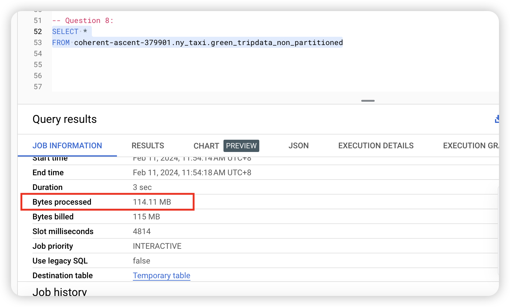

## Week 3 Homework

# Before you get started

Before we get started, download the data you need to your local computer and load them into your bucket manually.

**Step1: using python to download data**

```python
import requests
import os

# 定义数据链接的基础URL和文件名格式
base_url = "https://d37ci6vzurychx.cloudfront.net/trip-data/green_tripdata_2022-"
file_format = ".parquet"

# 指定本地保存数据文件的目录
save_directory = "./green_tripdata_2022/"

# 创建保存数据文件的目录（如果不存在）
if not os.path.exists(save_directory):
    os.makedirs(save_directory)

# 循环下载每个月份的数据文件
for month in range(1, 13):
    # 根据月份构建完整的文件链接
    file_url = f"{base_url}{month:02d}{file_format}"
    # 构建保存文件的路径
    file_name = f"green_tripdata_2022-{month:02d}{file_format}"
    save_path = os.path.join(save_directory, file_name)
    
    # 发送HTTP请求下载文件
    response = requests.get(file_url)
    
    # 检查响应状态码，如果是200表示请求成功
    if response.status_code == 200:
        # 将响应内容保存到本地文件
        with open(save_path, 'wb') as file:
            file.write(response.content)
        print(f"Successfully downloaded: {file_name}")
    else:
        print(f"Failed to download: {file_name}")

```

**Step2: load them into your bucket** 


**Step3: create tables in BigQuery**

```sql
-- Create an external table using the Green Taxi Trip Records Data for 2022.
CREATE OR REPLACE EXTERNAL TABLE `coherent-ascent-379901.ny_taxi.external_green_tripdata`
OPTIONS(
    format = 'parquet',
    uris = ['gs://dtc-zoomcamp/green_tripdata_2022-*.parquet']
);

-- Create a table in BQ using the Green Taxi Trip Records for 2022 (do not partition or cluster this table).
CREATE OR REPLACE TABLE coherent-ascent-379901.ny_taxi.green_tripdata_non_partitioned AS
SELECT * FROM coherent-ascent-379901.ny_taxi.external_green_tripdata;
```

## Question 1. What is count of records for the 2022 Green Taxi Data??

> **Answer: 840402**

```sql
SELECT COUNT(1) FROM coherent-ascent-379901.ny_taxi.green_tripdata_non_partitioned;
```

## Question 2. Data read

> **Answer:`0 MB for the External Table and 6.41MB for the Materialized Table`**
>
> I got the same number, but it's not in the options. So I choose one option closer.

```sql
--External Table
SELECT DISTINCT(PULocationID) AS all_PULocationID
FROM coherent-ascent-379901.ny_taxi.external_green_tripdata;

Job ID: coherent-ascent-379901:US.bquxjob_56a35905_18d962946b4
User: lililiVino@gmail.com
Location: US
Creation time: Feb 11, 2024, 11:15:05 AM UTC+8
Start time: Feb 11, 2024, 11:15:05 AM UTC+8
End time: Feb 11, 2024, 11:15:05 AM UTC+8
Duration: 0 sec
Bytes processed: 6.41 MB
Bytes billed: 10 MB

--Materialized Table
SELECT DISTINCT(PULocationID) AS all_PULocationID
FROM coherent-ascent-379901.ny_taxi.green_tripdata_non_partitioned;

Job ID： coherent-ascent-379901:US.bquxjob_2b4b41db_18d96226669
User：lililiVino@gmail.com
Location： US
Creation time： Feb 11, 2024, 11:07:34 AM UTC+8
Start time： Feb 11, 2024, 11:07:34 AM UTC+8
End time： Feb 11, 2024, 11:07:34 AM UTC+8
Duration： 0 sec
Bytes processed： 6.41 MB
Bytes billed： 10 MB

```

## Question 3. How many records have a fare_amount of 0?

> **Answer: 1622**

```sql
SELECT COUNT(1)
FROM coherent-ascent-379901.ny_taxi.green_tripdata_non_partitioned
WHERE fare_amount=0;
```

## Question 4. Best strategy

> **Answer: Partition by lpep_pickup_datetime Cluster on PUlocationID**

```sql
CREATE OR REPLACE TABLE coherent-ascent-379901.ny_taxi.green_tripdata_partitioned_clusterd 
PARTITION BY DATE(lpep_pickup_datetime)
CLUSTER BY PUlocationID AS
SELECT * FROM coherent-ascent-379901.ny_taxi.green_tripdata_non_partitioned
```
## Question 5. Data read

> **Answer: 12.82 MB for non-partitioned table and 1.12 MB for the partitioned table**

```sql
--12.82 MB
SELECT DISTINCT(PULocationID) AS all_PULocationID
FROM coherent-ascent-379901.ny_taxi.green_tripdata_non_partitioned
WHERE DATE(lpep_pickup_datetime) BETWEEN '2022-06-01' AND '2022-06-30';

--1.12 MB
SELECT DISTINCT(PULocationID) AS all_PULocationID
FROM coherent-ascent-379901.ny_taxi.green_tripdata_partitioned_clusterd
WHERE DATE(lpep_pickup_datetime) BETWEEN '2022-06-01' AND '2022-06-30';
```

## Question 6. Where is the data stored in the External Table you created?

> **Answer: GCP Bucket**

## Question 7. Is it best practice in Big Query to always cluster your data?

> **Answer: False**

It's not always necessary to cluster your data in BigQuery, but it can often be beneficial for performance optimization, especially for larger datasets or queries that frequently filter or join on specific columns.

## Question 8. 

> **Answer: actrually, I ran the code, but I didn't  know why, because I didn't get the problem you offered. Could you help me?**



## Submitting the solutions 

- Form for submitting: https://courses.datatalks.club/de-zoomcamp-2024/homework/hw3

Due date: Feb. 12, 2024, 11 p.m.
