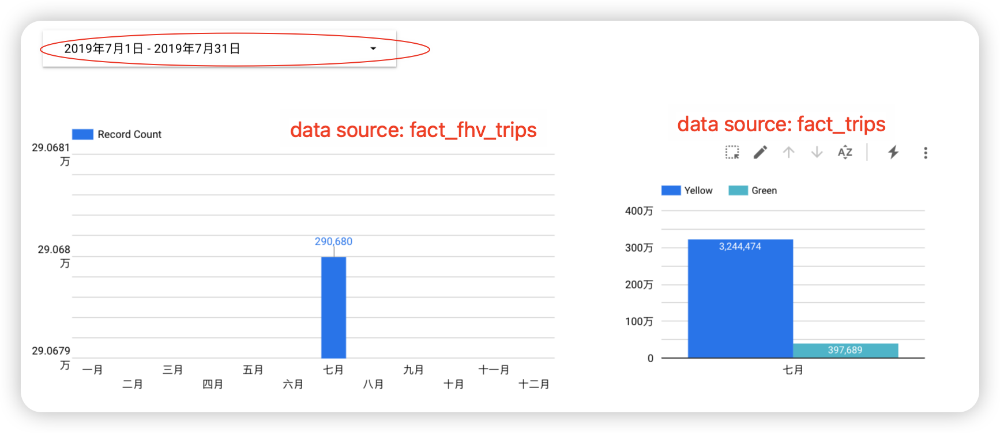

## Week 4 Homework

## Question 1. **What happens when we execute dbt build --vars '{'is_test_run':'true'}'** 

> **Answer: It applies a limit 100 to all of our models**

## Question 2.**What is the code that our CI job will run?**

> **Answer:`The code from a development branch requesting a merge to main`**

## Question 3. 

> **Answer: 22998722**

* Step1: Create a staging model with name `stg_fhv_tripdata.sql`

  ```sql
  with 
  
  source as (
  
      select * from {{ source('staging', 'fhv_tripdata') }}
  
  ),
  
  renamed as (
  
      select
          dispatching_base_num,
          pickup_datetime,
          dropoff_datetime,
          pulocationid,
          dolocationid,
          sr_flag,
          affiliated_base_number
      from source
      where EXTRACT(YEAR FROM pickup_datetime) IN  (2019) 
  
  )
  
  select * from renamed
  
  -- dbt build --select <model_name> --vars '{'is_test_run': 'false'}'
  
  
    limit 100
  
  
  ```

* Step2:Create a core model with name `fact_fhv_trips.sql`

  ```sql
  {{
      config(
          materialized='table'
      )
  }}
  
  with fhv_tripdata as (
      select *
      from {{ ref('stg_fhv_tripdata') }}
  ), 
  dim_zones as (
      select * from {{ ref('dim_zones') }}
      where borough != 'Unknown'
  )
  select fhv_tripdata.dispatching_base_num,
      fhv_tripdata.sr_flag,
      fhv_tripdata.affiliated_base_number,
      fhv_tripdata.pickup_datetime,
      fhv_tripdata.pulocationid,
      pickup_zone.borough as pickup_borough, 
      pickup_zone.zone as pickup_zone,
      fhv_tripdata.dropoff_datetime, 
      fhv_tripdata.dolocationid,
      dropoff_zone.borough as dropoff_borough, 
      dropoff_zone.zone as dropoff_zone
  from fhv_tripdata
  inner join dim_zones as pickup_zone
  on fhv_tripdata.pulocationid = pickup_zone.locationid
  inner join dim_zones as dropoff_zone
  on fhv_tripdata.dolocationid = dropoff_zone.locationid
  ```

* Step3: In dbt, run `dbt build --select stg_fhv_tripdata --vars '{'is_test_run': 'false'}'` And `dbt build --select fact_fhv_trips`

* Step4:Query in BigQuery

  ```sql
  select count(1)
  from coherent-ascent-379901.dbt_lili.fact_fhv_trips
  ```

## Question 4. 

> **Answer: Yellow**



## Submitting the solutions 

- Form for submitting: https://courses.datatalks.club/de-zoomcamp-2024/homework/hw4

Due date: 22 February (Thursday), 22:00 CET
