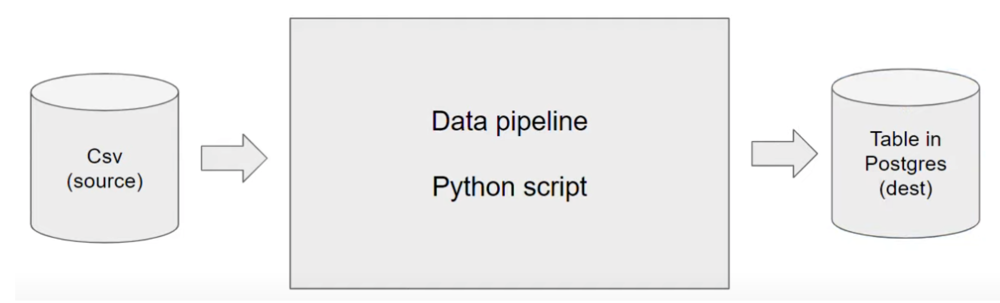

# 1、Introduction

**Data Engineering** is the design and development of systems for collecting, storing and analyzing data at scale.

## Data pipeline

**A data pipeline** is a service that receives data as input and outputs more data. For example, reading a CSV file, transforming the data somehow and storing it as a table in a PostgreSQL database.



# 2、Docker + Postgres

## 2.1、what's docker

**_([video scource](https://www.youtube.com/watch?v=EYNwNlOrpr0&list=PL3MmuxUbc_hJed7dXYoJw8DoCuVHhGEQb&index=3))_**

**Docker** is a _containerization software_ that allows us to isolate software in a similar way to virtual machines but in a much leaner way.

A **Docker image** is a _snapshot_ of a container that we can define to run our software, or in this case our data pipelines. By exporting our Docker images to Cloud providers such as Amazon Web Services or Google Cloud Platform we can run our containers there.

Docker provides the following advantages:？？？

- Reproducibility
- Local experiment
- Integration tests (CI/CD)
- Running pipelines on the cloud (AWS Batch, Kubernetes jobs)
- Spark (analytics engine for large-scale data processing)
- Serverless (AWS Lambda, Google functions)

Docker containers are **_stateless_**: any changes done inside a container will **NOT** be saved when the container is killed and started again. This is an advantage because it allows us to restore any container to its initial state in a reproducible manner, but you will have to store data elsewhere if you need to do so; a common way to do so is with _volumes_.

> Note: you can learn more about Docker and how to set it up on a Mac [in this link](https://github.com/ziritrion/ml-zoomcamp/blob/11_kserve/notes/05b_virtenvs.md#docker). You may also be interested in a [Docker reference cheatsheet](https://gist.github.com/ziritrion/1842c8a4c4851602a8733bba19ab6050#docker).

## 2.2、Creating a custom pipeline with Docker

**do all the things in Mac Terminal after setting up docker on your Mac:**

- `docker run -d -p 80:80 docker/getting-started`

(base) papa@papadeMacBook-Pro de %

- `docker run hello-world`

(base) papa@papadeMacBook-Pro de %

- `docker run -it ubuntu bash`

root@8516dbfbc42b:/#
In this situation, if we do something stupid, the host machine is not affected by it. This is what isolation actually means.
root@8516dbfbc42b:/# exit

- `docker run -it python:3.9`

直接进入 python

- `docker run -it --entrypoint=bash python:3.9`

不直接进入 python，进入 root@864775ebb19f:/# ，如果想要进入 python，需要输入 python

- `docker build -t test:pandas .`

create a container named test:pandas
test:pandas means image name
. represents in current path
重新打开 docker run -t test:pandas argument（docker run -t test:pandas 1)

**Let's create an example pipeline. We will create a dummy `pipeline.py` Python script that receives an argument and prints it.**

```python
import sys
import pandas # we don't need this but it's useful for the example

# print arguments
print(sys.argv)

# argument 0 is the name os the file
# argumment 1 contains the actual first argument we care about
day = sys.argv[1]

# cool pandas stuff goes here

# print a sentence with the argument
print(f'job finished successfully for day = {day}')
```

We can run this script with `python pipeline.py <some_number>` and it should print 2 lines:

- `['pipeline.py', '<some_number>']`
- `job finished successfully for day = <some_number>`

Let's containerize it by creating a Docker image. Create the folllowing `Dockerfile` file:

```dockerfile
# base Docker image that we will build on
FROM python:3.9.1

# set up our image by installing prerequisites; pandas in this case
RUN pip install pandas

# set up the working directory inside the container
WORKDIR /app
# copy the script to the container. 1st name is source file, 2nd is destination
COPY pipeline.py pipeline.py

# define what to do first when the container runs
# in this example, we will just run the script
ENTRYPOINT ["python", "pipeline.py"]
```

Let's build the image:

```ssh
docker build -t test:pandas .
```

- The image name will be `test` and its tag will be `pandas`. If the tag isn't specified it will default to `latest`.

We can now run the container and pass an argument to it, so that our pipeline will receive it:

```ssh
docker run -it test:pandas some_number
```

You should get the same output you did when you ran the pipeline script by itself.

> Note: these instructions asume that `pipeline.py` and `Dockerfile` are in the same directory. The Docker commands should also be run from the same directory as these files.

## 2.3、Running Postgres in a container

use official docker image of postgres

# 3、GCP + Terraform

# 4、Environment setup
