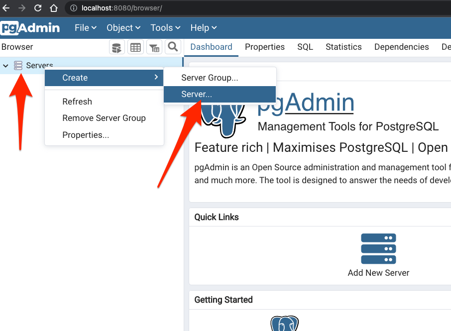
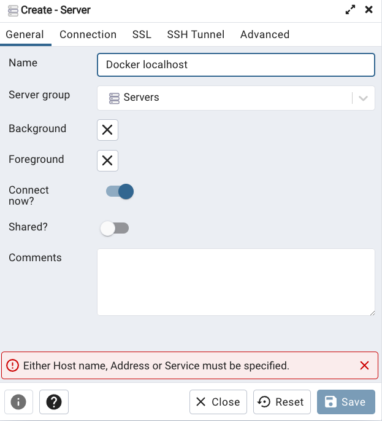

# 1、Introduction

**Data Engineering** is the design and development of systems for collecting, storing and analyzing data at scale.

## Data pipeline

**A data pipeline** is a service that receives data as input and outputs more data. For example, reading a CSV file, transforming the data somehow and storing it as a table in a PostgreSQL database.


# 2、Docker + Postgres

## 2.1、what's docker

**_([video scource](https://www.youtube.com/watch?v=EYNwNlOrpr0&list=PL3MmuxUbc_hJed7dXYoJw8DoCuVHhGEQb&index=3))_**

**Docker** is a _containerization software_ that allows us to isolate software in a similar way to virtual machines but in a much leaner way.

A **Docker image** is a _snapshot_ of a container that we can define to run our software, or in this case our data pipelines. By exporting our Docker images to Cloud providers such as Amazon Web Services or Google Cloud Platform we can run our containers there.

Docker provides the following advantages:？？？

- Reproducibility
- Local experiment
- Integration tests (CI/CD)
- Running pipelines on the cloud (AWS Batch, Kubernetes jobs)
- Spark (analytics engine for large-scale data processing)
- Serverless (AWS Lambda, Google functions)

Docker containers are **_stateless_**: any changes done inside a container will **NOT** be saved when the container is killed and started again. This is an advantage because it allows us to restore any container to its initial state in a reproducible manner, but you will have to store data elsewhere if you need to do so; a common way to do so is with _volumes_.

> Note: you can learn more about Docker and how to set it up on a Mac [in this link](https://github.com/ziritrion/ml-zoomcamp/blob/11_kserve/notes/05b_virtenvs.md#docker). You may also be interested in a [Docker reference cheatsheet](https://gist.github.com/ziritrion/1842c8a4c4851602a8733bba19ab6050#docker).

## 2.2、Creating a custom pipeline with Docker

**do all the things in Mac Terminal after setting up docker on your Mac:**

- `docker run -d -p 80:80 docker/getting-started`

(base) papa@papadeMacBook-Pro de %

- `docker run hello-world`

(base) papa@papadeMacBook-Pro de %

- `docker run -it ubuntu bash`

root@8516dbfbc42b:/#
In this situation, if we do something stupid, the host machine is not affected by it. This is what isolation actually means.
root@8516dbfbc42b:/# exit

- `docker run -it python:3.9`

直接进入 python

- `docker run -it --entrypoint=bash python:3.9`

不直接进入 python，进入 root@864775ebb19f:/# ，如果想要进入 python，需要输入 python

-  `docker build -t test:pandas .`

create a container named test:pandas
test:pandas means image name
. represents in current path
重新打开 docker run -t test:pandas argument（docker run -t test:pandas 1)

**Let's create an example pipeline. We will create a dummy `pipeline.py` Python script that receives an argument and prints it.**

```python
import sys
import pandas # we don't need this but it's useful for the example

# print arguments
print(sys.argv)

# argument 0 is the name os the file
# argumment 1 contains the actual first argument we care about
day = sys.argv[1]

# cool pandas stuff goes here

# print a sentence with the argument
print(f'job finished successfully for day = {day}')
```

We can run this script with `python pipeline.py <some_number>` and it should print 2 lines:

- `['pipeline.py', '<some_number>']`
- `job finished successfully for day = <some_number>`

Let's containerize it by creating a Docker image. Create the folllowing `Dockerfile` file:

```dockerfile
# base Docker image that we will build on
FROM python:3.9.1

# set up our image by installing prerequisites; pandas in this case
RUN pip install pandas

# set up the working directory inside the container
WORKDIR /app
# copy the script to the container. 1st name is source file, 2nd is destination
COPY pipeline.py pipeline.py

# define what to do first when the container runs
# in this example, we will just run the script
ENTRYPOINT ["python", "pipeline.py"]
```

Let's build the image:

```ssh
docker build -t test:pandas .
```

- The image name will be `test` and its tag will be `pandas`. If the tag isn't specified it will default to `latest`.

We can now run the container and pass an argument to it, so that our pipeline will receive it:

```ssh
docker run -it test:pandas some_number
```

You should get the same output you did when you ran the pipeline script by itself.

> Note: these instructions asume that `pipeline.py` and `Dockerfile` are in the same directory. The Docker commands should also be run from the same directory as these files.

## 2.3、Running Postgres in a container

_([Video source](https://www.youtube.com/watch?v=2JM-ziJt0WI&list=PL3MmuxUbc_hJed7dXYoJw8DoCuVHhGEQb&index=4))_

In later parts of the course we will use Airflow, which uses PostgreSQL internally. For simpler tests we can use PostgreSQL (or just Postgres) directly.

You can run a containerized version of Postgres that doesn't require any installation steps. You only need to provide a few _environment variables_ to it as well as a _volume_ for storing data.

Create a folder anywhere you'd like for Postgres to store data in. We will use the example folder `ny_taxi_postgres_data`. Here's how to run the container:

```bash
docker run -it \
    -e POSTGRES_USER="root" \
    -e POSTGRES_PASSWORD="root" \
    -e POSTGRES_DB="ny_taxi" \
    -v $(pwd)/ny_taxi_postgres_data:/var/lib/postgresql/data \
    -p 5432:5432 \
    postgres:13
```

- The container needs 3 environment variables:
  - `POSTGRES_USER` is the username for logging into the database. We chose `root`.
  - `POSTGRES_PASSWORD` is the password for the database. We chose `root`
    - **_IMPORTANT: These values are only meant for testing. Please change them for any serious project._**
  - `POSTGRES_DB` is the name that we will give the database. We chose `ny_taxi`.
- `-v` points to the volume directory. The colon `:` separates the first part (path to the folder in the host computer) from the second part (path to the folder inside the container).
  - Path names must be absolute. If you're in a UNIX-like system, you can use `pwd` to print you local folder as a shortcut; this example should work with both `bash` and `zsh` shells, but `fish` will require you to remove the `$`.
  - This command will only work if you run it from a directory which contains the `ny_taxi_postgres_data` subdirectory you created above.
- The `-p` is for port mapping（端口映射）. We map the default Postgres port to the same port in the host.  **-p HOST_PORT:CONTAINER_PORT**
- The last argument is the image name and tag. We run the official `postgres` image on its version `13`.

Once the container is running, we can log into our database with [pgcli](https://www.pgcli.com/) with the following command:

如果想要获得语法帮助，在bash中输入pgcli --help

```bash
pgcli -h localhost -p 5432 -u root -d ny_taxi
```

- `pgcli`pgclient，是一个python的library ，可以使用pip install pgcli 安装，
- `-h` is the host. Since we're running locally we can use `localhost`.
- `-p` is the port.
- `-u` is the username.
- `-d` is the database name.
- The password is not provided; it will be requested after running the command.

## 2.4、Ingesting data to Postgres with Python

([*Video source*](https://www.youtube.com/watch?v=2JM-ziJt0WI&list=PL3MmuxUbc_hJed7dXYoJw8DoCuVHhGEQb&index=4))

We will now create a Jupyter Notebook `upload-data.ipynb` file which we will use to read a CSV file and export it to Postgres. But According to the [TLC data website](https://www1.nyc.gov/site/tlc/about/tlc-trip-record-data.page), from 05/13/2022, the data will be in `.parquet` format instead of `.csv` The website has provided a useful [link](https://www1.nyc.gov/assets/tlc/downloads/pdf/working_parquet_format.pdf) with sample steps to read `.parquet` file and convert it to Pandas data frame.

> Note: knowledge of Jupyter Notebook, Python environment management and Pandas is asumed in these notes. Please check [this link](https://gist.github.com/ziritrion/9b80e47956adc0f20ecce209d494cd0a#pandas) for a Pandas cheatsheet and [this link](https://gist.github.com/ziritrion/8024025672ea92b8bdeb320d6015aa0d) for a Conda cheatsheet for Python environment management.

Check the completed `upload-data.ipynb` [in this link](../1_intro/upload-data.ipynb) for a detailed guide. Feel free to copy the file to your work directory; in the same directory you will need to have the CSV file linked above and the `ny_taxi_postgres_data` subdirectory.

## 2.5、Connecting pgAdmin and Postgres with Docker networking

_([Video source](https://www.youtube.com/watch?v=hCAIVe9N0ow&list=PL3MmuxUbc_hJed7dXYoJw8DoCuVHhGEQb&index=5))_

`pgcli` is a handy tool but it's cumbersome to use. [`pgAdmin` is a web-based tool](https://www.pgadmin.org/) that makes it more convenient to access and manage our databases. It's possible to run pgAdmin  as container along with the Postgres container, **but both containers will have to be in the same _virtual network_ so that they can find each other.**

Let's create a virtual Docker network called `pg-network`:

```bash
docker network create pg-network
```

>You can remove the network later with the command `docker network rm pg-network` . You can look at the existing networks with `docker network ls` .

We will now re-run our Postgres container with the added network name and the container network name, so that the pgAdmin container can find it (we'll use `pg-database` for the container name):

```bash
docker run -it \
    -e POSTGRES_USER="root" \
    -e POSTGRES_PASSWORD="root" \
    -e POSTGRES_DB="ny_taxi" \
    -v $(pwd)/ny_taxi_postgres_data:/var/lib/postgresql/data \
    -p 5432:5432 \
    --network=pg-network \
    --name pg-database \
    postgres:13
```

We will now run the pgAdmin container on another terminal:

```bash
docker run -it \
    -e PGADMIN_DEFAULT_EMAIL="admin@admin.com" \
    -e PGADMIN_DEFAULT_PASSWORD="root" \
    -p 8080:80 \
    --network=pg-network \
    --name pgadmin \
    dpage/pgadmin4
```
* The container needs 2 environment variables: a login email and a password. We use `admin@admin.com` and `root` in this example.
 * ***IMPORTANT: these are example values for testing and should never be used on production. Change them accordingly when needed.***
* pgAdmin is a web app and its default port is 80; we map it to 8080 in our localhost to avoid any possible conflicts.
* Just like with the Postgres container, we specify a network and a name. However, the name in this example isn't really necessary because there won't be any containers trying to access this particular container.
* The actual image name is `dpage/pgadmin4` .

You should now be able to load pgAdmin on a web browser by browsing to `localhost:8080`. Use the same email and password you used for running the container to log in.

Right-click on _Servers_ on the left sidebar and select _Create_ > _Server..._



Under _General_ give the Server a name and under _Connection_ add the same host name, user and password you used when running the container.




Click on _Save_. You should now be connected to the database.

We will explore using pgAdmin in later lessons.

## 2.6、Using the ingestion script with Docker

_([Video source](https://www.youtube.com/watch?v=B1WwATwf-vY&list=PL3MmuxUbc_hJed7dXYoJw8DoCuVHhGEQb&index=8))_

We will now export the Jupyter notebook file to a regular Python script and use Docker to run it.

### Exporting and testing the script

You can export the `ipynb` file to `py` with this command:

```bash
jupyter nbconvert --to=script upload-data.ipynb
```

Clean up the script by removing everything we don't need. We will also rename it to `ingest_data.py` and add a few modifications:
* We will use [argparse](https://docs.python.org/3/library/argparse.html) to handle the following command line arguments:
    * Username
    * Password
    * Host
    * Port
    * Database name
    * Table name
    * URL for the CSV file
* The _engine_ we created for connecting to Postgres will be tweaked so that we pass the parameters and build the URL from them, like this:
    ```python
    engine = create_engine(f'postgresql://{user}:{password}@{host}:{port}/{db}')
    ```
* We will also download the CSV using the provided URL argument.

You can check the completed `ingest_data.py` script [in this link](../1_intro/ingest_data.py).

In order to test the script we will have to drop the table we previously created. In pgAdmin, in the sidebar navigate to _Servers > Docker localhost > Databases > ny_taxi > Schemas > public > Tables > yellow_taxi_data_, right click on _yellow_taxi_data_ and select _Query tool_. Introduce the following command:

```sql
DROP TABLE yellow_taxi_data;
```

We are now ready to test the script with the following command:

```bash
python ingest_data.py \
    --user=root \
    --password=root \
    --host=localhost \
    --port=5432 \
    --db=ny_taxi \
    --table_name=yellow_taxi_trips \
    --url="https://s3.amazonaws.com/nyc-tlc/trip+data/yellow_tripdata_2021-01.csv"
```
* Note that we've changed the table name from `yellow_taxi_data` to `yellow_taxi_trips`.

Back in pgAdmin, refresh the Tables and check that `yellow_taxi_trips` was created. You can also run a SQL query to check the contents:

```sql
SELECT
    COUNT(1)
FROM
    yellow_taxi_trips;
```
* This query should return 1,369,765 rows.

# 3、GCP + Terraform


# 4、Environment setup

