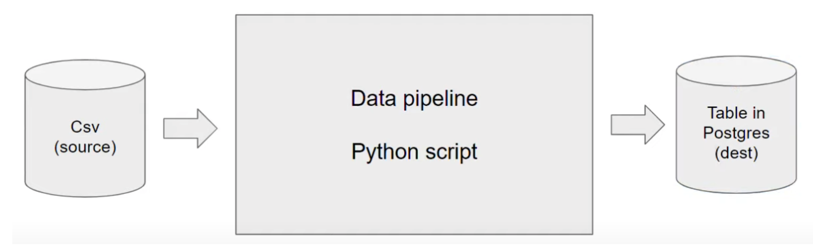
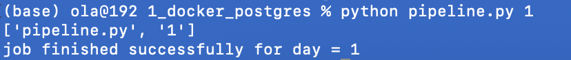
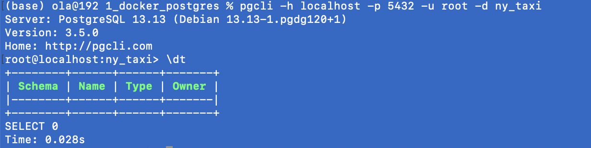
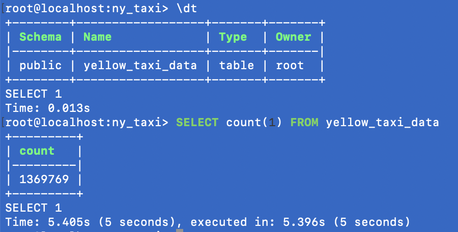
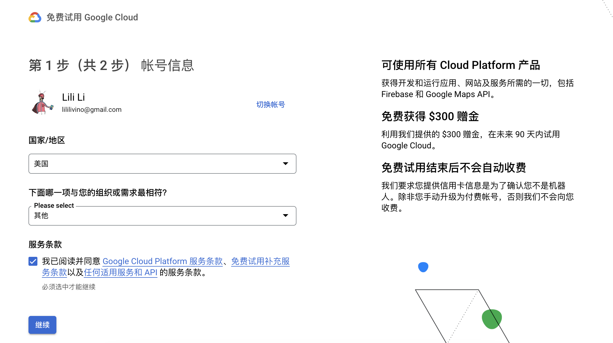

> Next:[02_data_ingestion](02_data_ingestion.md)

# 1、Introduction

> **数据工程**是用于大规模收集，存储和分析数据的系统的设计和开发

**Data Engineering** is the design and development of systems for collecting, storing and analyzing data at scale.

## Data pipeline

> data pipeline 是一种服务，接收数据，输出数据

**A data pipeline** is a service that receives data as input and outputs more data（一种接收数据作为输入并输出更多数据的服务）. For example, reading a CSV file, transforming the data somehow and storing it as a table in a PostgreSQL database.



# 2、Docker + Postgres

> 当我们谈论 Docker 时，可以把它想象成一个轻量级的虚拟化工具，用于将应用程序和它们的依赖打包到一个可移植的容器中。这个容器包括了应用程序的所有必需组件，如代码、运行时、系统工具、库等。解决了在不同环境中出现因为软件版本、依赖等问题而导致的运行时错误。Docker 提供了一种轻松管理和交付应用程序的方式，使得应用程序在不同的环境中表现一致。

> * ***容器(Container):** Docker 容器是一个轻量级、独立、可执行的软件包，包含了运行一个应用程序所需的一切：代码、运行时、系统工具、库以及设置，相当于安装好的系统*，Docker containers are **_stateless_**，任何修改都不会被保存，如果你想存储信息，常见的做法是通过volumes
> * ***镜像(Image):** 镜像是一个**只读**的模板，相当于安装光盘，用于创建容器。它包含了应用程序运行所需的所有信息。*
>

> 主要是在其中运行postgres容器和启动它，启动后，就可以使用docker制作pipeline（灌入数据）见2.6正式使用

## 2.1.What's docker

**_([video scource](https://www.youtube.com/watch?v=EYNwNlOrpr0&list=PL3MmuxUbc_hJed7dXYoJw8DoCuVHhGEQb&index=3))_**

**Docker** is a _containerization software_ that allows us to isolate software in a similar way to virtual machines but in a much leaner way.

A **Docker image** is a _snapshot_ of a container that we can define to run our software, or in this case our data pipelines. By exporting our Docker images to Cloud providers such as Amazon Web Services or Google Cloud Platform we can run our containers there.

Docker provides the following advantages:

- Reproducibility
- Local experiment
- Integration tests (CI/CD)
- Running pipelines on the cloud (AWS Batch, Kubernetes jobs)
- Spark (analytics engine for large-scale data processing)
- Serverless (AWS Lambda, Google functions)

Docker containers are **_stateless_**: any changes done inside a container will **NOT** be saved when the container is killed and started again. This is an advantage because it allows us to restore any container to its initial state in a reproducible manner, but you will have to store data elsewhere if you need to do so; a common way to do so is with _volumes_.

> Note: you can learn more about Docker and how to set it up on a Mac [in this link](https://github.com/ziritrion/ml-zoomcamp/blob/11_kserve/notes/05b_virtenvs.md#docker). You may also be interested in a [Docker reference cheatsheet](https://gist.github.com/ziritrion/1842c8a4c4851602a8733bba19ab6050#docker).

## 2.2.Creating a simple pipeline in Docker

> 语法：
>
> docker run -it 运行
>
> docker build -t 新建
>
> Dockerfile，python脚本，执行命令都在一个目录下

**(1) how to use Docker**

**setting up docker on your Mac**

The first thing you need to do is to set docker up on your Mac if you are using a macbook. [in this link](https://github.com/ziritrion/ml-zoomcamp/blob/11_kserve/notes/05b_virtenvs.md#docker)

**do all the things in Mac Terminal**, and see what happens in your Docker desktop

- `docker run -d -p 80:80 docker/getting-started`
  - 打开某个容器，-d后台（detached）模式运行容器，不占用当前终端。

- `docker run hello-world`

- `docker run -it ubuntu bash` 
  - 运行容器，终端进入容器shell

- `docker run -it python:3.9`
  - 运行容器，直接进入 python

- `docker run -it --entrypoint=bash python:3.9`
  - 运行容器，终端进入容器shell,不直接进入 python，进入 容器shell root@容器编码:/# ，如果想要进入 python，需要输入 python，如果python：3.9这个image中import pandas失败，需要进入这个镜像的终端，pip install pandas，下次再进入这个镜像，仍然没有pandas

- `docker build -t test:pandas .`
   - 新建镜像
   - "test:pandas" means image name
   - "." represents in current path当前目录下查找 `Dockerfile` 文件进行构建，所以需要新建一个Dockerfile哦
   - 重新打开 docker run -t test:pandas argument（for example: docker run -t test:pandas 1)


**(2)Let's create an example pipeline. **

**We will create a dummy `pipeline.py` Python script that receives an argument and prints it.**

```python
import sys
import pandas # we don't need this but it's useful for the example

# print arguments
print(sys.argv)

# argument 0 is the name of the python file
# argumment 1 contains the actual first argument we care about
day = sys.argv[1]

# cool pandas stuff goes here

# print a sentence with the argument
print(f'job finished successfully for day = {day}')
```

* 不使用docker，We can run this script with `python pipeline.py <some_number>` and it should print 2 lines:

  - `['pipeline.py', '<some_number>']`

  - `job finished successfully for day = <some_number>`





* 使用daocker，创建镜像：Let's containerize it by creating a Docker image. Create the folllowing `Dockerfile` file:

```dockerfile
# base Docker image that we will build on
FROM python:3.9.1

# set up our image by installing prerequisites; pandas in this case
RUN pip install pandas

# set up the working directory inside the container.This means that all the following commands will be executed in the /app directory inside the container. If the directory doesn't exist, Docker will create it.
WORKDIR /app
# copy the script to the container. 1st name is source file, 2nd is destination
COPY pipeline.py pipeline.py

# define what to do first when the container runs
# in this example, we will just run the script
ENTRYPOINT ["python", "pipeline.py"]

# 进入bash命令行模式   
#ENTRYPOINT ["bash"]
```

Let's build the image(将上面建立的Dockerfile，pipeline.py放在终端当下运行的文件夹内):

```ssh
docker build -t test:pandas .
```

- The image name will be `test` and its tag will be `pandas`. If the tag isn't specified it will default to `latest`.

运行容器：We can now run the container and pass an argument to it, so that our pipeline will receive it:

```ssh
docker run -it test:pandas some_number
```

You should get the same output you did when you ran the pipeline script by itself.

> Note: these instructions asume that `pipeline.py` and `Dockerfile` are in the same directory. The Docker commands should also be run from the same directory as these files.

## 2.3、Running Postgres locally with Docker

_([Video source](https://www.youtube.com/watch?v=2JM-ziJt0WI&list=PL3MmuxUbc_hJed7dXYoJw8DoCuVHhGEQb))_

> 如果遇到连接postgres数据库的问题，查看[link](https://www.youtube.com/watch?v=3IkfkTwqHx4&list=PL3MmuxUbc_hJed7dXYoJw8DoCuVHhGEQb)

You can run a containerized version of Postgres that doesn't require any installation steps. You only need to provide a few _environment variables_ to it as well as a _volume_ for storing data.

**Step1:create a new folder named ny_taxi_postgres_data**

==Possible issues(可能出现的问题)==：文件位置建立在icloud上了，不同电脑之间同步了，不过容器每次都要重新建立，后面换电脑操作出问题了，解决方法换路径建在本地就行了，我建在了用户文件夹下:`/Users/ola/ny_taxi_postgres_data`

```bash
PostgreSQL Database directory appears to contain a database; Skipping initialization

2023-03-11 01:11:22.674 UTC [1] FATAL:  could not open directory "pg_notify": No such file or directory
2023-03-11 01:11:22.679 UTC [1] LOG:  database system is shut down
```

Create a folder anywhere you'd like for Postgres to store data in. We will use the example folder `ny_taxi_postgres_data`. Here's how to run the container:

```bash
docker run -it \
    -e POSTGRES_USER="root" \
    -e POSTGRES_PASSWORD="root" \
    -e POSTGRES_DB="ny_taxi" \
    -v /Users/ola/ny_taxi_postgres_data:/var/lib/postgresql/data \
    -p 5432:5432 \
    --name pg-database \
    postgres:13
```

- The container needs 3 environment variables:
  - `POSTGRES_USER` is the username for logging into the database. We chose `root`.
  - `POSTGRES_PASSWORD` is the password for the database. We chose `root`
    - _IMPORTANT: These values are only meant for testing. Please change them for any serious project._
  - `POSTGRES_DB` is the name that we will give the database. We chose `ny_taxi`.
- `-v` points to the volume directory. The colon `:` separates the first part (path to the folder in the host computer) from the second part (path to the folder inside the container).这是一个卷挂载，用于将容器内的 PostgreSQL 数据库数据持久化到主机上的目录，之前的数据不会保存在容器中。将存储数据到本地，下次打开postgres可以继续使用
  - Path names must be absolute. If you're in a UNIX-like system, you can use `pwd` to print you local folder as a shortcut; this example should work with both `bash` and `zsh` shells, but `fish` will require you to remove the `$`.
  - This command will only work if you run it from a directory which contains the `ny_taxi_postgres_data` subdirectory you created above.
-  `-p` is for port mapping（端口映射）. We map the default Postgres port to the same port in the host.  **-p HOST_PORT:CONTAINER_PORT**
- `--name`， 是容器的名字，如果不写的话，会随机生成一个
- The last argument is the image name and tag. We run the official `postgres` image on its version `13`.

**Step2:打开postgres**

Once the container is running, we can log into our database with [pgcli](https://www.pgcli.com/) with the following command:

如果想要获得语法帮助，在bash中输入pgcli --help

```bash
pgcli -h localhost -p 5432 -u root -d ny_taxi
```

- `pgcli`pgclient，*Pgcli* is a command line interface for Postgres，是一个python的library ，如果没有，可以使用pip install pgcli 安装，
- `-h` is the host. Since we're running locally we can use `localhost`.
- `-p` is the port.
- `-u` is the username.
- `-d` is the database name.
- The password is not provided; it will be requested after running the command.



==Possible issues（可能出现的问题）：==电脑没有安装pgcli，导致启动不了

```bash
(base) ola@192 ~ % pgcli -h localhost -p 5432 -u root -d ny_taxi
zsh: command not found: pgcli
```

解决方法：在终端输入`pip install pgcli`，安装，但是又出现问题了，显示没有 install psycopg2-binary，解决方法，一劳永逸，换电脑直接执行库包安装：requirements.txt，写入库名和版本，执行`pip install -r requirements.txt`

## 2.4、Using the ingestion Jupyter notebook 

([*Video source*](https://www.youtube.com/watch?v=2JM-ziJt0WI&list=PL3MmuxUbc_hJed7dXYoJw8DoCuVHhGEQb))

> **在docker中打开postgres容器-->在jupyter中导入数据**

一步一步来，第一步网页下载数据，第二步将本地数据表传到2.3建立的本地数据库

We will now create a Jupyter Notebook `upload-data.ipynb` file which we will use to read a CSV file and export it to Postgres. But According to the [TLC data website](https://www1.nyc.gov/site/tlc/about/tlc-trip-record-data.page), from 05/13/2022, the data will be in `.parquet` format instead of `.csv` The website has provided a useful [link](https://www1.nyc.gov/assets/tlc/downloads/pdf/working_parquet_format.pdf) with sample steps to read `.parquet` file and convert it to Pandas data frame.

> Note: knowledge of Jupyter Notebook, Python environment management and Pandas is asumed in these notes. Please check [this link](https://gist.github.com/ziritrion/9b80e47956adc0f20ecce209d494cd0a#pandas) for a Pandas cheatsheet and [this link](https://gist.github.com/ziritrion/8024025672ea92b8bdeb320d6015aa0d) for a Conda cheatsheet for Python environment management.

* .parquet:  `upload-data.ipynb` [in this link](../01_basics_setup/2_docker_sql/upload-data.ipynb)for a detailed guide. 

* .csv:`upload-data-csv.ipynb` [in this link](../01_basics_setup/2_docker_sql/other_file/upload-data-csv.ipynb)for a detailed guide. 

what you can get after doing things up there:



Ps: 也可以直接在终端中输入下载数据`wget https://d37ci6vzurychx.cloudfront.net/trip-data/yellow_tripdata_2021-01.parquet`

## 2.5、Putting two container in one network with Docker network

_([Video source](https://www.youtube.com/watch?v=hCAIVe9N0ow&list=PL3MmuxUbc_hJed7dXYoJw8DoCuVHhGEQb))_

> ==**pgAdmin和Postgres在相同的virtual Docker networ中，使它们找到对方-->在pgAdmin中找到本地的Postgres中的数据库**==

`pgcli` is a handy tool but it's cumbersome（繁琐） to use. [`pgAdmin` is a web-based tool](https://www.pgadmin.org/) that makes it more convenient to access and manage our databases. It's possible to run pgAdmin  as container along with the Postgres container, **but both containers will have to be in the same _virtual network_ so that they can find each other.**

Let's create a virtual Docker network called `pg-network`:

```bash
docker network create pg-network
```

>You can remove the network later with the command `docker network rm pg-network` . You can look at the existing networks with `docker network ls` .

==先在Docker桌面端删除2.3中运行的容器，因为名字一样，啊！有冲突。-v使用相同通过的文件夹，2.4灌入的数据不会丢==We will now re-run our Postgres container with the added network name and the container network name, so that the pgAdmin container can find it (we'll use `pg-database` for the container name):

```bash
docker run -it \
    -e POSTGRES_USER="root" \
    -e POSTGRES_PASSWORD="root" \
    -e POSTGRES_DB="ny_taxi" \
    -v /Users/ola/ny_taxi_postgres_data:/var/lib/postgresql/data \
    -p 5432:5432 \
    --network=pg-network \
    --name pg-database \
    postgres:13
```

We will now run the pgAdmin container on another terminal:

```bash
docker run -it \
    -e PGADMIN_DEFAULT_EMAIL="admin@admin.com" \
    -e PGADMIN_DEFAULT_PASSWORD="root" \
    -p 8080:80 \
    --network=pg-network \
    --name pgadmin \
    dpage/pgadmin4
```
* The container needs 2 environment variables: a login email and a password. We use `admin@admin.com` and `root` in this example.
 * ***IMPORTANT: these are example values for testing and should never be used on production. Change them accordingly when needed.***
* pgAdmin is a web app and its default port is 80; we map it to 8080 in our localhost to avoid any possible conflicts.
* Just like with the Postgres container, we specify a network and a name. However, the name in this example isn't really necessary because there won't be any containers trying to access this particular container.
* The actual image name is `dpage/pgadmin4` .

You should now be able to load pgAdmin on a web browser by browsing to  `localhost:8080`. Use the same email and password you used for running the container to log in.

Right-click on _Servers_ on the left sidebar and select _Create_ > _Server..._


Under _General_ give the Server a name and under _Connection_ add the same host name, user and password you used when running the container.


Click on _Save_. You should now be connected to the database.

We will explore using pgAdmin in later lessons.

## 2.6、Running multiple containers with Docker-compose

_([Video source](https://www.youtube.com/watch?v=hKI6PkPhpa0&list=PL3MmuxUbc_hJed7dXYoJw8DoCuVHhGEQb))_

> 以下重新建立了新的容器，与2.5不一样，所以需要重新在pgadmin中建立新的server

`docker-compose` allows us to launch multiple containers using a single configuration file, so that we don't have to run multiple complex `docker run` commands separately.

Docker compose makes use of YAML files. Here's the `docker-compose.yaml` file for running the Postgres and pgAdmin containers:

```yaml
services:
  pgdatabase:
    image: postgres:13
    environment:
      - POSTGRES_USER=root
      - POSTGRES_PASSWORD=root
      - POSTGRES_DB=ny_taxi
    volumes:
      - "/Users/ola/ny_taxi_postgres_data:/var/lib/postgresql/data:rw"
    ports:
      - "5432:5432"
  pgadmin:
    image: dpage/pgadmin4
    environment:
      - PGADMIN_DEFAULT_EMAIL=admin@admin.com
      - PGADMIN_DEFAULT_PASSWORD=root
    volumes:
      - "/Users/ola/data_pgadmin:/var/lib/pgadmin"
    ports:
      - "8080:80"
```

* We don't have to specify a network because `docker-compose` takes care of it: every single container (or "service", as the file states) will run withing the same network and will be able to find each other according to their names (`pgdatabase` and `pgadmin` in this example).
* We've added a volume for pgAdmin to save its settings, so that you don't have to keep re-creating the connection to Postgres every time you rerun the container. Make sure you create a `data_pgadmin` directory in your work folder where you run `docker-compose` from.
* All other details from the `docker run` commands (environment variables, volumes and ports) are mentioned accordingly in the file following YAML syntax.

We can now run Docker compose by running the following command from the same directory where `docker-compose.yaml` is found. ==**Make sure that all previous containers aren't running anymore**:==

```bash
docker-compose up
```

You will have to press `Ctrl+C` in order to shut down the containers. The proper way of shutting them down is with this command:

```bash
docker-compose down
```

And if you want to run the containers again in the background rather than in the foreground (thus freeing up your terminal), you can run them in detached mode:

```bash
docker-compose up -d
```

If you want to run the dockerized ingest script when you run Postgres and pgAdmin with `docker-compose`, you will have to find the name of the virtual network that Docker compose created for the containers. You can use the command `docker network ls` to find it and then change the `docker run` command for the dockerized script to include the network name.


## 2.7、Using the ingestion script with Docker

> 1. 在docker中打开2.6中的容器，删除数据库中相同库表的数据，也可以不删除，会被替换
> 2. 建立Python script
> 3. 建立docker image
> 4. 打开docker container，加入参数，执行python script

_([Video source](https://www.youtube.com/watch?v=B1WwATwf-vY&list=PL3MmuxUbc_hJed7dXYoJw8DoCuVHhGEQb&index=8))_

We will now export the Jupyter notebook file to a regular Python script and use Docker to run it.

**测试：Exporting and testing the script**

**Step1:撰写py文档**

You can export the `ipynb` file to `py` with this command:

```bash
jupyter nbconvert --to=script upload-data.ipynb
```

Clean up the script by removing everything we don't need. We will also rename it to `ingest_data.py` and add a few modifications:
* We will use [argparse](https://docs.python.org/3/library/argparse.html) to handle the following command line arguments:
    * Username
    * Password
    * Host
    * Port
    * Database name
    * Table name
    * URL for the CSV file
* The _engine_ we created for connecting to Postgres will be tweaked so that we pass the parameters and build the URL from them, like this:
    ```python
    engine = create_engine(f'postgresql://{user}:{password}@{host}:{port}/{db}')
    ```
* We will also download the Parquet using the provided URL argument.

You can check the completed `ingest_data.py` script [in this link](../1_basics_setup/2_docker_sql/ingest_data.py).

In order to test the script we will have to drop the table we previously created. In pgAdmin, in the sidebar navigate to _Servers > Docker localhost > Databases > ny_taxi > Schemas > public > Tables > yellow_taxi_trips_, right click on _yellow_taxi_trips_ and select _Query tool_. Introduce the following command:

```sql
DROP TABLE yellow_taxi_data;
```

**Step2:导入数据**

We are now ready to test the script with the following command:

```bash
python ingest_data.py \
    --user=root \
    --password=root \
    --host=localhost \
    --port=5432 \
    --db=ny_taxi \
    --table_name=yellow_taxi_data \
    --url="https://d37ci6vzurychx.cloudfront.net/trip-data/yellow_tripdata_2021-01.parquet"
```
Back in pgAdmin, refresh the Tables and check that `yellow_taxi_data` was created. You can also run a SQL query to check the contents:

```sql
SELECT
    COUNT(1)
FROM
    yellow_taxi_data;
```
* This query should return 1369769 rows.

**正式使用docker：Dockerizing the script**

Let's modify the [Dockerfile we created before to include our `ingest_data.py` script and create a new image:

```dockerfile
FROM python:3.9.1

# We need to install wget to download the csv file
RUN apt-get install wget
# psycopg2 is a postgres db adapter for python: sqlalchemy needs it
RUN pip install pandas sqlalchemy psycopg2 pyarrow

WORKDIR /app
COPY ingest_data.py ingest_data.py 

ENTRYPOINT [ "python", "ingest_data.py" ]
```

Build the image:

```bash
docker build -t taxi_ingest:v001 .
```

And run it:

```bash
docker run -it \
    --network=2_docker_sql_default \
    taxi_ingest:v001 \
    --user=root \
    --password=root \
    --host=pgdatabase \
    --port=5432 \
    --db=ny_taxi \
    --table_name=yellow_taxi_data \
    --url="https://d37ci6vzurychx.cloudfront.net/trip-data/yellow_tripdata_2021-01.parquet"
```

* We need to provide the network for Docker to find the Postgres container. It goes before the name of the image.使用`docker network l
  s`找到2.6建立的network
* Since Postgres is running on a separate container, the host argument will have to point to the container name of Postgres.来自2.6

## 2.8、SQL refresher

Below are a series of SQL query examples to remember how SQL works. For this example we'll asume that we're working with 2 tables named `trips` (list of all yelow taxi trips of NYC for January 2021) and `zones` (list of zone IDs for pick ups and drop offs).

>Check the [homework](https://github.com/DataTalksClub/data-engineering-zoomcamp/blob/main/week_1_basics_n_setup/homework.md) for the session to learn about the `zones` table.

>For a more detailed look into SQL, check out [this article](https://towardsdatascience.com/sql-in-a-nutshell-part-1-basic-real-world-scenarios-33a25ba8d220).

```sql
SELECT
    *
FROM
    trips
LIMIT 100;
```

* Selects all rows in the `trips` table. If there are more than 100 rows, select only the first 100.

```sql
SELECT
    *
FROM
    trips t,
    zones zpu,
    zones zdo
WHERE
    t."PULocationID" = zpu."LocationID" AND
    t."DOLocationID" = zdo."LocationID"
LIMIT 100;
```

* Selects all rows in the `trips` table. If there are more than 100 rows, select only the first 100.
* We give aliases to the `trips` and `zones` tables for easier access.
* We replace the IDs inside `PULocationID` and `DOLocationID` with the actual zone IDs for pick ups and drop offs.
* We use double quotes (`""`) for the column names because in Postgres we need to use them if the column names contains capital letters.

```sql
SELECT
    tpep_pickup_datetime,
    tpep_dropoff_datetime,
    total_amount,
    CONCAT(zpu."Borough", '/', zpu."Zone") AS "pickup_loc",
    CONCAT(zdo."Borough", '/', zdo."Zone") AS "dropoff_loc"
FROM
    trips t,
    zones zpu,
    zones zdo
WHERE
    t."PULocationID" = zpu."LocationID" AND
    t."DOLocationID" = zdo."LocationID"
LIMIT 100;
```

* Same as previous but instead of the complete rows we only display specific columns.
* We make use of ***joins*** (_implicit joins_ in this case) to display combined info as a single column.
  * The new "virtual" column `pickup_loc` contains the values of both `Borough` and `Zone` columns of the `zones` table, separated by a slash (`/`).
  * Same for `dropoff_loc`.
* More specifically this is an ***inner join***, because we only select the rows that overlap between the 2 tables.
* Learn more about SQL joins [here](https://dataschool.com/how-to-teach-people-sql/sql-join-types-explained-visually/) and [here](https://www.wikiwand.com/en/Join_(SQL)).

```sql
SELECT
    tpep_pickup_datetime,
    tpep_dropoff_datetime,
    total_amount,
    CONCAT(zpu."Borough", '/', zpu."Zone") AS "pickup_loc",
    CONCAT(zdo."Borough", '/', zdo."Zone") AS "dropoff_loc"
FROM
    trips t JOIN zones zpu
        ON t."PULocationID" = zpu."LocationID"
    JOIN zones zdo
        ON t."DOLocationID" = zdo."LocationID"
LIMIT 100;
```

* Exactly the same statement as before but rewritten using explicit `JOIN` keywords.

  * Explicit inner joins are preferred over implicit inner joins.

* The `JOIN` keyword is used after the `FROM` statement rather than the `WHERE` statement. The `WHERE` statement is actually unneeded.

  ```sql
  SELECT whatever_columns FROM table_1 JOIN table_2_with_a_matching_column ON column_from_1=column_from_2
  ```

* You can also use the keyword `INNER JOIN` for clarity.

* Learn more about SQL joins [here](https://dataschool.com/how-to-teach-people-sql/sql-join-types-explained-visually/) and [here](https://www.wikiwand.com/en/Join_(SQL)).

```sql
SELECT
    tpep_pickup_datetime,
    tpep_dropoff_datetime,
    total_amount,
    "PULocationID",
    "DOLocationID"
FROM
    trips t
WHERE
    "PULocationID" is NULL
LIMIT 100;
```

* Selects rows from the `trips` table whose pick up location is null and displays specific columns.
* If you have not modified the original tables, this query should return an empty list.

```sql
SELECT
    tpep_pickup_datetime,
    tpep_dropoff_datetime,
    total_amount,
    "PULocationID",
    "DOLocationID"
FROM
    trips t
WHERE
    "DOLocationID" NOT IN (
        SELECT "LocationID" FROM zones
    )
LIMIT 100;
```

* Selects rows fromn the `trips` table whose drop off location ID does not appear in the `zones` table.
* If you did not modify any rows in the original datasets, the query would return an empty list.

```sql
DELETE FROM zones WHERE "LocationID" = 142;
```

* Deletes all rows in the `zones` table with `LocationID` of 142.
* If we were to run this query and then run the previous query, we would get a list of rows with `PULocationID` of 142.

```sql
SELECT
    tpep_pickup_datetime,
    tpep_dropoff_datetime,
    total_amount,
    CONCAT(zpu."Borough", '/', zpu."Zone") AS "pickup_loc",
    CONCAT(zdo."Borough", '/', zdo."Zone") AS "dropoff_loc"
FROM
    trips t LEFT JOIN zones zpu
        ON t."PULocationID" = zpu."LocationID"
    LEFT JOIN zones zdo
        ON t."DOLocationID" = zdo."LocationID"
LIMIT 100;
```

* Similar to the join query from before but we use a ***left join*** instead.
* ***Left joins*** shows all rows from the "left" part of the statement but only the rows from the "right" part that overlap with the "left" part, thus the name.
* This join is useful if we deleted one of the `LocationID` rows like before. The inner join would omit some rows from the `trips` table, but this query will show all rows. However, since one ID is missing, the "virtual" columns we defined to transform location ID's to actual names will appear with empty strings if the query cannot find the location ID.
* Learn more about SQL joins [here](https://dataschool.com/how-to-teach-people-sql/sql-join-types-explained-visually/) and [here](https://www.wikiwand.com/en/Join_(SQL)).

```sql
SELECT
    tpep_pickup_datetime,
    tpep_dropoff_datetime,
    DATE_TRUNC('DAY', tpep_pickup_datetime),
    total_amount,
FROM
    trips t
LIMIT 100;
```

* Selects all rows from the `trips` table but displays specific columns.
* `DATE_TRUNC` is a function that trunctates a timestamp. When using `DAY` as a parameter, it removes any smaller values (hours, minutes, seconds) and displays them as `00:00:00` instead.

```sql
SELECT
    tpep_pickup_datetime,
    tpep_dropoff_datetime,
    CAST(tpep_pickup_datetime AS DATE) as "day",
    total_amount,
FROM
    trips t
LIMIT 100;
```

* Very similar to previous query, but instead it casts the `TIMESTAMP` type to `DATE`, so that the hours:minutes:seconds info is completely omitted rather than show as `00:00:00`. The columns will be displayed under the name `day`.

```sql
SELECT
    CAST(tpep_pickup_datetime AS DATE) as "day",
    COUNT(1)
FROM
    trips t
GROUP BY
    CAST(tpep_pickup_datetime AS DATE)
ORDER BY "day" ASC;
```

* Counts the amount of records in the `trips` table grouped by day.
* We remove the limit of 100 records because we do not want to restrict the amount of info on screen.
* Grouping does not guarantee order, so we enforce that the rows will be displayed in ascending order from earliest to latest day.

```sql
SELECT
    CAST(tpep_pickup_datetime AS DATE) as "day",
    COUNT(1) as "count",
    MAX(total_amount),
    MAX(passenger_count)
FROM
    trips t
GROUP BY
    CAST(tpep_pickup_datetime AS DATE)
ORDER BY "count" DESC;
```

* Similar to the previous query but orders the rows by count and displays them in descending order, so that the day with the highest amount of trips is shown first.
* We also show the maximum amount that a driver earned in a trip for that day and the maximum passenger count on a single trip for that day.

```sql
SELECT
    CAST(tpep_pickup_datetime AS DATE) as "day",
    "DOLocationID",
    COUNT(1) as "count",
    MAX(total_amount),
    MAX(passenger_count)
FROM
    trips t
GROUP BY
    1, 2
ORDER BY "count" DESC;
```

* Similar to previous but we also include the drop off location column and we group by it as well, so that each row contains the amount of trips for that location by day.
* Instead of having to repeat the same line in both the `SELECT` and `GROUP BY` parts, we can simply indicate the arguments we use after the `SELECT` keyword by order number.
  * SQL is 1-indexed. The first argument is 1, not 0.

```sql
SELECT
    CAST(tpep_pickup_datetime AS DATE) as "day",
    "DOLocationID",
    COUNT(1) as "count",
    MAX(total_amount),
    MAX(passenger_count)
FROM
    trips t
GROUP BY
    1, 2
ORDER BY
    "day" ASC,
    "DOLocationID" ASC;
```

* Similar to previous query but we now order by ascending order both by day and then drop off location ID, both in ascending order.

As a final note, SQL commands can be categorized into the following categories:

* ***DDL***: Data Definition Language.
  * Define the database schema (create, modify, destroy)
  * `CREATE`, `DROP`, `ALTER`, `TRUNCATE`, `COMMENT`, `RENAME`
* ***DQL***: Data Query Language.
  * Perform queries on the data within schema objects. Get data from the database and impose order upon it.
  * `SELECT`
* ***DML***: Data Manipulation Language.
  * Manipulates data present in the database.
  * `INSERT`, `UPDATE`, `DELETE`, `LOCK`...
* ***DCL***: Data Control Language.
  * Rights, permissions and other controls of the database system.
  * Usually grouped with DML commands.
  * `GRANT`, `REVOKE`
* ***TCL***: Transaction Control Language.
  * Transactions within the database.
  * Not a universally considered category.
  * `COMMIT`, `ROLLBACK`, `SAVEPOINT`, `SET TRANSACTION`

# 3、GCP + Terraform

_([Video source](https://www.youtube.com/watch?v=Hajwnmj0xfQ&list=PL3MmuxUbc_hJed7dXYoJw8DoCuVHhGEQb&index=6))_

[Terraform](https://www.terraform.io/) is an [infrastructure as code](https://www.wikiwand.com/en/Infrastructure_as_code) tool that allows us to provision infrastructure resources as code, thus making it possible to handle infrastructure as an additional software component and take advantage of tools such as version control. It also allows us to bypass the cloud vendor GUIs.

（Terraform 是一种基础设施即代码工具，允许我们将基础设施资源编写为代码并进行部署，从而使基础设施成为一个额外的软件组件，可以利用诸如版本控制等工具进行管理。它还允许我们绕过云服务商的 GUI 界面进行管理）

During this course we will use [Google Cloud Platform](https://cloud.google.com/) (GCP) as our cloud services provider.

##  3.0. Terraform setup

[overview](https://github.com/DataTalksClub/data-engineering-zoomcamp/blob/main/01-docker-terraform/1_terraform_gcp/1_terraform_overview.md)

使用 Homebrew 包管理器安装。这种方法更为简单，并且可以方便地更新 Terraform 到最新版本。

您可以按照以下步骤使用 Homebrew 安装 Terraform：

1. 确认您已经安装了 Homebrew。在终端中输入 `brew --version` 检查是否已安装。
2. 添加 HashiCorp tap 到 Homebrew：`brew tap hashicorp/tap`
3. 安装 Terraform：`brew install hashicorp/tap/terraform`
   1. 出现error： Your Command Line Tools (CLT) does not support macOS 13.
   2. 原因：当前安装的 Command Line Tools (CLT) 版本不支持 macOS 13，因此无法继续安装 Terraform。可能是由于你的系统版本较新，而你安装的 CLT 版本过旧。
   3. 解决：你可以尝试更新或重新安装 CLT，或者安装最新版本的 Xcode
   4. 安装Xcode在终端中输入：`sudo rm -rf /Library/Developer/CommandLineTools`；`sudo xcode-select --install`
4. 检查 Terraform 是否已正确安装：`terraform --version`

## 3.1.GCP  setup

_([Video source](https://www.youtube.com/watch?v=18jIzE41fJ4&list=PL3MmuxUbc_hJed7dXYoJw8DoCuVHhGEQb))_

GCP is organized around _projects_. You may create a project and access all available GCP resources and services from the project dashboard.

We will now create a project and a _service account_, and we will download the authentication keys to our computer. A _service account_ is like a user account but for apps and workloads; you may authorize or limit what resources are available to your apps with service accounts.

>You can jump to the [next section](1_intro.md#gcp-setup-for-access) if you already know how to do this.

Please follow these steps:

1. **Create an account on GCP**. You should receive $300 in credit when signing up on GCP for the first time with an account.

   

1. **Setup a new project** and write down the Project ID.

   > 新建一个新的项目，并记下项目id

   1. From the GCP Dashboard, click on the drop down menu next to the _Google Cloud Platform_ title to show the project list and click on _New project_.
   1. Give the project a name. We will use `dtc-de` in this example. You can use the autogenerated Project ID (this ID must be unique to all of GCP, not just your account). Leave the organization as _No organization_. Click on _Create_.
   1. Back on the dashboard, make sure that your project is selected. Click on the previous drop down menu to select it otherwise.

1. **Setup a service account** for this project and **download the JSON authentication key files**.

   > 给项目新建一个服务账号，并下载JSON 身份验证密钥文件

   1. _IAM & Admin_ > _Service accounts_ > _Create service account_
   1. Provide a service account name. We will use `dtc-de-user`. Leave all other fields with the default values. Click on _Create and continue_.
   1. Grant the Viewer role (_Basic_ > _Viewer_) to the service account and click on _Continue_
   1. There is no need to grant users access to this service account at the moment. Click on _Done_.
   1. With the service account created, click on the 3 dots below _Actions_ and select _Manage keys_.
   1. _Add key_ > _Create new key_. Select _JSON_ and click _Create_. The files will be downloaded to your computer. Save them to a folder and write down the path.

1. **Download the [GCP SDK](https://cloud.google.com/sdk/docs/quickstart) for local setup**. Follow the instructions to install and connect to your account and project.

   > 安装GCP SDK，GCP SDK（Google Cloud SDK）是一个用于与 Google Cloud Platform（GCP）进行交互和管理的工具包。它提供了一组命令行工具和库，让开发者能够在**命令行界面（CLI）中执行各种云服务的操作**

   >1、第一步，解压到根目录
   >
   >2、第二步，在根目录，使用安装脚本将 gcloud CLI 工具添加到您的 `PATH`
   >
   >./google-cloud-sdk/install.sh
   >
   >3、第三步，如需初始化 gcloud CLI，授权CLI 使用您的用户帐号凭据访问 Google Cloud
   >
   >./google-cloud-sdk/bin/gcloud init
   >
   >
   >
   >To install or remove components at your current SDK version [420.0.0], run: $ gcloud components install COMPONENT_ID
   >
   >$ gcloud components remove COMPONENT_ID
   >
   >To update your SDK installation to the latest version [420.0.0], run:
   >
   >$ gcloud components update

   遇到的问题：在终端中执行上述操作，检查是否安装gcloud --version，终端显示

   ```
   (base) ola@192 ~ % gcloud --version                  
   zsh: command not found: gcloud
   ```

   解决方法：新建一个终端窗口，在输入gcloud --version即可

1. Set google cloud  **environment variable** to point to the auth keys.

   > 配置环境变量

   1. The environment variable name is `GOOGLE_APPLICATION_CREDENTIALS`

   1. The value for the variable is the path to the json authentication file you downloaded previously.

   1. Check how to assign environment variables in your system and shell. In bash, the command should be:

      ```bash
      export GOOGLE_APPLICATION_CREDENTIALS="<path/to/authkeys>.json"
      ```

   1. Refresh the token and verify the authentication with the GCP SDK:

      ```bash
      gcloud auth application-default login
      
      gcloud auth application-default print-access-token
      ```

You should now be ready to work with GCP.

## 3.2.GCP setup for access

In the following chapters we will setup a _Data Lake_ on Google Cloud Storage and a _Data Warehouse_ in BigQuery. We will explore these concepts in future lessons but a Data Lake is where we would usually store data and a Data Warehouse provides a more structured way to access this data.


 We need to setup access first by assigning the Storage Admin, Storage Object Admin, BigQuery Admin and Viewer IAM roles to the Service Account, and then enable the `iam` and `iamcredentials` APIs for our project.

Please follow these steps:

1. Assign the following IAM Roles to the Service Account: Storage Admin, Storage Object Admin, BigQuery Admin and Viewer.
   1. On the GCP Project dashboard, go to _IAM & Admin_ > _IAM_
   1. Select the previously created Service Account and edit the permissions by clicking on the pencil shaped icon on the left.
   1. Add the following roles and click on _Save_ afterwards:
      * `Storage Admin`: for creating and managing _buckets_.
      * `Storage Object Admin`: for creating and managing _objects_ within the buckets.
      * `BigQuery Admin`: for managing BigQuery resources and data.
      * `Viewer` should already be present as a role.
1. Enable APIs for the project (these are needed so that Terraform can interact with GCP):
   * https://console.cloud.google.com/apis/library/iam.googleapis.com
   * https://console.cloud.google.com/apis/library/iamcredentials.googleapis.com
1. Make sure that the `GOOGLE_APPLICATION_CREDENTIALS` environment variable is set.


## 3.3. Using basic Terraform to create a gcp bucket

_([Video source](https://www.youtube.com/watch?v=Y2ux7gq3Z0o&list=PL3MmuxUbc_hJed7dXYoJw8DoCuVHhGEQb&index=12))_

> 看课程视频，很好理解！！*可以通过搜索[terraform google provider](https://registry.terraform.io/providers/hashicorp/google/latest/docs) 找到代码*
>
> Terraform ***configuration***用来描述infrastructure，在一个文件夹中有且仅有一个Terraform ***configuration***文件；文件格式Terraform 语言的`.tf`或者 JSON语言的`tf.json`

> There must only be a single `terraform` block but there may be multiple `provider` and `resource` blocks

There are 2 important components to Terraform: **the code files and Terraform commands**.

**Terraform configuration（配置）**

The set of files used to describe infrastructure in Terraform is known as a Terraform ***configuration***. Terraform configuration files end up in :`.tf` for files wtritten in Terraform language or `tf.json` for JSON files. 

A Terraform configuration must be in its own working directory; you cannot have 2 or more separate configurations in the same folder.

Here's a basic `main.tf` file written in Terraform language with all of the necesary info to describe basic infrastructure:

```java
terraform {
  required_providers {
    google = {
      source  = "hashicorp/google"
      version = "5.13.0"
    }
  }
}

provider "google" {
  credentials = "./keys/my-creds.json" # Credentials only needs to be set if you do not have the GOOGLE_APPLICATION_CREDENTIALS set
  project     = "coherent-ascent-379901"
  region      = "us-central1"
}


resource "google_storage_bucket" "demo-bucket" {
  name          = "coherent-ascent-379901-terra-bucket"
  location      = "US"
  force_destroy = true

  lifecycle_rule {
    condition {
      age = 2 //days
    }
    action {
      type = "AbortIncompleteMultipartUpload"
    }
  }
}

resource "google_bigquery_dataset" "demo_dataset" {
  dataset_id = "demo_dataset"

}
```

* Terraform divides information into ***blocks***, which are defined within braces (`{}`), similar to Java or C++. However, unlike these languages, statements are not required to end with a semicolon `;` but use linebreaks instead.
* By convention, arguments with single-line values in the same nesting level have their equal signs (`=`) aligned for easier reading.
* There are 3 main blocks: `terraform`, `provider` and `resource`. There must only be a single `terraform` block but there may be multiple `provider` and `resource` blocks.
* The `terraform` block contains settings:
  * The `required_providers` sub-block specifies the providers required by the configuration. In this example there's only a single provider which we've called `google`.
    * A _provider_ is a plugin that Terraform uses to create and manage resources.
    * Each provider needs a `source` in order to install the right plugin. By default the Hashicorp repository is used, in a similar way to Docker images.
      * `hashicorp/google` is short for `registry.terraform.io/hashicorp/google` .
    * Optionally, a provider can have an enforced `version`. If this is not specified the latest version will be used by default, which could introduce breaking changes in some rare cases.
  * We'll see other settings to use in this block later.
* The `provider` block configures a specific provider. Since we only have a single provider, there's only a single `provider` block for the `google` provider.
  * The contents of a provider block are provider-specific. The contents in this example are meant for GCP but may be different for AWS or Azure.
  * Some of the variables seen in this example, such as `credentials` or `zone`, can be provided by other means which we'll cover later.
* The `resource` blocks define the actual components of our infrastructure. In this example we have a single resource.
  * `resource` blocks have 2 strings before the block: the resource ***type*** and the resource ***name***. Together the create the _resource ID_ in the shape of `type.name`.
  * About resource types:
    * The first prefix of the resource type maps to the name of the provider. For example, the resource type `google_compute_network` has the prefix `google` and thus maps to the provider `google`.
    * The resource types are defined in the Terraform documentation and refer to resources that cloud providers offer. In our example [`google_compute_network` (Terraform documentation link)](https://registry.terraform.io/providers/hashicorp/google/latest/docs/resources/compute_network) refers to GCP's [Virtual Private Cloud service](https://cloud.google.com/vpc).
  * Resource names are the internal names that we use in our Terraform configurations to refer to each resource and have no impact on the actual infrastructure.
  * The contents of a resource block are specific to the resource type. [Check the Terraform docs](https://registry.terraform.io/browse/providers) to see a list of resource types by provider.
    * In this example, the `google_compute_network` resource type has a single mandatory argument called `name`, which is the name that the resource will have within GCP's infrastructure.
      * Do not confuse the _resource name_ with the _`name`_ argument!

**Terraform commands**.

With a configuration ready, you are now ready to create your infrastructure. There are a number of commands that must be followed:

* `terraform init` : initialize your work directory by downloading the necessary providers/plugins.
* `terraform fmt` (optional): formats your configuration files so that the format is consistent.
* `terraform validate` (optional): returns a success message if the configuration is valid and no errors are apparent.
* `terraform plan` :  creates a preview of the changes to be applied against a remote state, allowing you to review the changes before applying them.
* `terraform apply` : applies the changes to the infrastructure.
* `terraform destroy` : removes your stack from the infrastructure.


* **初始化链接GCP**

```bash
terraform init
```

This will download the necessary plugins to connect to GCP and download them to your directory  

Now let's plan the infrastructure:

* **计划，需要输入project id**

```bash
terraform plan
```

Terraform will ask for your **Project ID.** Type it and press enter to let Terraform access GCP and figure out what to do. The infrastructure plan will be printed on screen with all the planned changes marked with a `+` sign next to them.

Let's apply the changes:

* **应用更改**

```bash
terraform apply
```

You will need to confirm this step by typing `yes` when prompted. This will create all the necessary components in the infrastructure an return a `terraform.tfstate` with the current state of the infrastructure.

After you've successfully created the infrastructure, you may destroy it so that it doesn't consume credit unnecessarily:

* **销毁**

```bash
terraform destroy
```

Once again, you will have to confirm this step by typing `yes` when prompted. This will remove your complete stack from the cloud, so only use it when you're 100% sure of it.

## 3.4.Using Variables Terraform to create a gcp bucket

_([Video source](https://www.youtube.com/watch?v=PBi0hHjLftk&list=PL3MmuxUbc_hJed7dXYoJw8DoCuVHhGEQb&index=13))_

**Variables**


* ***Input variables*** block types are useful for customizing aspects of other blocks without altering the other blocks' source code. They are often referred to as simply _variables_. They are passed at runtime.

  ```java
  variable "credentials" {
    description = "My Credentials"
    default     = "/Users/ola/Downloads/coherent-ascent-379901-a51f81e9854e.json"
    #ex: if you have a directory where this file is called keys with your service account json file
    #saved there as my-creds.json you could use default = "./keys/my-creds.json"
  }
  
  
  variable "project" {
    description = "Project"
    default     = "coherent-ascent-379901"
  }
  
  variable "region" {
    description = "Region for GCP resources. Choose as per your location: https://cloud.google.com/about/locations"
    #Update the below to your desired region
    default     = "us-central1"
  }
  
  variable "location" {
    description = "Project Location"
    #Update the below to your desired location
    default     = "US"
  }
  
  variable "bq_dataset_name" {
    description = "My BigQuery Dataset Name"
    #Update the below to what you want your dataset to be called
    default     = "demo_dataset"
  }
  
  
  
  variable "gcs_storage_class" {
    description = "Bucket Storage Class"
    default     = "STANDARD"
  }
  
  ```

  * Description:

    * An input variable block starts with the type `variable` followed by a name of our choosing.
    * The block may contain a number of fields. In this example we use the fields `description`, `type` and `default`.
    * `description` contains a simple description for documentation purposes.
    * `type` specifies the accepted value types for the variable
    * If the `default` field is defined, the variable becomes optional because a default value is already provided by this field. Otherwise, a value must be provided when running the Terraform configuration.
    * For additional fields, check the [Terraform docs](https://www.terraform.io/language/values/variables).

  * Variables must be accessed with the keyword `var.` and then the name of the variable.

  * In our `main.tf` file above, we could access this variable inside the `google` provider block with this line:

    ```java
    region = var.region
    ```

* ***Local values*** block types behave more like constants.

  ```java
  locals {
    data_lake_bucket = "dtc_data_lake"
  }
  ```

  * Description:

    * Local values may be grouped in one or more blocks of type `locals`. Local values are often grouped according to usage.
    * Local values are simpler to declare than input variables because they are only a key-value pair.

  * Local values must be accessed with the word `local` (_mind the lack of `s` at the end!_).


We will now create a new `main.tf` file as well as an auxiliary `variables.tf` file with all the blocks we will need for our project

In `main.tf` we will configure the `terraform` block as follows:

```java
terraform {
  required_providers {
    google = {
      source  = "hashicorp/google"
      version = "5.13.0"
    }
  }
}

provider "google" {
  //credentials = "./keys/my-creds.json" # Credentials only needs to be set if you do not have the GOOGLE_APPLICATION_CREDENTIALS set
  project = var.project
  region  = var.region
}


resource "google_storage_bucket" "demo-bucket" {
  name          = "${local.data_lake_bucket}_${var.project}"
  location      = var.location
  force_destroy = true
  # Optional, but recommended settings:
  storage_class = var.gcs_storage_class

  lifecycle_rule {
    condition {
      age = 2 //days
    }
    action {
      type = "AbortIncompleteMultipartUpload"
    }
  }
}


resource "google_bigquery_dataset" "demo_dataset" {
  dataset_id = var.bq_dataset_name

}
```

then, do terraform command

# 4、Extra content

## Setting up a development environment in a Google Cloud VM

If you cannot set up a local development environment, you may use part of the $300 credits of GCP in creating a Cloud VM and access to it via SSH to set up the environment there.

[Follow the instructions in this video](https://www.youtube.com/watch?v=ae-CV2KfoN0&list=PL3MmuxUbc_hJed7dXYoJw8DoCuVHhGEQb&index=11).

## Port mapping and networks in Docker

If you're having issues with Docker and networking (especially if you already have Postgres running locally in your host computer), a [videoguide is also available](https://www.youtube.com/watch?v=tOr4hTsHOzU).

## Docker Module Walk-Through on WSL

[videocourse](https://www.youtube.com/watch?v=Mv4zFm2AwzQ)

## Setting up GitHub Codespaces

[videocourse](https://www.youtube.com/watch?v=XOSUt8Ih3zA&list=PL3MmuxUbc_hJed7dXYoJw8DoCuVHhGEQb)

## 不同电脑之间，python库包环境保持一致

解决方法，一劳永逸，换电脑直接执行库包安装：requirements.txt，写入库名和版本，执行`pip install -r requirements.txt`；如果不知道现在安装的库版本，执行`pip show 库名`；也可以不写版本，直接默认安装最新版本，可能会导致依赖问题或不兼容问题
