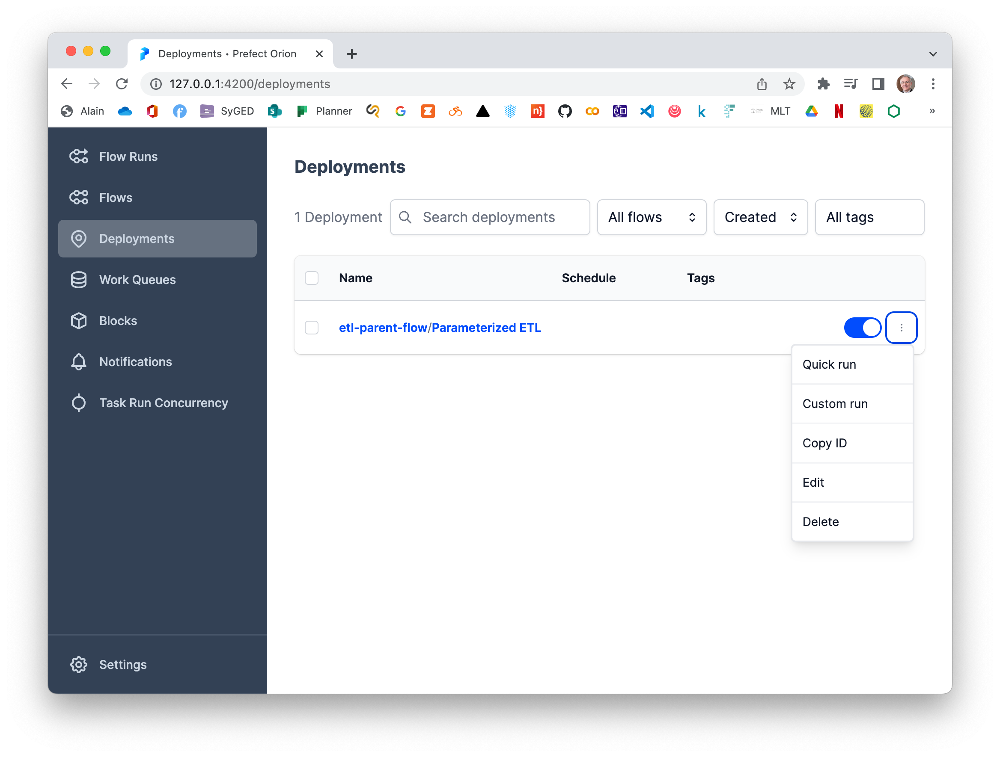
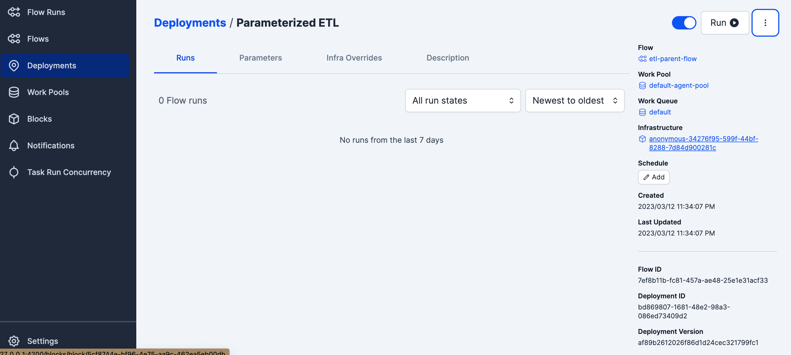
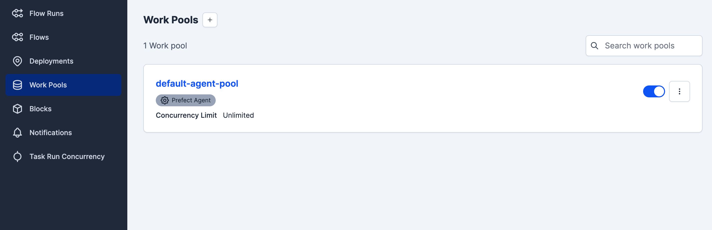
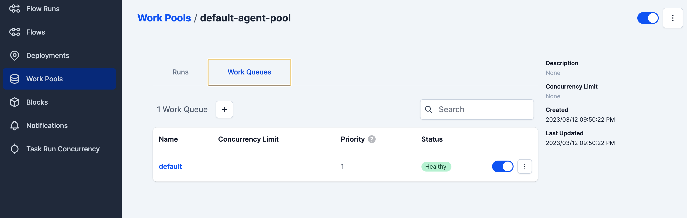
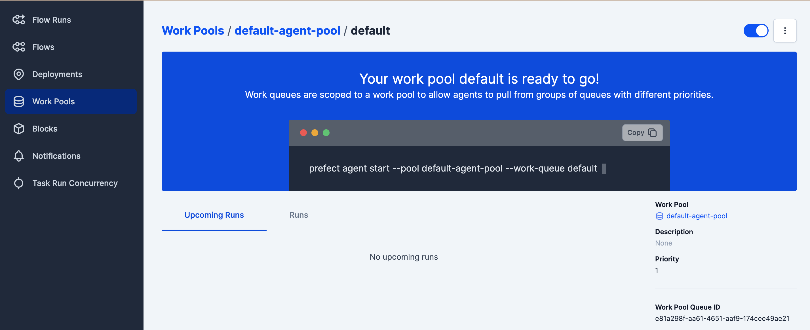

>Previous: [01_Introduction](01_Introduction.md)

>Next: [03_data_warehouse](03_data_warehouse.md)

本章总结：

* 使用Prefect实现ETL的workflow，将数据存储在云端或本地，GCP用于云端存储数据（GCS中的bucket用于存储数据，Big Query查询和计算数据）
* 实现方法：prefect **+** script.py **+** command运行py文档or Deployment

[code from the video](https://github.com/discdiver/prefect-zoomcamp)

# Data Ingestion

This lesson will cover the topics of _Data Lake_ and _pipelines orchestration with *prefect*

# -1.Data Lake

_[Video source](https://www.youtube.com/watch?v=W3Zm6rjOq70&list=PL3MmuxUbc_hJed7dXYoJw8DoCuVHhGEQb&index=16)_

## *1.1.What* is a Data Lake?


A ***Data Lake*** is a _central repository_ that holds _big data_ from many sources.

The _data_ in a Data Lake could either be structured, unstructured or a mix of both.

The main goal behind a Data Lake is being able to ingest data as quickly as possible and making it available to the other team members.

A Data Lake should be:

* Secure
* Scalable
* Able to run on inexpensive hardware

## *1.2.Data* Lake vs Data Warehouse


A Data Lake (DL) is not to be confused with a Data Warehouse (DW). There are several differences:

* Data Processing:
  * DL: The data is **raw** and has undergone minimal processing. The data is generally unstructured.
  * DW: the data is **refined**; it has been cleaned, pre-processed and structured for specific use cases.
* Size:
  * DL: Data Lakes are **large** and contains vast amounts of data, in the order of petabytes. Data is transformed when in use only and can be stored indefinitely.
  * DW: Data Warehouses are **small** in comparison with DLs. Data is always preprocessed before ingestion and may be purged periodically.
* Nature:
  * DL: data is **undefined** and can be used for a wide variety of purposes.
  * DW: data is historic and **relational**, such as transaction systems, etc.
* Users:
  * DL: Data scientists, data analysts.
  * DW: Business analysts.
* Use cases:
  * DL: Stream processing实时处理数据, machine learning, real-time analytics...
  * DW: Batch processing离线批量处理大量数据, business intelligence, BI reporting.

**Why did Data Lakes come into existence ？**

because as companies started to realize the importance of data, they soon found out that they couldn't ingest data right away into their DWs but they didn't want to waste uncollected data when their devs hadn't yet finished developing the necessary relationships for a DW, so the Data Lake was born to collect any potentially useful data that could later be used in later steps from the very start of any new projects.

* Companies realized the value of data 公司意识到数据的价值 
* Store and access data quickly 快速存储和访问数据 
* Cannot always define structure of data 不能总是定义数据的结构 
* Usefulness of data being realized later in the project lifecycle在项目生命周期后期实现的数据的有用性 
* ncrease in data scientists 数据科学家中的 lncrease 
* R&D on data products研发数据产品 
* Need for Cheap storage of Big data 需要廉价存储大数据

## *1.3. ELT vs ETL*

When ingesting data, DWs use the ***Export, Transform and Load*** (ETL) model whereas DLs use ***Export, Load and Transform*** (ELT).

The main difference between them is the order of steps. In DWs, ETL (Schema on Write) means the data is _transformed_ (preprocessed, etc) before arriving to its final destination, whereas in DLs, ELT (Schema on read) the data is directly stored without any transformations and any schemas are derived when reading the data from the DL.

## *1.4.Data Swamp - Data Lakes gone wrong*

Data Lakes are only useful if data can be easily processed from it. Techniques such as versioning and metadata are very helpful in helping manage a Data Lake. A Data Lake risks degenerating into a ***Data Swamp*** if no such measures are taken, which can lead to bad results:

* No versioning of the data
* Incompatible schemas for the same data
* No metadata associated
* Joins between different datasets are not possible

## *1.5.Data Lake Cloud Providers*

* Google Cloud Platform > [Cloud Storage](https://cloud.google.com/storage)
* Amazon Web Services > [Amazon S3](https://aws.amazon.com/s3/)
* Microsoft Azure > [Azure Blob Storage](https://azure.microsoft.com/en-us/services/storage/blobs/)

# -2.Introduction to Workflow Orchestration

工作流编排工具

_[Video source](https://www.youtube.com/watch?v=0yK7LXwYeD0&list=PL3MmuxUbc_hJed7dXYoJw8DoCuVHhGEQb&index=17)_

In the previous lesson we saw the definition of [data pipeline](1_intro.md#data-pipelines) and we created a [pipeline script](../1_intro/ingest_data.py) that downloaded a CSV and processed it so that we could ingest it to Postgres.

The script we created is an example of how **NOT** to create a pipeline,

* because it contains 2 steps which could otherwise be separated (downloading and processing). The reason is that if our internet connection is slow or if we're simply testing the script, it will have to download the CSV file every single time that we run the script, which is less than ideal.

Ideally, each of these steps would be contained as separate entities, like for example 2 separate scripts. For our pipeline, that would look like this:

```
(web) → DOWNLOAD → (csv) → INGEST → (Postgres)
```

We have now separated our pipeline into a `DOWNLOAD` script and a `INGEST` script.

In this lesson we will create a more complex pipeline:

```
(web)
  ↓
DOWNLOAD
  ↓
(csv)
  ↓
PARQUETIZE
  ↓
(parquet) ------→ UPLOAD TO S3
  ↓
UPLOAD TO GCS
  ↓
(parquet in GCS)
  ↓
UPLOAD TO BIGQUERY
  ↓
(table in BQ)
```

_Parquet_ is a [columnar storage datafile format](https://parquet.apache.org/) which is more efficient than CSV.

This ***Data Workflow*** has more steps and even branches. This type of workflow is often called a ***Directed Acyclic Graph*** (DAG)有向无环图, because it lacks any loops and the data flow is well defined.（因为它没有任何循环，数据流程是明确定义的。）

The steps in capital letters are our ***jobs*** and the objects in between are the jobs' outputs, which behave as ***dependencies*** for other jobs. Each job may have its own set of ***parameters*** and there may also be global parameters which are the same for all of the jobs.

A ***Workflow Orchestration Tool*** allows us to define data workflows and parametrize them; it also provides additional tools such as history and logging.

The tool we will focus on in this course is Prefect , but there are many others such as Luigi,  **[Apache Airflow](https://airflow.apache.org/)**,, Argo, etc.

# -3.Introduction to Prefect Concepts, without ETL

Perfect is the modern open source data flow automation platform that's going to allow you to add observability and orchestration by using python just to write code as workflows and it's going to let you build run and monitor this pipeline at scale.

## *Method_1：Not Using prefect, Manual Load Data* to Postgres

**Step1:建立ingest_data_parquet.py文档**

建立导入数据`ingest_data_parquet.py`文档，见[这个链接](../2_data_ingestion/ingest_data_parquet.py)

**Step2:docker中连接postgres**

**==tips：==**

* 在icloud中建立的ny_taxi_postgres_data文件夹，出现了权限bug

> "/var/lib/postgresql/data" has invalid permissions.
>
> 解决方法，应该是文件夹权限问题，所以在主机上新建ny_taxi_postgres_data，问题解决

```mkdir ny_taxi_postgres_data```

```
docker run -it \
    -e POSTGRES_USER="root" \
    -e POSTGRES_PASSWORD="root" \
    -e POSTGRES_DB="ny_taxi" \
    -v $(pwd)/ny_taxi_postgres_data:/var/lib/postgresql/data \
    -p 5432:5432 \
    --network=pg-network \
    --name pg-database \
    postgres:13
```

**Step3:python手动导入**

打开postgres容器后，进入·ingest_data_parquet.py·所在文件夹，并在终端中输入：

```
python ingest_data_parquet.py
```

**Step4:检查是否导入数据**

在终端中输入`pgcli -h localhost -p 5432 -u root -d ny_taxi`，打开数据库，输入`\dt`查看所有数据表

## *Method_2：Using  Prefect Workfolw  To Load Data to postgres*

***Step1:建立ingest_data_parquet_flow.py文档***

建立导入数据`ingest_data_parquet_flow.py`文档，见[这个链接](../2_data_ingestion/ingest_data_parquet_flow.py)

***Step2:检查是否安装prefect***

`prefect --version`

如果没有安装，在终端安装，`pip install prefect`

***Step3:docker中连接postgres***

**==tips：==**

* 在icloud中建立的ny_taxi_postgres_data文件夹，出现了权限bug

> "/var/lib/postgresql/data" has invalid permissions.
>
> 解决方法，应该是文件夹权限问题，所以在主机上新建ny_taxi_postgres_data，问题解决

```mkdir ny_taxi_postgres_data```

```
docker run -it \
    -e POSTGRES_USER="root" \
    -e POSTGRES_PASSWORD="root" \
    -e POSTGRES_DB="ny_taxi" \
    -v $(pwd)/ny_taxi_postgres_data:/var/lib/postgresql/data \
    -p 5432:5432 \
    --network=pg-network \
    --name pg-database \
    postgres:13
```

==可能出现的问题==：输入上面的脚本，终端显示：```docker: Error response from daemon: network pg-network not found.``

解决方法：终端输入docker network create pg-network，这个在上一章关于在Connecting pgAdmin and Postgres with Docker networking学习过，点击[link](01_Introduction.md)直达

***Step4:启动Prefect Orion orchestration engine***

* 在终端中输入 `prefect orion start`

* 新建一个终端窗口，输入 `prefect config set PREFECT_API_URL=http://127.0.0.1:4200/api`
* 打开 http://127.0.0.1:4200/ Orion interface

***Step5:安装prefect-sqlalchemy（如果 http://127.0.0.1:4200/ Orion interface，block下没有sqlalchemy）***

* 在终端中输入`pip install prefect-sqlalchemy`

* 在终端输入`prefect block register -m prefect_sqlalchemy`，重新进入 http://127.0.0.1:4200/界面block模块中，看到sqlalchemy出现

* 找到sqlalchemy，点击+，Write or select these parameters :

  - **Block Name**: postgres-connector
  - **Driver**: SyncDriver
  - **The driver name to use**: postgresql+psycopg2
  - **The name of the database to use**: ny_taxi
  - **Username**: root
  - **Password**: root
  - **Host**: localhost
  - **Port**: 5432

  Then click on the **Create** button

  可以看到下面的脚本，需要放在文档中，已经放啦

  

***Step6:导入数据***

在终端中输入`python ingest_data_parquet_flow.py`(进入py所在路径)

进程：

```bash
(base) papa@papadeMacBook-Pro 2_data_ingestion % python ingest_data_parquet_flow.py 
17:36:53.144 | INFO    | prefect.engine - Created flow run 'rainbow-manul' for flow 'Ingest Data'
17:36:53.389 | INFO    | Flow run 'rainbow-manul' - Created subflow run 'paper-cuscus' for flow 'Subflow'
17:36:53.448 | INFO    | Flow run 'paper-cuscus' - Logging Subflow for: yellow_taxi_trips_three
17:36:53.512 | INFO    | Flow run 'paper-cuscus' - Finished in state Completed()
17:36:53.538 | INFO    | Flow run 'rainbow-manul' - Created task run 'extract_data-0' for task 'extract_data'
17:36:53.539 | INFO    | Flow run 'rainbow-manul' - Executing 'extract_data-0' immediately...
--2023-03-09 17:36:53--  https://d37ci6vzurychx.cloudfront.net/trip-data/yellow_tripdata_2021-01.parquet
Resolving d37ci6vzurychx.cloudfront.net (d37ci6vzurychx.cloudfront.net)... 65.8.165.107, 65.8.165.201, 65.8.165.5, ...
Connecting to d37ci6vzurychx.cloudfront.net (d37ci6vzurychx.cloudfront.net)|65.8.165.107|:443... connected.
HTTP request sent, awaiting response... 200 OK
Length: 21686067 (21M) [application/x-www-form-urlencoded]
Saving to: 'output.csv'

output.csv              100%[===============================>]  20.68M  4.84MB/s    in 4.3s    

2023-03-09 17:36:59 (4.84 MB/s) - 'output.csv' saved [21686067/21686067]

17:37:04.265 | INFO    | Task run 'extract_data-0' - Finished in state Completed()
17:37:04.294 | INFO    | Flow run 'rainbow-manul' - Created task run 'transform_data-0' for task 'transform_data'
17:37:04.294 | INFO    | Flow run 'rainbow-manul' - Executing 'transform_data-0' immediately...
17:37:04.366 | INFO    | Task run 'transform_data-0' - pre: missing passenger count: 26726
17:37:04.530 | INFO    | Task run 'transform_data-0' - post: missing passenger count: 0
17:37:04.564 | INFO    | Task run 'transform_data-0' - Finished in state Completed()
17:37:04.594 | INFO    | Flow run 'rainbow-manul' - Created task run 'load_data-0' for task 'load_data'
17:37:04.595 | INFO    | Flow run 'rainbow-manul' - Executing 'load_data-0' immediately...
17:37:04.855 | INFO    | Task run 'load_data-0' - Created a new engine.
17:37:05.362 | INFO    | Task run 'load_data-0' - Created a new connection.
17:40:48.765 | INFO    | Task run 'load_data-0' - Finished in state Completed()
17:40:48.829 | INFO    | Flow run 'rainbow-manul' - Finished in state Completed('All states completed.')
```

***Step7:检查是否导入数据***

在终端中输入`pgcli -h localhost -p 5432 -u root -d ny_taxi`，打开数据库，输入`\dt`查看所有数据表

```bash
(base) papa@papadeMacBook-Pro 2_data_ingestion % pgcli -h localhost -p 5432 -u root -d ny_taxi
Server: PostgreSQL 13.10 (Debian 13.10-1.pgdg110+1)
Version: 3.5.0
Home: http://pgcli.com
root@localhost:ny_taxi> \dt
+--------+-------------------------+-------+-------+
| Schema | Name                    | Type  | Owner |
|--------+-------------------------+-------+-------|
| public | yellow_taxi_trips       | table | root  |
| public | yellow_taxi_trips_three | table | root  |
| public | yellow_taxi_trips_two   | table | root  |
+--------+-------------------------+-------+-------+
SELECT 3
Time: 0.039s
root@localhost:ny_taxi> select count(1) from yellow_taxi_trips_three
+---------+
| count   |
|---------|
| 1343043 |
+---------+
SELECT 1
Time: 1.192s (1 second), executed in: 1.186s (1 second)
```

***Step8:关闭***

Ctrl+D to quit pgcli.

Ctrl+C to quit Orion.

# 4.ETL with GCP & Prefect

_[videocourse](https://www.youtube.com/watch?v=W-rMz_2GwqQ&list=PL3MmuxUbc_hJed7dXYoJw8DoCuVHhGEQb&index=20)_

## ***Step1:Start Prefect Orion***

终端输入`prefect orion start`

Check out the dashboard at [http://127.0.0.1:4200](http://127.0.0.1:4200/)

## ***Step2:Load and save data***

### *** 2.1.Load and save data in local, without GCP Bucket***

***建立并运行etl_web_to_gcs.py文档***

建立导入数据`etl_web_to_local.py`文档，见[这个链接](../2_data_ingestion/etl_web_to_local.py)

终端输入`python etl_web_to_local.py`

过程:

```bash
(base) ola@192 2_data_ingestion % python etl_web_to_local.py
11:52:56.814 | INFO    | prefect.engine - Created flow run 'myrtle-oryx' for flow 'etl-web-to-gcs'
11:52:57.234 | INFO    | Flow run 'myrtle-oryx' - Created task run 'fetch-0' for task 'fetch'
11:52:57.236 | INFO    | Flow run 'myrtle-oryx' - Executing 'fetch-0' immediately...
--2023-03-12 11:52:57--  https://d37ci6vzurychx.cloudfront.net/trip-data/yellow_tripdata_2021-01.parquet
Resolving d37ci6vzurychx.cloudfront.net (d37ci6vzurychx.cloudfront.net)... 143.204.101.58, 143.204.101.63, 143.204.101.175, ...
Connecting to d37ci6vzurychx.cloudfront.net (d37ci6vzurychx.cloudfront.net)|143.204.101.58|:443... connected.
HTTP request sent, awaiting response... 200 OK
Length: 21686067 (21M) [application/x-www-form-urlencoded]
Saving to: 'output_flow_etl.parquet'

output_flow_etl.parquet                            100%[================================================================================================================>]  20.68M  8.56MB/s    in 2.4s    

2023-03-12 11:53:01 (8.56 MB/s) - 'output_flow_etl.parquet' saved [21686067/21686067]

11:53:02.086 | INFO    | Task run 'fetch-0' - Finished in state Completed()
11:53:02.138 | INFO    | Flow run 'myrtle-oryx' - Created task run 'clean-0' for task 'clean'
11:53:02.141 | INFO    | Flow run 'myrtle-oryx' - Executing 'clean-0' immediately...
11:53:02.496 | INFO    | Task run 'clean-0' -    VendorID tpep_pickup_datetime tpep_dropoff_datetime  passenger_count  trip_distance  RatecodeID  ... tip_amount  tolls_amount  improvement_surcharge  total_amount  congestion_surcharge  airport_fee
0         1  2021-01-01 00:30:10   2021-01-01 00:36:12              1.0            2.1         1.0  ...        0.0           0.0                    0.3          11.8                   2.5          NaN
1         1  2021-01-01 00:51:20   2021-01-01 00:52:19              1.0            0.2         1.0  ...        0.0           0.0                    0.3           4.3                   0.0          NaN

[2 rows x 19 columns]
11:53:02.500 | INFO    | Task run 'clean-0' - columns: VendorID                          int64
tpep_pickup_datetime     datetime64[ns]
tpep_dropoff_datetime    datetime64[ns]
passenger_count                 float64
trip_distance                   float64
RatecodeID                      float64
store_and_fwd_flag               object
PULocationID                      int64
DOLocationID                      int64
payment_type                      int64
fare_amount                     float64
extra                           float64
mta_tax                         float64
tip_amount                      float64
tolls_amount                    float64
improvement_surcharge           float64
total_amount                    float64
congestion_surcharge            float64
airport_fee                     float64
dtype: object
11:53:02.503 | INFO    | Task run 'clean-0' - rows: 1369769
11:53:02.567 | INFO    | Task run 'clean-0' - Finished in state Completed()
11:53:02.630 | INFO    | Flow run 'myrtle-oryx' - Created task run 'write_local-0' for task 'write_local'
11:53:02.633 | INFO    | Flow run 'myrtle-oryx' - Executing 'write_local-0' immediately...
11:53:07.652 | INFO    | Task run 'write_local-0' - Finished in state Completed()
11:53:07.696 | INFO    | Flow run 'myrtle-oryx' - Finished in state Completed('All states completed.')
```

### 2.2.*Load data and save data in GCP Bucket*

* **建立一个bucket（在Cloud Storage下面），**在GCP的IM中建立一个service account，建立一个项目，也可以在老的服务账号里，如何建立一个Create service account：
  * On **Google Cloud Console**, select **IAM & Admin**, and **Service Accounts**. Then click on **+ CREATE SERVICE ACCOUNT** with these informations:
    - Service account details: zoom-de-service-account
    - Click on **CREATE AND CONTINUE** button.
    - Give the roles **BigQuery Admin** and **Storage Admin**.
    - Click on **CONTINUE** button.
    - Click on **DONE** button.
* **GCS Bucket Block**
  * 在**prefect**中建立**普通**GCS Bucket的**Block**
    * Inside Orion, select **Blocks** at the left menu, choose the block **GCS Bucket** and click **Add +** button. Complete the form with:
    * Block Name: zoom-gcs
    * Name of the bucket: dtc_data_lake_firstone==GCS中建立的bucket名字一样==
    * click create button
  * 在**prefect**中建立**加密GCS Bucket的**Block
    * Under **Gcp Credentials**, click on **Add +** button to create a **GCP Credentials** with these informations:
    * block Name: zoom-gcp-creds
    * 将service account中的key json内容贴进去，可以直接手动个打开粘贴复制，也可以使用命令
      * `cat ~/opt/gcp/hopeful-summer-375416-c150de675a7d.json | pbcopy`
  * ==可能出现的问题==：打开prefect orion后，在http://127.0.0.1:4200的block下面找不到GCS Bucket，需要重新安装一下prefect-gcp，在终端输入
    * `pip install prefect_gcp`
    * `prefect block register -m prefect_gcp`
    * 重新刷新http://127.0.0.1:4200，在block下找到GCS Bucket
* **Modify our python program**

We then obtain a fragment of code to insert into our python code. Which allows us to add the `write_gcs` method to `etl_web_to_gcs.py`增加函数：

```python
@task
def write_gcs(path: Path) -> None:
    """Upload local parquet file to GCS"""
    gcs_block = GcsBucket.load("zoom-gcp")
    gcs_block.upload_from_path(from_path=path, to_path=path)
    return
```

* **Run the python program again**

`python etl_web_to_gcs.py`

* **back to GCP, check out the added data in your bucket**

Before leaving, I deleted my bucket.**？？？why did this man delete his bucket？？？**

`Ctrl+C` to stop Prefect Orion.

# 5.From Google Cloud Storage to Big Query

_[videocourse](https://www.youtube.com/watch?v=Cx5jt-V5sgE&list=PL3MmuxUbc_hJed7dXYoJw8DoCuVHhGEQb&index=21)_

Now let’s create another python program to load our data into the Google Cloud Storage (GCS) to Big Query.

## *Method_1：Manual setup In GCP UI interface*

| choose big query from the left hamburger menu | choose Google Cloud Storage  | You need to decide the final part of Destination, except for the Project that should be choosen from existed ones | check out the data using query, after the former steps |
| --------------------------------------------- | ---------------------------- | ------------------------------------------------------------ | ------------------------------------------------------ |
|                         |  |                                  |                            |

## *Method_2：Prefect Workfolw setup using python*

### ***Step1:Start Prefect Orion***

* type this command at the prompt：`prefect orion start`

* Check out the dashboard at [http://127.0.0.1:4200](http://127.0.0.1:4200/)

### *Step2:Modify and Run  python program*

* establishe`etl_gcs_to_bq.py`文档，见[这个链接](../2_data_ingestion/etl_gcs_to_bq.py)

  * in this document, there is some script like:

    ```python
    def write_bq(df: pd.DataFrame) -> None:
        """Write DataFrame to BiqQuery"""
    
        gcp_credentials_block = GcpCredentials.load("zoom-gcp-creds")
    
        df.to_gbq(
            destination_table="dezoomcamp.rides",
            project_id="fast-mariner-379909",
            credentials=gcp_credentials_block.get_credentials_from_service_account(),
            chunksize=500_000,
            if_exists="append",
        )
    ```

    `gcp_credentials_block = GcpCredentials.load("zoom-gcp-creds")`， ==you need to estabish a credential GCS Block in the Prefect, before run etl_gcs_to_bq.py.== How to do this  you can click here to find out[ 在**prefect**中建立**加密GCS Bucket的**Block](##Step2:With GCP Bucket)

* type this command at the prompt：`python etl_gcs_to_bq.py`

### *Step3:check out the outcome in GCP just like method_1*

Check out the big query , you should see the table you added in step2.

# 6.Parametrizing Flow & Deployments with ETL into GCS flow

参数流程&调度

We will see in this section:

- Parametrizing the script from your flow (rather then hard coded)
- Parameter validation with Pydantic
- Creating a deployment locally
- Running the flow
- Setting up Prefect Agent
- Notifications

## 6.1.*Parametrizing the script from your flow*

从流程中参数化脚本，使用for循环？？

### ***Step1:Start Prefect Orion***

* type this command at the prompt：`prefect orion start`

* Check out the dashboard at [http://127.0.0.1:4200](http://127.0.0.1:4200/)

### *Step2:Modify and Run  python program*

establishe`parameterized_flow.py`文档，见[这个链接](../2_data_ingestion/parameterized_flow.py)


## 6.2.*Parameter validation with Pydantic*

We do nothing with Pydantic in the video… But it would be relevant to add this tool in my code. See [pydantic](https://docs.pydantic.dev/).

There are many ways to create a deployment, but we will use [CLI](https://docs.prefect.io/concepts/deployments/#create-a-deployment-on-the-cli). In a future video, we will see how to deploy with python script.See [Deployments overview](https://docs.prefect.io/concepts/deployments/#deployments-overview) for more information.

## *6.3.Building a deployment locally*

### Step1:create a deployment file.

```bash
cd ~/iCloud/Data-Engineer-Zoomcamp/2_data_ingestion/flows
prefect orion start

prefect deployment build 03_deployments/parameterized_flow.py:etl_parent_flow -n "Parameterized ETL"
```

A deployment model `etl_parent_flow-deployment.yaml` is created.

edit etl_parent_flow-deployment.yaml, parameters: {}--->parameters: {color : "yellow",months :[1, 2, 3],year :2021}

过程：

```bash
(base) ola@192 2_data_ingestion % prefect deployment build parameterized_flow.py:etl_parent_flow -n "Parameterized ETL"
Found flow 'etl-parent-flow'
Default '.prefectignore' file written to /Users/ola/Library/Mobile 
Documents/com~apple~CloudDocs/Data-Engineer-Zoomcamp/2_data_ingestion/.prefectignore
Deployment YAML created at '/Users/ola/Library/Mobile 
Documents/com~apple~CloudDocs/Data-Engineer-Zoomcamp/2_data_ingestion/etl_parent_flow-deployment.yaml'.
Deployment storage None does not have upload capabilities; no files uploaded.  Pass --skip-upload to suppress this warning.
```

### Step2:*Ready to be run the flow in Prefect UI* 

```bash
prefect deployment apply etl_parent_flow-deployment.yaml
```

```bash
(base) ola@192 2_data_ingestion % prefect deployment apply etl_parent_flow-deployment.yaml
Successfully loaded 'Parameterized ETL'
Deployment 'etl-parent-flow/Parameterized ETL' successfully created with id 'bd869807-1681-48e2-98a3-086ed73409d2'.
View Deployment in UI: http://127.0.0.1:4200/deployments/deployment/bd869807-1681-48e2-98a3-086ed73409d2

To execute flow runs from this deployment, start an agent that pulls work from the 'default' work queue:
$ prefect agent start -q 'default'
```

| Go to the Orion UI. We should see the deployment model is there. |                                  |
| ------------------------------------------------------------ | -------------------------------- |
|                               |  |

Click on **Quick run** button.

Select **Flow Runs** in the left menu. Orion UI should indicate that our run is in **Scheduled** state.

The **Scheduled** state indicates that our flow a ready to be run but we have no agent picking of this run.

### *Step3:Setting up Prefect Agent to run the flow*

| Select **Work Pools** in the left menu. |                                 |                                 |
| --------------------------------------- | ------------------------------- | ------------------------------- |
|           |  |  |

copy the code in picture3 into the terminal

`prefect agent start --pool default-agent-pool --work-queue default`

## 6.4.*Notifications*

We can setup a notification.

Go to the Orion UI, select **Notifications** and create a notification.

# 7.Schedules and Docker Storage with Infrastructure

We will see in this section:

- Scheduling a deployment
- Flow code storage
- Running tasks in Docker

## *Scheduling a deployment*

* See [Schedules](https://docs-v1.prefect.io/core/concepts/schedules.html) for more information.

* See crontab work schedule snytax:

```scss
*     *     *   *    *        command to be executed
-     -     -   -    -
|     |     |   |    |
|     |     |   |    +----- day of the week (0 - 6) (Sunday=0)
|     |     |   +------- month (1 - 12)
|     |     +--------- day of the month (1 - 31)
|     +----------- hour (0 - 23)
+------------- min (0 - 59)
```

* Make sure that Prefect Orion UI is started.

```bash
cd ~/iCloud/Data-Engineer-Zoomcamp/2_data_ingestion/
prefect orion start

prefect deployment parameterized_flow.py:etl_parent_flow -n etl2 --cron "0 0 * * *" -a
```

We should see this in the terminal window.

```bash
Found flow 'etl-parent-flow'
Default '.prefectignore' file written to /Users/boisalai/GitHub/prefect/.prefectignore
Deployment YAML created at '/Users/boisalai/GitHub/prefect/etl_parent_flow-deployment.yaml'.
Deployment storage None does not have upload capabilities; no files uploaded.  Pass --skip-upload to suppress this
warning.
Deployment 'etl-parent-flow/etl2' successfully created with id 'e580671d-3677-4e8d-8041-a6591ec0a92a'.

To execute flow runs from this deployment, start an agent that pulls work from the 'default' work queue:
$ prefect agent start -q 'default'
```

We should see new deployment that is named etl2  on the Orion UI, and it will execute everyday at 24:00.

* We can obtain help on prefect command.

```
prefect deployment --help
prefect deployment build --help
prefect deployment apply --help
```

## *Flow code storage in Docker*

we will store our code in Docker Hub.we're going to put those right into the docker image and they'll save us some time down the road when we want to pull those images and run things.

### Step1: register in Docker Hub

https://hub.docker.com/

### Step2: Let’s make a `Dockerfile`.

**File `~/iCloud/Data-Engineer-Zoomcamp/2_data_ingestion/docker-requirements.txt`**

```txt
pandas==1.5.2
prefect-gcp[cloud_storage]==0.2.4
protobuf==4.21.11
pyarrow==10.0.1
```

**File `~/iCloud/Data-Engineer-Zoomcamp/2_data_ingestion/Dockerfile`**

``` dockerfile
# base Docker image that we will build on
# use image：prefecthq/prefect，并指定了版本号为 2.7.7-python3.9
FROM prefecthq/prefect:2.7.7-python3.9

# 该命令将本地的 docker-requirements.txt 文件复制到 Docker 镜像中，这里的目标路径是 Docker 镜像的根目录。
COPY docker-requirements.txt

# 安装 docker-requirements.txt 文件中指定的 Python 依赖包。
#其中，--trusted-host pypi.python.org 选项指定了信任的 PyPI 主机，--no-cache-dir 选项指定了不使用缓存目录。
RUN pip install -r docker-requirements.txt --trusted-host pypi.python.org --no-cache-dir

# 该命令将本地的 flows 目录复制到 Docker 镜像中，这里的目标路径是 /opt/prefect/flows
COPY flows /opt/prefect/flows

# 该命令在 Docker 镜像中创建一个目录 /opt/prefect/data/yellow，其中 -p 选项表示如果目录不存在，则会自动创建父目录。
RUN mkdir -p /opt/prefect/data/yellow
```

### Step3: Let’s make a `docker image`.

``` bash
open your docker  app
cd ~/iCloud/Data-Engineer-Zoomcamp/2_data_ingestion
docker image build -t sleepyola/prefect:zoom .
```

Note that `sleepyola` is my dockerhub username.

### Step4: push that image to your dockerhub

Make sure you are already logged to dockerhub.

``` bash
cd ~/iCloud/Data-Engineer-Zoomcamp/2_data_ingestion
docker login -u sleepyola
docker image push sleepyola/prefect:zoom
```

### Step5: create a DockerContainer block 

#### 5.1.method_1: in prefect Orion Ui

Go to the Orion UI, select **Blocks** in the right menu, click the **+** button to add a **Docker Container** with these
information:

- **Block Name**: zoom
- **Type (Optional)** \> The type of infrastructure: **docker-container**
- **Image (Optional)** \> Tag of a Docker image to use: **sleepyola/prefect:zoom**
- **ImagePullPolicy (Optional)**: ALWAYS
- **Auto Remove (Optional)**: ON

Then click on **Create** button.

#### 5.2.method2: from python

Note that it is also possible to create a DockerContainer block from python.

**File `make_docker_block.py`**

``` python
from prefect.infrastructure.docker import DockerContainer

## alternative to creating DockerContainer block in the UI
docker_block = DockerContainer(
    image="sleepyola/prefect:zoom",  # insert your image here
    image_pull_policy="ALWAYS",
    auto_remove=True,
)

docker_block.save("zoom", overwrite=True)
```

### Step6: create a deployment  

We already know how to create a deployment file from command line. [you can check here](##6.3.Building a deployment locally)

Now, we will create a deployment file from python.

**File `docker_deploy.py`**

``` python
from prefect.deployments import Deployment
from parameterized_flow import etl_parent_flow
from prefect.infrastructure.docker import DockerContainer

docker_block = DockerContainer.load("zoom")

docker_dep = Deployment.build_from_flow(
    flow=etl_parent_flow,
    name="docker-flow",
    infrastructure=docker_block,
)


if __name__ == "__main__":
    docker_dep.apply()
```

Then, execute this script with this command.

``` bash
cd ~/iCloud/Data-Engineer-Zoomcamp/2_data_ingestion
python flows/03_deployments/docker_deploy.py
```

Go to the Orion UI, select **Deployments** in the the menu. We should see the **docker-flow**. Click on it.

if you want to add more deployments in one python script, here is the example:

假设有一个名为`/opt/prefect/flows`的文件夹，其中包含两个Prefect流程定义文件`flow1.py`和`flow2.py`，并且每个文件定义了一个名为`flow1`和`flow2`的Prefect流程。现在，我们可以创建一个新文件`main.py`，用于在同一Docker容器中部署这两个流程。

```python
from prefect.deployments import Deployment
from parameterized_flow import flow1, flow2
from prefect.infrastructure.docker import DockerContainer

docker_block = DockerContainer.load("zoom")

deployments = []

# 部署 flow1
dep1 = Deployment.build_from_flow(
    flow=flow1,
    name="docker-flow1",
    infrastructure=docker_block,
)
deployments.append(dep1)

# 部署 flow2
dep2 = Deployment.build_from_flow(
    flow=flow2,
    name="docker-flow2",
    infrastructure=docker_block,
)
deployments.append(dep2)

# 应用所有的部署
for deployment in deployments:
    deployment.apply()
```

在这个例子中，我们导入了两个流程定义，`flow1`和`flow2`，然后分别用它们来构建两个部署对象，并添加到一个列表中。最后，我们循环遍历这个列表，并将每个部署对象应用到Prefect引擎中。这样，我们就可以在同一个Docker容器中部署多个Prefect流程定义文件。


See a list of available profiles:

``` bash
cd ~/iCloud/Data-Engineer-Zoomcamp/2_data_ingestion
prefect profile ls
```

> `prefect profile ls`是Prefect CLI中的一个命令，用于列出当前系统中的所有Prefect配置文件及其相关信息。这些配置文件中包含了Prefect连接不同运行时后端的信息，例如连接Prefect Cloud或者Prefect Server等。在使用Prefect CLI和Prefect Engine运行workflow时，可以通过这些配置文件来指定要使用的运行时后端，以及该后端的相关信息。

``` bash
cd ~/iCloud/Data-Engineer-Zoomcamp/2_data_ingestion
prefect config set PREFECT_API_URL="http://127.0.0.1:4200/api"
```

> `prefect config set PREFECT_API_URL="http://127.0.0.1:4200/api"`是Prefect CLI中的一个命令，用于设置Prefect CLI的全局配置参数。在这个例子中，这个命令设置了Prefect CLI使用的Prefect Server API的URL地址为"http://127.0.0.1:4200/api"。这个命令可以让Prefect CLI在运行时自动连接到指定的Prefect Server API，以便执行一些与Server API相关的操作，例如在Prefect Server中创建/修改workflow、任务等等。

See [this link ,you can get some help](https://docs.prefect.io/concepts/settings/#setting-and-clearing-values).

```bash
执行 docker run -it sleepyola/prefect:zoom 后，终端变成了 root@b05e8f2abacb:/opt/prefect#，这表示你已经进入了 Docker 容器的命令行界面，其中 b05e8f2abacb 是容器的 ID，/opt/prefect# 是容器的工作目录。这意味着你可以在这个容器内执行命令，如在容器中安装软件、运行脚本等。当你退出容器的命令行界面后，该容器将停止运行。
```


Now the docker interface could communicate with the Orion server.

``` bash
cd ~/iCloud/Data-Engineer-Zoomcamp/2_data_ingestion
prefect agent start -q default
```

### Step7:Running tasks in Docker

#### 7.1.method_1:use command line

Now we could run our flow from Orion UI or from command line. Here is how to do with command line.

``` bash
cd ~/iCloud/Data-Engineer-Zoomcamp/2_data_ingestion

prefect deployment run etl-parent-flow/docker-flow -p "months=[1,2]"
```

We should see this in the terminal window.

``` txt
Creating flow run for deployment 'etl-parent-flow/docker-flow'...
Created flow run 'precious-numbat'.
└── UUID: 133c8d13-ee98-4944-8f21-245af5db8b9b
└── Parameters: {'months': [1, 2]}
└── Scheduled start time: 2023-01-28 16:32:44 EST (now)
└── URL: http://127.0.0.1:4200/flow-runs/flow-run/133c8d13-ee98-4944-8f21-245af5db8b9b
```

#### **7.2.method_2:use prefect orion ui**

open prefect agent -->Click on Deployments, select docker-flow, select Runs tab.

==可能出现的问题==：

* 在执运行后，prefect agent执行终端页面出现bugsh`1: wget: @SaveToNotion #thread found`，原因是在docker的容器内没有安装wget，所以需要在DockerFile中加入安装的脚本`RUN apt-get update && apt-get install -y wget`，重新创建prefect的镜像

  * 解决方法：在这之前需要删除之前创建的image镜像
    * 退出要删除的正在运行的image
    * 可以在docker desktop上手动删除，但是推送到docker hub上的image仍然存在，好像是因为docker hub会缓存镜像
    * 在终端输入 `docker rmi imagename`，刷新docker hub后，没有变化
    * 再次登陆docker hub，手动删除image镜像

* 上面问题解决后，又出现问题：

  ```bash
  Flow run encountered an exception. google.auth.exceptions.DefaultCredentialsError: Could not automatically determine credentials. Please set GOOGLE_APPLICATION_CREDENTIALS or explicitly create credentials and re-run the application. For more information, please see https://cloud.google.com/docs/authentication/getting-started
  ```

  * 解决方法：在脚本中使用的gcp Block中加入 **Gcp Credentials**，具体方法见[点击这里](###2.2.*Load data and save data in GCP Bucket*)
    * **To solve this problem, I have go into Orion server, I selected my **zoom-gcp block and I added in the field **Gcp Credentials** my **zoom-gcp-creds**.The files appeared in my google bucket with no error message!

## See also

- [Jeff Hale - Supercharge your Python code with Blocks \| PyData NYC 2022](https://www.youtube.com/watch?v=sR9fNHfOETw)

# 8.Prefect Cloud and Additional Resources

See [DE Zoomcamp 2.2.7 - Prefect Cloud/Additional resources](https://www.youtube.com/watch?v=gGC23ZK7lr8).

We will see:

- Using Prefect Cloud instead of local Prefect
- Workspaces
- Running flows on GCP

Recommended links:

- [Prefect docs](https://docs.prefect.io/)
- [Prefect Discourse](https://discourse.prefect.io/)
- [Prefect Cloud](https://app.prefect.cloud/)
- [Prefect Slack](https://prefect-community.slack.com/)
- [Anna Geller GutHub](https://github.com/anna-geller)
