> Previous:[01_Introduction](01_Introduction.md)
>
> [See the content tree](index.md)
>
> Next:[03_data-warehouse](03_data-warehouse.md)

# 1.Intro to Orchestration

*[videocourse](https://www.youtube.com/watch?v=Li8-MWHhTbo&list=PL3MmuxUbc_hJed7dXYoJw8DoCuVHhGEQb)*

> 编排（Orchestration）是通过**自动化**实现的一种依赖管理过程

In this section, we'll cover the basics of workflow orchestration. We'll discuss what it is, why it's important, and how it can be used to build data pipelines.


**1.1.what is Orchestration?**

* A large part of data engineering is **extracting, transforming, and loading** data between sources.


* **Orchestration** is a process of dependency management, facilitated through **automation**.orchestration is one of the undercurrents.when we say orchestration is an undercurrent that means it happens throughout the entire life cycle of data engineering.
* The data orchestrator manages scheduling, triggering, monitoring, and even resource allocation. 
  * ☝️ Every workflow requires sequential steps.（每个工作流程都需要按**顺序**进行的步骤） 
  *  ☔️ Poorly sequenced transformations brew a storm far more bitter.（顺序不当的转换会酿成更为痛苦的风暴） 
  * 📕 Steps 🟰 tasks（步骤 🟰 任务）
  *  🔄 Workflows 🟰 DAGs（工作流程 🟰 有向无环图（DAGs，Directed Acyclic Graphs））


**1.2.What does a *good* solution look like?**

it's important to have good orchestrator to have a good solution.

- Workflow management
- Automation
- Error handling 
- Recovery
- Monitoring, alerting
- Resource optimization
- Observability
- Debugging
- Compliance/Auditing

# 2.Mage

In this section, we'll introduce the Mage platform. We'll cover what makes Mage different from other orchestrators, the fundamental concepts behind Mage, and how to get started. To cap it off, we'll spin Mage up via Docker 🐳 and run a simple pipeline.

## 2.1.what's Mage

*[Videocourse](https://www.youtube.com/watch?v=AicKRcK3pa4&list=PL3MmuxUbc_hJed7dXYoJw8DoCuVHhGEQb&index=18)*

*Mage An open-source pipeline tool for orchestrating, transforming, and integrating data* . *more details about it, check  [here](https://docs.docker.com/get-docker/).*

## 2.2.Configure Mage

*[Videocourse](https://www.youtube.com/watch?v=2SV-av3L3-k&list=PL3MmuxUbc_hJed7dXYoJw8DoCuVHhGEQb&index=19)*

we need to use Mage to make a pipeline, so we need to configure Mage. Here, we use Docker to make it.All the command line works in your computer's Terminal.

* **Step1:  start by cloning the repo:**

```bash
git clone https://github.com/mage-ai/mage-zoomcamp.git mage-zoomcamp
```

There are some files in the repo:

> `docker-compose.yml` 文件使用 `Dockerfile` 进行构建，并在容器中设置各种环境变量、共享文件等配置。这样可以通过一条命令启动多个相互协作的服务。

we have a **docker-compose.yml** file, some contents in ${}, that means pulling variables locally and then injecting them into our Docker containers. and all the variables are in **.env** file（隐藏文件，在电脑文件中看不到，在vscode中可以看到）

saving your password or something in  **.env** file is a very safe way for ensuring security.

requirements.txt

docker-compose.yml

README.md

Dockerfile

.env

* **Step2: Navigate to the repo:**

```bash
cd mage-zoomcamp
```

* **Step3: use command** 

```bash
mv dev.env .env
```

Rename `dev.env` to simply `.env`— this will _ensure_ the file is not committed to Git by accident, since it _will_ contain credentials in the future.

* **Step4: Now, let's build the container：**

  使用`docker compose build`这意味着你的项目可能有多个服务，每个服务都有一个独立的 Dockerfile，并且这些服务在 `docker-compose.yml` 文件中进行了定义.`docker-compose build` 会根据 `docker-compose.yml` 文件中的配置构建所有的服务。

```bash
docker compose build
```

create and open a new container


* **Step5: Finally, start the Postges and Mage containers:**

```bash
docker compose up
```

create and open some new containers form file **docker-compose.yml**

here is a [docker-compose.yml](../2_workflow-orchestration/mage-zoomcamp/docker-compose.yml):


Now, navigate to http://localhost:6789 in your browser! Voila! 

PS: In the future, you might need to update Mage image version, use the command down below to make it.

```
docker pull mageai/mageai:latest
```

## 2.3.A example Pipeline

*[Videocourse](https://www.youtube.com/watch?v=stI-gg4QBnI&list=PL3MmuxUbc_hJed7dXYoJw8DoCuVHhGEQb&index=20)*

Navigate to http://localhost:6789 in your browser.There is a project called magic-zoomcamp, and there is a example pipeline alreday in it. You can check it out and know how it works.

# 3.Load to Local : Mage and Postgres

Hooray! Mage is up and running. Now, let's build a *real* pipeline. 

In this section, we'll build a simple ETL pipeline that **loads data** from an **API** into a **local** Postgres database. 

Our database will be built using Docker— it will be running locally, but it's the same as if it were running in the cloud.

## 3.1.Configure Postgres

*[Videocourse](https://www.youtube.com/watch?v=pmhI-ezd3BE&list=PL3MmuxUbc_hJed7dXYoJw8DoCuVHhGEQb&index=21)*

> 配置环境变量到mage---打开2.2配置的容器---测试连接

Configuring Postgres in the project within Mage in order to make sure we  connected to that postgres container(配置postgres，以确保连接postgres container).

**Step1: Add environment variables that is in `.env` into `io_config.yaml` file.** 

The `io_config` YAML file contains the information and credentials required to access databases, data warehouses, and data lakes.You can learn more about io_config.yaml in [here](https://docs.mage.ai/development/io_config).You can learn more about variable interpolation and referencing secrets via our variables overview [here](https://docs.mage.ai/development/variables/overview).

You can do this in Vscode or Mage UI. In Mage, find the files button on the side bar, click it to go to the project's file. Just like the picture below down.


Find io_config.yaml and add these code into it.

```yaml
dev:
    POSTGRES_CONNECT_TIMEOUT: 10
    POSTGRES_DBNAME: "{{ env_var('POSTGRES_DBNAME') }}"
    POSTGRES_SCHEMA: "{{ env_var('POSTGRES_SCHEMA') }}"
    POSTGRES_USER: "{{ env_var('POSTGRES_USER') }}"
    POSTGRES_PASSWORD: "{{ env_var('POSTGRES_PASSWORD') }}"
    POSTGRES_HOST: "{{ env_var('POSTGRES_HOST') }}"
    POSTGRES_PORT: "{{ env_var('POSTGRES_PORT') }}"
```

**Step2: test the connection with postgres**

* create a new pipeline

  

* use ` Pipeline settings`, rename the pipeline you just created, new name is test_config

  

  

* use ` Edit pipeline` , click `Data loader` 

  

Set as picture below down, type `SELECT 1`to test. if no error occer, well done!


## 3.2.ETL: Ingest data to Postgres

*[Videocourse](https://www.youtube.com/watch?v=Maidfe7oKLs&list=PL3MmuxUbc_hJed7dXYoJw8DoCuVHhGEQb&index=22)*

**Step1: create a new pipeline named api_to_postgres in Mage**

**Step2: Load Data **

* use ` Edit pipeline`, click `Data loader` ---`python`---`API`

* you will get a data load python script, paste data url into it.

  > we will use this data url: https://github.com/DataTalksClub/nyc-tlc-data/releases/download/yellow/yellow_tripdata_2021-01.csv.gz

  The whole script you can check out here [load_data.py](../2_workflow-orchestration/mage_postgres/load_data.py)

**Step3: Transform Data**

There are some issues with the data you just loaded. You might want to look into it and convert it into a more organized format. Specifically, the 'passenger_count' has values of   0, which is incorrect. We need to make a transformation for that.

click `transformer` ---`python`---`Generic(no template)`

The whole script you can check out here [transform_data.py](../2_workflow-orchestration/mage_postgres/transform_data.py)

**Step4: Export Data**

we can use python or sql to export our data. Here, we choose to use python.

click `Data exporter` ---`python`---`PostgreSQL`

The whole script you can check out here [export_data.py](../2_workflow-orchestration/mage_postgres/export_data.py)

Finally, you can create a new data loader to test your data.

use: 

```sql
SELECT * FROM ny_taxi.yellow_cab_data LIMIT 10
```

# 4.Load to Cloud:Mage and GCP

welcome back in this module we're going to do everything we need to do in Google Cloud for mage to read and write data to both Google Cloud Storage and Google BigQuery.

## 4.1.Configure GCP

[*Videocourse*](https://www.youtube.com/watch?v=00LP360iYvE&list=PL3MmuxUbc_hJed7dXYoJw8DoCuVHhGEQb)

**Step1: create a new bucket named `mage-zoomcamp`**

Go to GCP, and search the`cloud storage`. `create`,don't need to modify eveything. Just press `continue` to create a new bucket.

**Step2: create a new Service accounts **

Mage uses service accounts to connect to gcp. Go to GCP, and search the`Service accounts`, press `createService accounts  `:

1. give it a new name `mage-zoomcamp`, 
2. Grant this service account access to project bisic viewer. 
3. Done.
4. Create and download a key for the Service accounts you just created.

**Step3:  Configure GCP in Mage**

1. Move the key json file to your Mage project directory

2. Go to `localhost:6789`

3. Modify  `io_config.yaml` file

   

5. You can check  [docker-compose.yml](../2_workflow-orchestration/mage-zoomcamp/docker-compose.yml), find this code:`volumes: - .:/home/src/` in Mage image, that means copy eveything in this directory to `/home/src/` which is in the mage.so, you can use terminal in Mage `ls -la` find your key json file.


6. copy the json file name and change the `GOOGLE_SERVICE_ACC_KEY_FILEPATH:`, ok, everything is done here. 


7. Let's check if the connection to GCP is good.

   

## 4.2.ETL: Ingest data to GCS

[*Videocourse*](https://www.youtube.com/watch?v=w0XmcASRUnc&list=PL3MmuxUbc_hJed7dXYoJw8DoCuVHhGEQb)

we'll walk through the process of using Mage to extract, transform, and load data from an API to Google Cloud Storage (GCS).

###  Pipeline-1:load local data into GCS

1. Here, use the data that created by a pipeline named example_pipeline in Mage. 


2. You can get the `titanic_clean.csv`  in your local `mage-zoomcamp` folder.You wiil upload it to GCS bucket. 

   Uploading local csv file to your bucket successfully means the connection with GCS is correct.

   

3. After step2, You can either create a new pipeline or use your old pipeline to check the connection to Google Cloud Storage (GCS). Loading data in  Google Cloud Storage  successfully means the connection with GCS is correct.


### Pipeline-2: load cloud data to GCS

1. Create a new pipeline named `api_to gcs` in Standard bath and **reuse** `load_taxi_data` and `transform_taxi_data` of pipeline `api_to_postgres` by draging them into current pipeline. At last, create a new data exporter like down below.


2. Modify and run.


3. done.


### Pipeline-3: load partitioned parquet data to GCS 

So partitioning means to break a data  by some row or characteristic and partitioning by date is often particularly useful.
because it creates an even distribution for rides and it's a very natural way to part to query data.

1. Create a new data exporter and leave other blocks based on [Pipeline-2: load cloud data to GCS](###Pipeline-2: load cloud data to GCS)

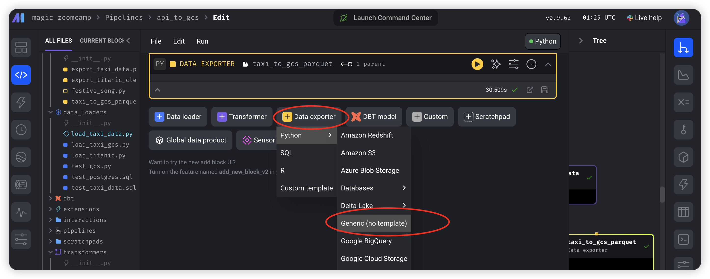

2. We use python library `pyarrow` to do the partitioning.The whole script you can check out here [export_data_partition.py](../2_workflow-orchestration/mage_gcs/export_data_partition.py)   And you run this block.

3. Then Go back to look into the new data you have exported to GCS. You can see the data has been partitioned into los of parts by date.

   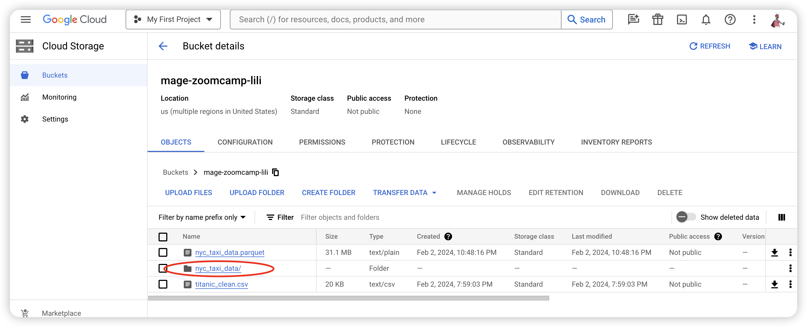

## 4.3.ETL: GCS to BigQuery

[*Videocourse*](https://www.youtube.com/watch?v=JKp_uzM-XsM&list=PL3MmuxUbc_hJed7dXYoJw8DoCuVHhGEQb&index=25&pp=iAQB)

Now that we've written data to GCS, let's load it into BigQuery. In this section, we'll walk through the process of using Mage to load our data from GCS to BigQuery. This closely mirrors a very common data engineering workflow: loading data from a data lake into a data warehouse.

1. Create a new pipeline named `gcs_to bigquery`in Standard bath and use `python`-`google cloud store` to load data. and named it `load_taxi_gcs`


Modify and run. what you need to modify is `bucket_name` and `object_key`, and `deleting the test part`. The whole script you can check out here [load_data.py](../2_workflow-orchestration/mage_bigquery/load_data.py)

2. Because there is something wrong with the column name, so we need to do some transformations to it.

   click `transformer` ---`python`---`Generic(no template)` The whole script you can check out here [transform_data.py](../2_workflow-orchestration/mage_bigquery/transform_data.py)

3. click `Data exporter` ---`SQL`, named `write_taxi_to_bigquery`, modify the settings like down below.

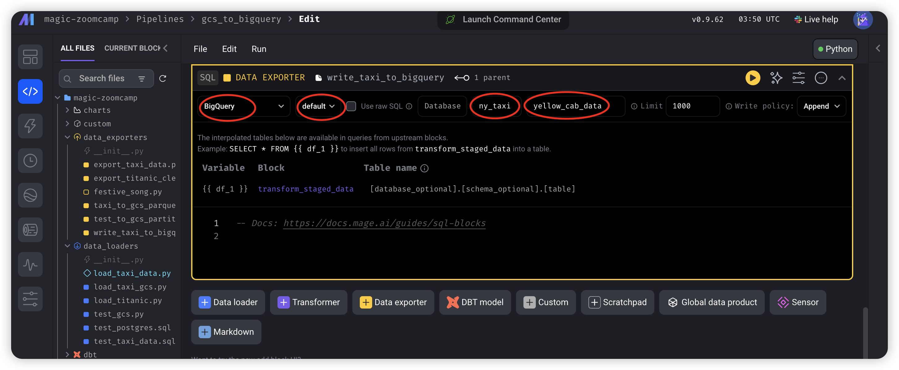

type and run this block :

```sql
SELECT * FROM {{ df_1 }}
```

in here, there might be a error about the permission of creating dataset, so you need to go back to GCP and change the `IM` of your service account, grant the ` BigQuery Admin` to it. 

If you get this message, done!

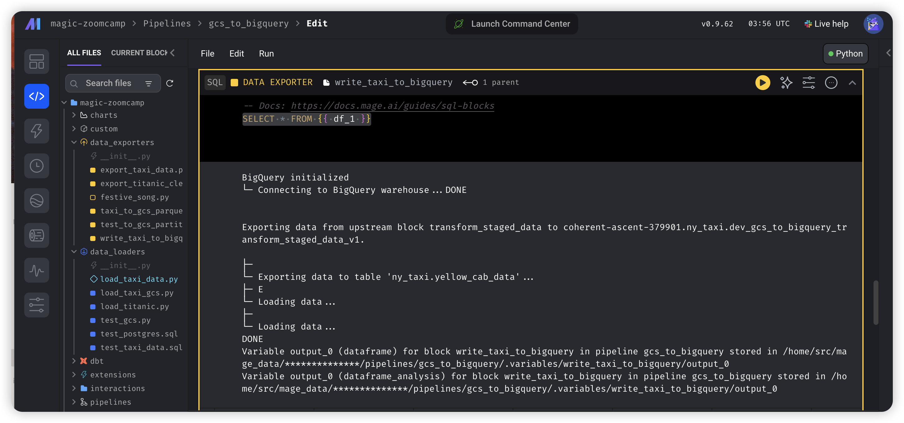

4. Go back to GCP,  search `bigquery` to look into the data you just loaded.

   

---


**How to schedule your pipeline:**

1. click `triggers` 

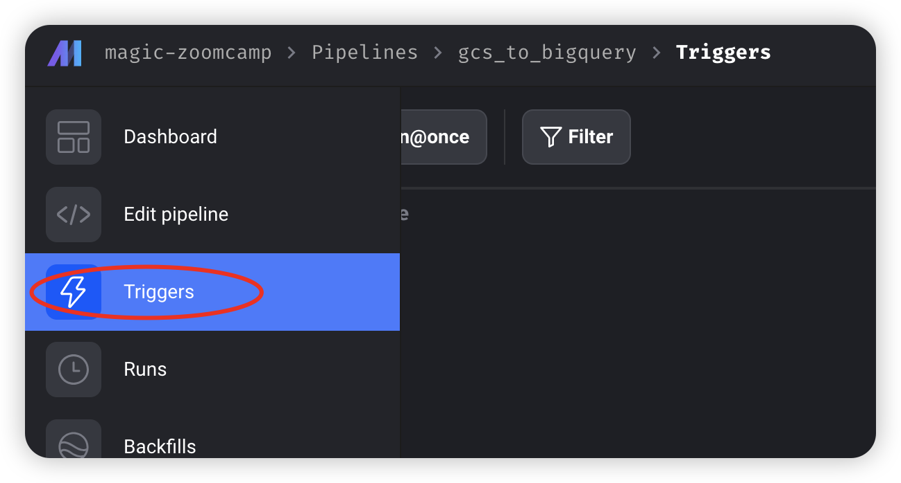

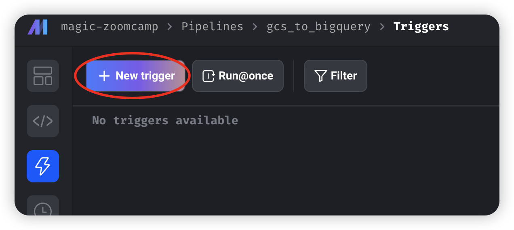

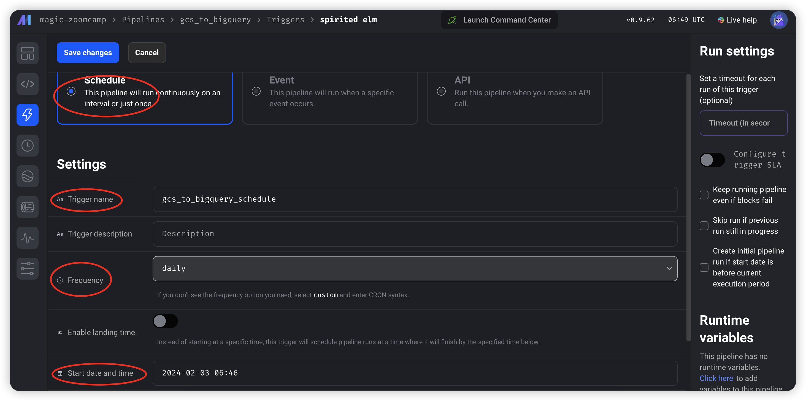

2. save changes

# 5.Variables in Mage

* By now you're familiar with building pipelines, but what about **adding parameters**?

* In Mage there are a bunch of different types of variables. like There are runtime variables, Global variables you can you can look at all of these in mage documentation.In this video, we'll discuss some built-in **runtime variables** that exist in Mage and show you how to define your own! 

* We'll also cover how to use these variables to parameterize your pipelines. 

* Finally, we'll talk about what it means to *backfill* a pipeline and how to do it in Mage.

- [Mage Variables Overview](https://docs.mage.ai/development/variables/overview)
- [Mage Runtime Variables](https://docs.mage.ai/getting-started/runtime-variable)
-  [Backfilling pipelines](https://docs.mage.ai/orchestration/backfills/overview)

### 5.1.Parameterized Execution depending on variables

参数化执行

[*Videocourse*](https://www.youtube.com/watch?v=H0hWjWxB-rg&list=PL3MmuxUbc_hJed7dXYoJw8DoCuVHhGEQb&index=27)

**write data to a specific parquet file by date in order to get a incremental data增量数据**, it seems like [pipeline-3](###Pipeline-3: load partitioned parquet data to GCS ), but there is a bit different from it.

1. clone the pipeline and rename it to `api_to_gcs_parameter`

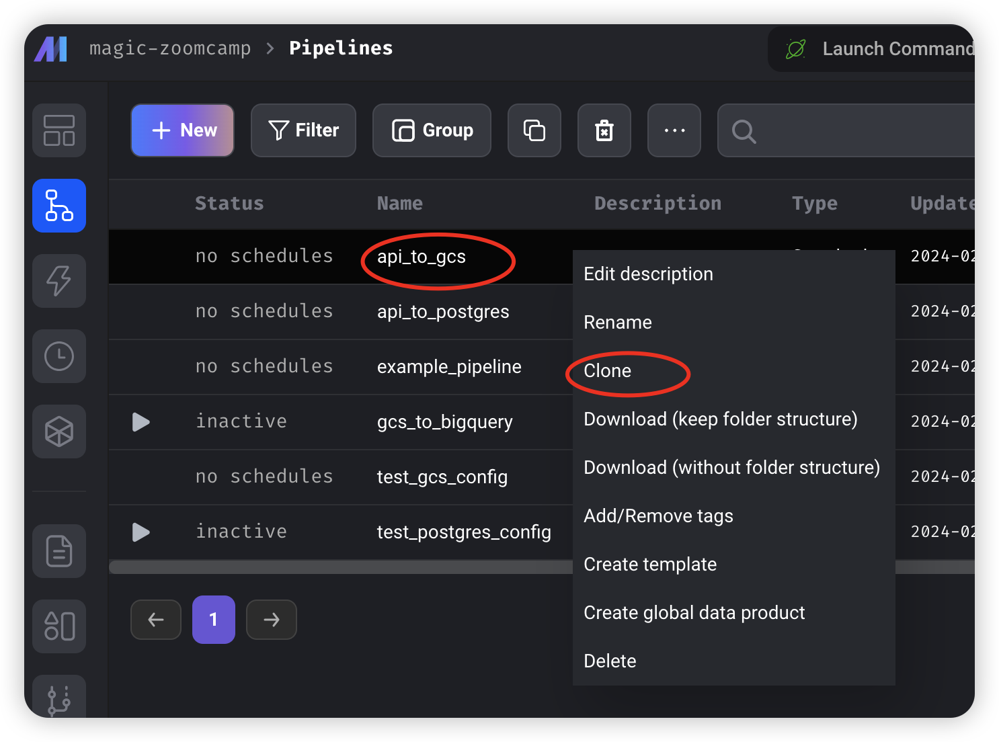

2. modify

   * `Delete partitioned block`

   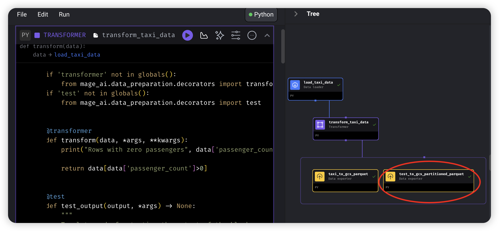

   * add a `data exporter `named `taxi_to_gcs_parameter` by `python`-`google cloud storage` , and copy the content of `taxi_to_gcs_parquet`, and don't change anything in the `taxi_to_gcs_parquet` and delete it in this pipeline.

     > The blocks in the pipeline can be reused. If a copied block is modified, it will change all pipelines containing this block. Be cautious!

   * Knowing what is `kwargs` : modify `taxi_to_gcs_parameter` by just leave `print(kwargs)` init

   ```python
   @data_exporter
   def export_data_to_google_cloud_storage(df: DataFrame, **kwargs) -> None:
       """
       Template for exporting data to a Google Cloud Storage bucket.
       Specify your configuration settings in 'io_config.yaml'.
   
       Docs: https://docs.mage.ai/design/data-loading#googlecloudstorage
       """
       
       
       print(kwargs)
   ```

   ​	the output is 

   ```python
   {'env': 'dev', 'execution_date': datetime.datetime(2024, 2, 8, 4, 11, 14, 601203), 'interval_end_datetime': datetime.datetime(2024, 2, 9, 4, 11, 14, 601203), 'interval_seconds': None, 'interval_start_datetime': datetime.datetime(2024, 2, 8, 4, 11, 14, 601203), 'interval_start_datetime_previous': None, 'event': {}, 'logger': <Logger taxi_to_gcs_parameter_test (INFO)>, 'configuration': {}, 'context': {}, 'pipeline_uuid': 'api_to_gcs_parameter', 'block_uuid': 'taxi_to_gcs_parameter'}
   ```

   * After knowing `kwarg`, modify the whole script to [export_data.py](../2_workflow-orchestration/mage_gcs/export_data_parameter.py) and run.

     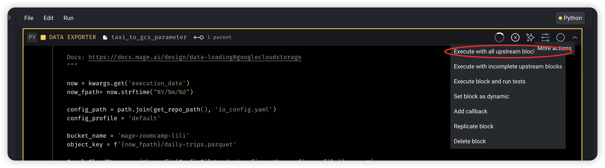

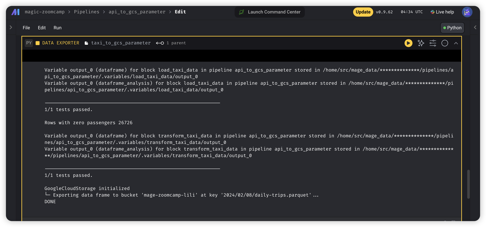

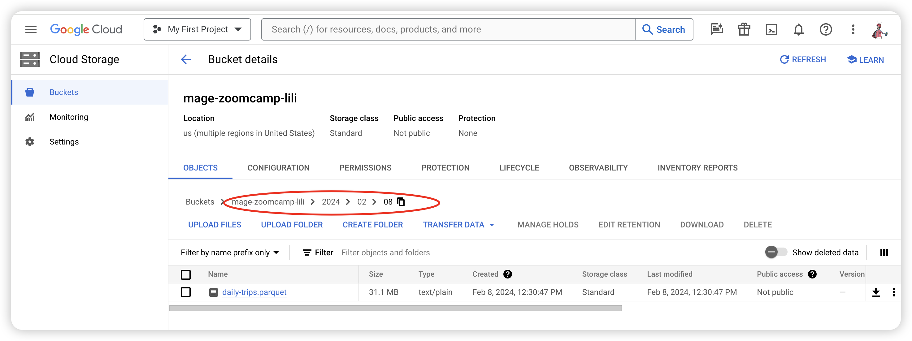

### 5.2.Backfills

Using backfill to replicate lost data.More details in [Backfilling pipelines](https://docs.mage.ai/orchestration/backfills/overview)

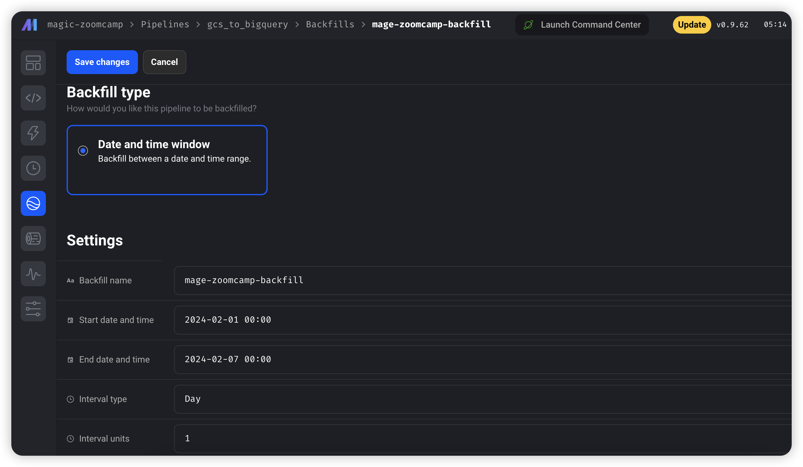


# Summary

Through [3.Load to Local : Mage and Postgres](#3.Load to Local : Mage and Postgres) and [4.Load to Cloud:Mage and GCP](#4.Load to Cloud:Mage and GCP), although you can export data to GCP, but the whole **mage project and container is in local machine** including all the pipeline you created. And [6.Deployment (Optional)](#6.Deployment (Optional)) in this chapter, you can learn a cloud version of creating a pipeline project in the cloud, and deploy container images to a new Cloud Run service or to a new revision of an existing Cloud Run service.

# 6. Deploying mage-ai to GCP (Optional)

In this section, we'll cover deploying Mage using Terraform and Google Cloud. This section is optional— it's not *necessary* to learn Mage, but it might be helpful if you're interested in creating a fully deployed project. If you're using Mage in your final project, you'll need to deploy it to the cloud.

## 6.1.Prerequisites

If some steps you haved prepared in last lesson, you can skip them.

* step1: [Installing Terraform](https://developer.hashicorp.com/terraform/tutorials/aws-get-started/install-cli)
* step2: [Installing `gcloud` CLI](https://cloud.google.com/sdk/docs/install):atfer installing, using `gcloud auth list `  to list your active account or `gcloud storage ls` to list your buckets to check if you install gcloud cli successfully.
* step3: [Set Google Cloud permission](01_Introduction.md/##3.1.GCP  setup): Go to `IM`, set your service account:
  * Artifact Registry Reader
  * Artifact Registry Writer
  * Cloud Run Developer
  * Cloud SQL Admin
  * Service Account Token Creator
  * Owner
* Step4:[Installing Terraform](https://docs.mage.ai/production/deploying-to-cloud/using-terraform)

## 6.2.Deploying to GCP with Terraform

[*Videocourse1*](https://www.youtube.com/watch?v=9A872B5hb_0&list=PL3MmuxUbc_hJed7dXYoJw8DoCuVHhGEQb&index=30)

[*Videocourse2*](https://www.youtube.com/watch?v=9A872B5hb_0&list=PL3MmuxUbc_hJed7dXYoJw8DoCuVHhGEQb&index=31)

If some steps you haved prepared in last lesson, you can skip them.

- [Deploying to GCP with Terraform](https://docs.mage.ai/production/deploying-to-cloud/gcp/setup)

  - clone [Mage Terraform Templates](https://github.com/mage-ai/mage-ai-terraform-templates)

  - modify .tf file in gcp directory 

  - `terraform init; terraform plan; terraform apply;terraform destroy`

    - Error1: after type `terraform apply`

      - GCP - 2.2.7d Load Balancer Problem (Security Policies quota)
    
      ```bash
      ╷
      │ Error: Error waiting for Creating SecurityPolicy "mage-data-prep-security-policy": Quota 'SECURITY_POLICY_RULES' exceeded.  Limit: 0.0 globally.
      │       metric name = compute.googleapis.com/security_policy_rules
      │       limit name = SECURITY-POLICY-RULES-per-project
      │       dimensions = map[global:global]
      │ 
      │ 
      │   with google_compute_security_policy.policy,
      │   on load_balancer.tf line 7, in resource "google_compute_security_policy" "policy":
      │    7: resource "google_compute_security_policy" "policy" {
      ```
    
      * Solution: 
    
        If you are on the free trial account on GCP you will face this issue when trying to deploy the infrastructures with terraform. This service is not available for this kind of account.
    
        The solution I found was to delete the *load_balancer.tf* file and to comment or delete the rows that differentiate it on the *main.tf* file. After this just do **terraform destroy** to delete any infrastructure created on the fail attempts and re-run the **terraform apply**.
    
        Code on *main.tf* to comment/delete:
    
        Line 166, 167, 168
    
    - Error2: after type `terraform destroy`
    
      - ```bash
         Error: Error when reading or editing Database: googleapi: Error 400: Invalid request: failed to delete database "mage-data-prep-db". Detail: pq: database "mage-data-prep-db" is being accessed by other users. (Please use psql client to delete database that is not owned by "cloudsqlsuperuser")., invalid
        │ 
        │ 
        ╵
        ╷
        │ Error: Error, failed to deleteuser postgres in instance mage-data-prep-db-instance: googleapi: Error 400: Invalid request: failed to delete user postgres: . role "postgres" cannot be dropped because some objects depend on it Details: 43 objects in database mage-data-prep-db., invalid
        ```
    
      - Solution:
    
        - Try `terraform destroy` again, it seems a networking problem.
    
  
  * go to GCP , search `cloud run` and you can see a new service. 
  
    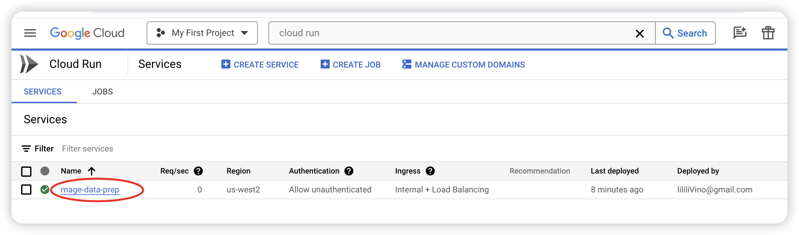
  
  * Open it and set the networking and copy the `URL`, you can open a mage project
  
    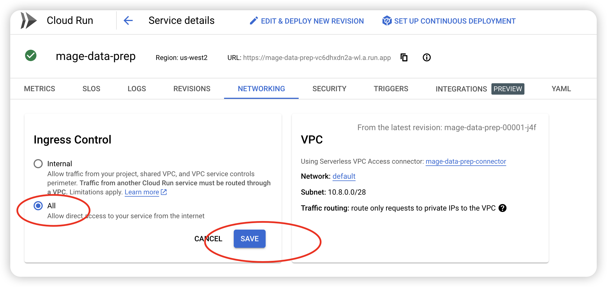

