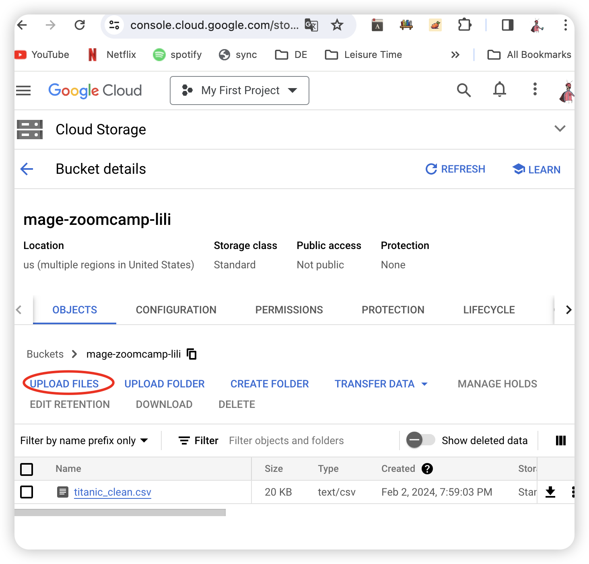

# 1.Intro to Orchestration

*[videocourse](https://www.youtube.com/watch?v=Li8-MWHhTbo&list=PL3MmuxUbc_hJed7dXYoJw8DoCuVHhGEQb)*

> 编排（Orchestration）是通过**自动化**实现的一种依赖管理过程

In this section, we'll cover the basics of workflow orchestration. We'll discuss what it is, why it's important, and how it can be used to build data pipelines.


**1.1.what is Orchestration?**

* A large part of data engineering is **extracting, transforming, and loading** data between sources.


* **Orchestration** is a process of dependency management, facilitated through **automation**.orchestration is one of the undercurrents.when we say orchestration is an undercurrent that means it happens throughout the entire life cycle of data engineering.
* The data orchestrator manages scheduling, triggering, monitoring, and even resource allocation. 
  * ☝️ Every workflow requires sequential steps.（每个工作流程都需要按**顺序**进行的步骤） 
  *  ☔️ Poorly sequenced transformations brew a storm far more bitter.（顺序不当的转换会酿成更为痛苦的风暴） 
  * 📕 Steps 🟰 tasks（步骤 🟰 任务）
  *  🔄 Workflows 🟰 DAGs（工作流程 🟰 有向无环图（DAGs，Directed Acyclic Graphs））


**1.2.What does a *good* solution look like?**

it's important to have good orchestrator to have a good solution.

- Workflow management
- Automation
- Error handling 
- Recovery
- Monitoring, alerting
- Resource optimization
- Observability
- Debugging
- Compliance/Auditing

# 2.Mage

In this section, we'll introduce the Mage platform. We'll cover what makes Mage different from other orchestrators, the fundamental concepts behind Mage, and how to get started. To cap it off, we'll spin Mage up via Docker 🐳 and run a simple pipeline.

## 2.1.what's Mage

*[Videocourse](https://www.youtube.com/watch?v=AicKRcK3pa4&list=PL3MmuxUbc_hJed7dXYoJw8DoCuVHhGEQb&index=18)*

*Mage An open-source pipeline tool for orchestrating, transforming, and integrating data* . more details about it, check  [here](https://docs.docker.com/get-docker/).

## 2.2.Configure Mage

*[Videocourse](https://www.youtube.com/watch?v=2SV-av3L3-k&list=PL3MmuxUbc_hJed7dXYoJw8DoCuVHhGEQb&index=19)*

we need to use Mage to make a pipeline, so we need to configure Mage. Here, we use Docker to make it.All the command line works in your computer's Terminal.

* **Step1:  start by cloning the repo:**

```bash
git clone https://github.com/mage-ai/mage-zoomcamp.git mage-zoomcamp
```

There are some files in the repo:

> `docker-compose.yml` 文件使用 `Dockerfile` 进行构建，并在容器中设置各种环境变量、共享文件等配置。这样可以通过一条命令启动多个相互协作的服务。

we have a **docker-compose.yml** file, some contents in ${}, that means pulling variables locally and then injecting them into our Docker containers. and all the variables are in **.env** file（隐藏文件，在电脑文件中看不到，在vscode中可以看到）

saving your password or something in  **.env** file is a very safe way for ensuring security.

requirements.txt

docker-compose.yml

README.md

Dockerfile

.env

* **Step2: Navigate to the repo:**

```bash
cd mage-zoomcamp
```

* **Step3: use command** 

```bash
mv dev.env .env
```

Rename `dev.env` to simply `.env`— this will _ensure_ the file is not committed to Git by accident, since it _will_ contain credentials in the future.

* **Step4: Now, let's build the container：**

  使用`docker compose build`这意味着你的项目可能有多个服务，每个服务都有一个独立的 Dockerfile，并且这些服务在 `docker-compose.yml` 文件中进行了定义.`docker-compose build` 会根据 `docker-compose.yml` 文件中的配置构建所有的服务。

```bash
docker compose build
```

create and open a new container


* **Step5: Finally, start the Postges and Mage containers:**

```bash
docker compose up
```

create and open some new containers form file **docker-compose.yml**

here is a [docker-compose.yml](../2_workflow-orchestration/mage-zoomcamp/docker-compose.yml):


Now, navigate to http://localhost:6789 in your browser! Voila! 

PS: In the future, you might need to update Mage image version, use the command down below to make it.

```
docker pull mageai/mageai:latest
```

## 2.3.A example Pipeline

*[Videocourse](https://www.youtube.com/watch?v=stI-gg4QBnI&list=PL3MmuxUbc_hJed7dXYoJw8DoCuVHhGEQb&index=20)*

Navigate to http://localhost:6789 in your browser.There is a project called magic-zoomcamp, and there is a example pipeline alreday in it. You can check it out and know how it works.

# 3.Local version: Mage and Postgres

Hooray! Mage is up and running. Now, let's build a *real* pipeline. 

In this section, we'll build a simple ETL pipeline that **loads data** from an **API** into a **local** Postgres database. 

Our database will be built using Docker— it will be running locally, but it's the same as if it were running in the cloud.

## 3.1.Configure Postgres

*[Videocourse](https://www.youtube.com/watch?v=pmhI-ezd3BE&list=PL3MmuxUbc_hJed7dXYoJw8DoCuVHhGEQb&index=21)*

> 配置环境变量到mage---打开2.2配置的容器---测试连接

Configuring Postgres in the project within Mage in order to make sure we  connected to that postgres container(配置postgres，以确保连接postgres container).

**Step1: Add environment variables that is in `.env` into `io_config.yaml` file.** 

The `io_config` YAML file contains the information and credentials required to access databases, data warehouses, and data lakes.You can learn more about io_config.yaml in [here](https://docs.mage.ai/development/io_config).You can learn more about variable interpolation and referencing secrets via our variables overview [here](https://docs.mage.ai/development/variables/overview).

You can do this in Vscode or Mage UI. In Mage, find the files button on the side bar, click it to go to the project's file. Just like the picture below down.


Find io_config.yaml and add these code into it.

```yaml
dev:
    POSTGRES_CONNECT_TIMEOUT: 10
    POSTGRES_DBNAME: "{{ env_var('POSTGRES_DBNAME') }}"
    POSTGRES_SCHEMA: "{{ env_var('POSTGRES_SCHEMA') }}"
    POSTGRES_USER: "{{ env_var('POSTGRES_USER') }}"
    POSTGRES_PASSWORD: "{{ env_var('POSTGRES_PASSWORD') }}"
    POSTGRES_HOST: "{{ env_var('POSTGRES_HOST') }}"
    POSTGRES_PORT: "{{ env_var('POSTGRES_PORT') }}"
```

**Step2: test the connection with postgres**

* create a new pipeline

  

* use ` Pipeline settings`, rename the pipeline you just created, new name is test_config

  

  

* use ` Edit pipeline` , click `Data loader` 

  

Set as picture below down, type `SELECT 1`to test. if no error occer, well done!


## 3.2.ETL: Ingest data to Postgres

*[Videocourse](https://www.youtube.com/watch?v=Maidfe7oKLs&list=PL3MmuxUbc_hJed7dXYoJw8DoCuVHhGEQb&index=22)*

**Step1: create a new pipeline named api_to_postgres in Mage**

**Step2: Load Data **

* use ` Edit pipeline`, click `Data loader` ---`python`---`API`

* you will get a data load python script, paste data url into it.

  > we will use this data url: https://github.com/DataTalksClub/nyc-tlc-data/releases/download/yellow/yellow_tripdata_2021-01.csv.gz

  The whole script you can check out here [load_data.py](../2_workflow-orchestration/mage_progres/load_data.py)

**Step3: Transform Data**

There are some issues with the data you just loaded. You might want to look into it and convert it into a more organized format. Specifically, the 'passenger_count' has values of   0, which is incorrect. We need to make a transformation for that.

click `transformer` ---`python`---`Generic(no template)`

The whole script you can check out here [transform_data.py](../2_workflow-orchestration/mage_progres/transform_data.py)

**Step4: Export Data**

we can use python or sql to export our data. Here, we choose to use python.

click `Data exporter` ---`python`---`PostgreSQL`

The whole script you can check out here [export_data.py](../2_workflow-orchestration/mage_progres/export_data.py)

Finally, you can create a new data loader to test your data.

use: 

```sql
SELECT * FROM ny_taxi.yellow_cab_data LIMIT 10
```

# 4.Cloud version:Mage and GCP

welcome back in this module we're going to do everything we need to do in Google Cloud for mage to read and write data to both Google Cloud Storage and Google Big
Query.

## 4.1.Configure GCP

[*Videocourse*](https://www.youtube.com/watch?v=00LP360iYvE&list=PL3MmuxUbc_hJed7dXYoJw8DoCuVHhGEQb)

**Step1: create a new bucket named `mage-zoomcamp`**

Go to GCP, and search the`cloud storage`. `create`,don't need to modify eveything. Just press `continue` to create a new bucket.

**Step2: create a new Service accounts **

Mage uses service accounts to connect to gcp. Go to GCP, and search the`Service accounts`, press `createService accounts  `:

1. give it a new name `mage-zoomcamp`, 
2. Grant this service account access to project bisic viewer. 
3. Done.
4. Create and download a key for the Service accounts you just created.

**Step3:  Configure GCP in Mage**

1. Move the key json file to your Mage project directory
2. Go to `localhost:6789`
3. Modify  `io_config.yaml` file
4. 

5. You can check  [docker-compose.yml](../2_workflow-orchestration/mage-zoomcamp/docker-compose.yml), find this code:`volumes: - .:/home/src/` in Mage image, that means copy eveything in this directory to `/home/src/` which is in the mage.so, you can use terminal in Mage `ls -la` find your key json file.


6. copy the json file name and change the `GOOGLE_SERVICE_ACC_KEY_FILEPATH:`, ok, everything is done here. 


7. Let's check if the connection to GCP is good.

   

## 4.2.ETL: Ingest data to GCS

[*Videocourse*](https://www.youtube.com/watch?v=w0XmcASRUnc&list=PL3MmuxUbc_hJed7dXYoJw8DoCuVHhGEQb)

we'll walk through the process of using Mage to extract, transform, and load data from an API to Google Cloud Storage (GCS).

###  Pipeline-1:load local data into GCS

1. Here, use the data that created by a pipeline named example_pipeline in Mage. 


2. You can get the `titanic_clean.csv`  in your local `mage-zoomcamp` folder.You wiil upload it to GCS bucket.

   

3. You can either create a new pipeline or use your old pipeline to check the connection to Google Cloud Storage (GCS).


### Pipeline-2: load cloud data to GCS

1. Create a new pipeline named `api_to gcs` in Standard bath and **reuse** `load_taxi_data` and `transform_taxi_data` of pipeline `api_to_postgres` by draging them into current pipeline. At last, create a new data exporter like down below.


Modify and run.


done.


### Pipeline-3: load cloud data to GCS 

## 4.3.ETL: GCS to BigQuery

[*Videocourse*](https://www.youtube.com/watch?v=JKp_uzM-XsM&list=PL3MmuxUbc_hJed7dXYoJw8DoCuVHhGEQb&index=25&pp=iAQB)

Now that we've written data to GCS, let's load it into BigQuery. In this section, we'll walk through the process of using Mage to load our data from GCS to BigQuery. This closely mirrors a very common data engineering workflow: loading data from a data lake into a data warehouse.

1. Create a new pipeline named gcs_to bigquery in Standard bath and use python google cloud store to load data

   

2. 


