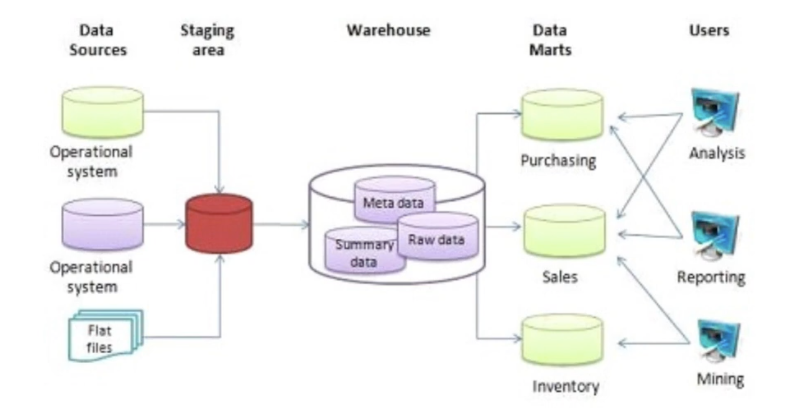
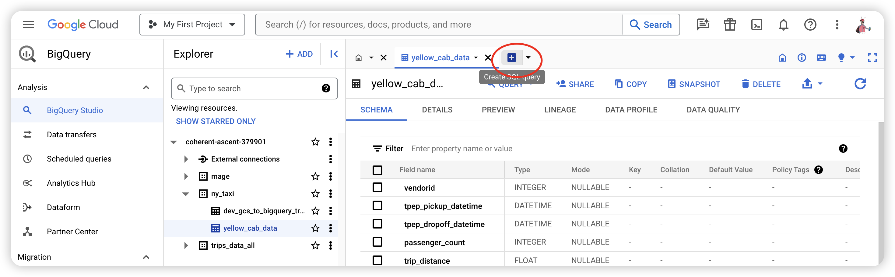
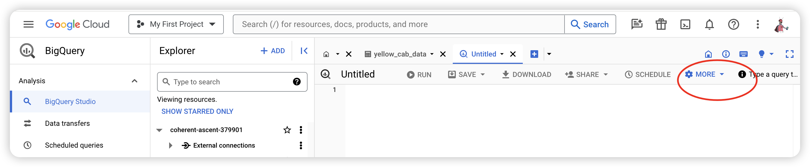
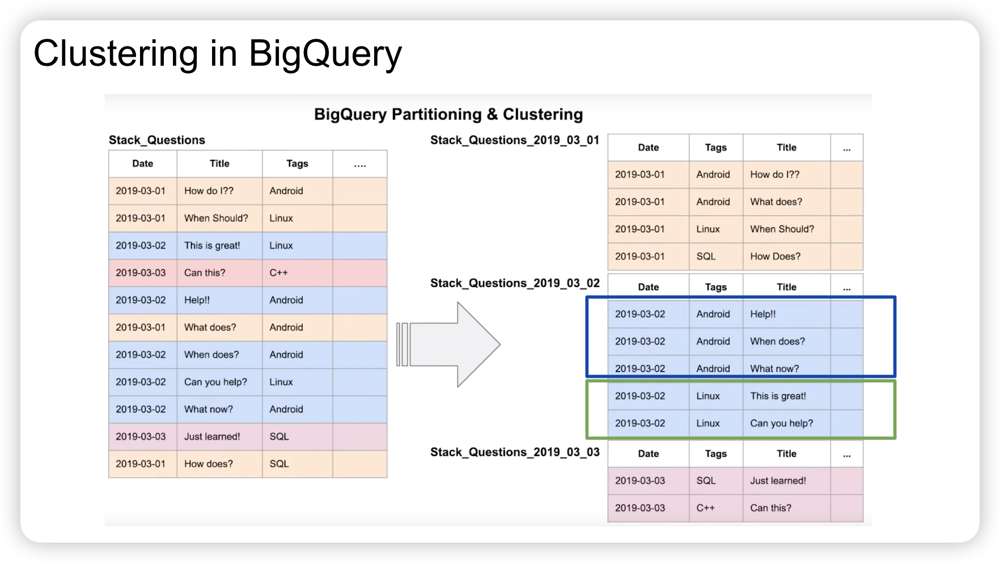
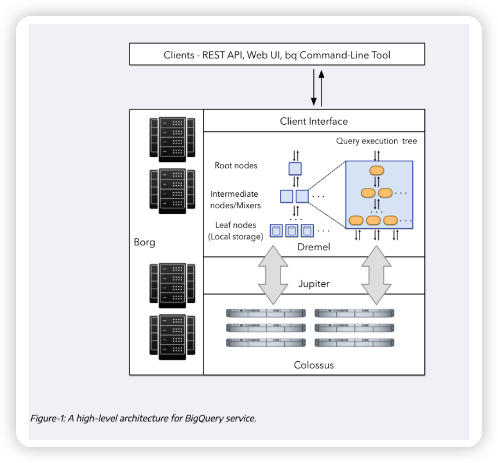
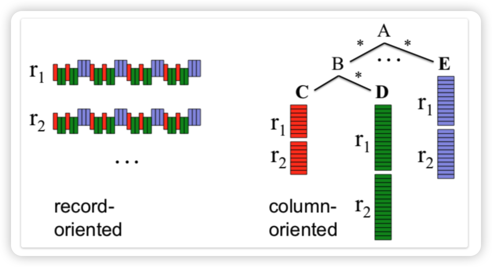
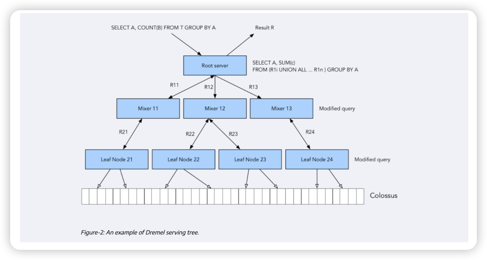

> Previous:[02_workflow-orchestration](02_workflow-orchestration.md)
>
> [See the content tree](index.md)
>
> Next:[04_analytics](04_analytics.md)

## 1.Concepts

### 1.1.OLAP vs OLTP

**OLTP** systems are designed to handle large volumes of transactional data involving multiple users.

**OLAP** system is designed to process large amounts of data quickly, allowing users to analyze multiple data dimensions
Teams can use this data for decision-making and problem-solving.

|                     | **OLTP**-Online Transaction Processing                       | **OLAP**-Online Analytical Processing                        |
| ------------------- | ------------------------------------------------------------ | ------------------------------------------------------------ |
| Purpose             | Control and run essential business operations in real time大量短小的事务数据进行快速处理和存储 | Plan, solve problems, support decisions, discover hidden insights海量数据中进行分析和提取出有价值的信息 |
| Data updates        | Short, fast updates initiated by user                        | Data periodically refreshed with scheduled, long-running batch jobs |
| Database design     | Normalized databases for efficiency(标准化数据库以提高效率)  | Denormalized databases for analysis(用于分析的非规范化数据库) |
| Space requirements  | Generally small if historical data is archived               | Generally large due to aggregating large datasets            |
| Backup and recovery | Regular backups required to ensure business continuity and meet legal and governance requirements | Lost data can be reloaded from OLTP database as needed in lieu of regular backups |
| Productivity        | Increases productivity of end users                          | Increases productivity of business managers, data analysts, and executives |
| Data view           | Lists day-to-day business transactions                       | Multi-dimensional view of enterprise data                    |
| User examples       | Customer-facing personnel, clerks, online shoppers           | Knowledge workers such as data analysts, business analysts, and executives |

### 1.2.What is a data wahehouse-OLAP solution

- OLAP solution

- Used for reporting and data analysis

  

See also [The Data Warehouse Toolkit 3rd Edition](https://www.kimballgroup.com/data-warehouse-business-intelligence-resources/books/data-warehouse-dw-toolkit/)
by Ralph Kimball and Margy Ross.

## 2.BigQuery

### 2.1.Overwiew

BigQuery is a fully managed(完全托管) enterprise data warehouse that helps you manage and analyze your data with built-in features like machine learning, geospatial analysis, and business intelligence.

- Serverless data warehouse(无服务器数据仓库)
  - There are no servers to manage or database software to install
- Software as well as infrastructure including
  - **scalability** and **high-availability**
- Built-in features like
  - machine learning
  - geospatial analysis
  - business intelligence
- BigQuery maximizes flexibility by separating the compute engine that analyzes your data from your storage
- On demand pricing
  - 1 TB of data processed is \$5
- Flat rate pricing
  - Based on number of pre requested slots
  - 100 slots → \$2,000/month = 400 TB data processed on demand pricing

See [What is BigQuery?](https://cloud.google.com/bigquery/docs/introduction) for more information.

### 2.2.Query Settings

Click on **MORE** button, select **Query Settings**. In the **Resource management** section, we should disable **Use cached results**.

### 2.3.BigQuery Partition&Clustering

> Partition类似周/日/月表，在此基础上Clustering指定一个字段进行数据分类，也就是相同值的数据放在一起，我理解为排序

About how to use big query, the sql script is in [here](../3_data_warehouse/big_query.sql)

* **(1)Partition**

  A partitioned table is divided into segments, called partitions, that make it easier to manage and query your data. By dividing a large table into smaller partitions, you can improve query performance and **control costs** by reducing the number of bytes read by a query. You partition tables by specifying a partition column which is used to segment the table.

  See [Introduction to partitioned tables](https://cloud.google.com/bigquery/docs/partitioned-tables) for more information.

* **(2)clustering**

  Clustered tables in BigQuery are tables that have a user-defined column sort order using clustered columns. Clustered
  tables can improve query performance and **reduce query costs.**

  See [Introduction to clustered tables](https://cloud.google.com/bigquery/docs/clustered-tables).

  

* **(3)Partitioning vs Clustering**

  > 3:18/7:43 (3.1.2)

  | **Clustering**                                               | **Partitoning**                       |
  | ------------------------------------------------------------ | ------------------------------------- |
  | Cost benefit unknown.                                        | Cost known upfront.                   |
  | You need more granularity than partitioning alone allows.    | You need partition-level management.  |
  | Your queries commonly use filters or aggregation against multiple particular columns. | Filter or aggregate on single column. |
  | The cardinality of the number of values in a column or group of columns is large. |                                       |

* **(4)Clustering over paritioning**

  Like clustering, partitioning uses user-defined partition columns to specify how data is partitioned and what data is
  stored in each partition. Unlike clustering, partitioning provides granular query cost estimates before you run a query.

  See [Introduction to clustered tables](https://cloud.google.com/bigquery/docs/clustered-tables).

  - Partitioning results in a small amount of data per partition (approximately less than 1 GB).

  - Partitioning results in a large number of partitions beyond the limits on partitioned tables.

  - Partitioning results in your mutation operations modifying the majority of partitions in the table frequently (for
    example, every few minutes).

* **(5)Automatic reclustering**

  As data is added to a clustered table

  - The newly inserted data can be written to blocks that contain key ranges that overlap with the key ranges in
    previously written blocks

  - These overlapping keys weaken the sort property of the table

  To maintain the performance characteristics of a clustered table

  - BigQuery performs automatic re-clustering in the background to restore the sort property of the table

  - For partitioned tables, clustering is maintained for data within the scope of each partition.

### 2.4.BigQuery Best Practice

- Cost reduction
  - Avoid `SELECT *`
  - Price your queries before running them
  - Use clustered or partitioned tables
  - Use streaming inserts with caution
  - Materialize query results in stages

In BigQuery, materialized views are precomputed views that periodically cache the results of a query for increased
performance and efficiency. BigQuery leverages precomputed results from materialized views and whenever possible reads
only delta changes from the base tables to compute up-to-date results. See [Introduction to materialized
views](https://cloud.google.com/bigquery/docs/materialized-views-intro)

- Query performance
  - Filter on partitioned columns
  - Denormalizing data
  - Use nested or repeated columns
  - Use external data sources appropriately
  - Don’t use it, in case u want a high query performance
  - Reduce data before using a `JOIN`
  - Do not treat `WITH` clauses as prepared statements
  - Avoid oversharding tables

- Query performance
  - Avoid JavaScript user-defined functions
  - Use approximate aggregation functions (HyperLogLog++)
  - Order Last, for query operations to maximize performance
  - Optimize your join patterns
  - As a best practice, place the table with the largest number of rows first, followed by the table with the fewest
    rows, and then place the remaining tables by decreasing size.

### 2.5.Internals of BigQuery

**A high-level architecture for BigQuery service**

See also:

- [BigQuery under the hood](https://cloud.google.com/blog/products/bigquery/bigquery-under-the-hood)
- [A Deep Dive Into Google BigQuery Architecture](https://panoply.io/data-warehouse-guide/bigquery-architecture/)
- [BigQuery explained: An overview of BigQuery’s
  architecture](https://cloud.google.com/blog/products/data-analytics/new-blog-series-bigquery-explained-overview)

**Record-oriented vs column-oriented**

BigQuery stores table data in columnar format, meaning it stores each column separately. Column-oriented databases are
particularly efficient at scanning individual columns over an entire dataset.

Column-oriented databases are optimized for analytic workloads that aggregate data over a very large number of records.
Often, an analytic query only needs to read a few columns from a table. See [Overview of BigQuery
storage](https://cloud.google.com/bigquery/docs/storage_overview) and [Storage
layout](https://cloud.google.com/bigquery/docs/storage_overview#storage_layout).

**An example of Dremel serving tree**

See [A Deep Dive Into Google BigQuery Architecture](https://panoply.io/data-warehouse-guide/bigquery-architecture/).

### 2.6.BigQuery References

- [BigQuery How-to-guides](https://cloud.google.com/bigquery/docs/how-to)
- [Dremel: Interactive Analysis of Web-Scale Datasets](https://research.google/pubs/pub36632/)
- [A Deep Dive Into Google BigQuery Architecture](https://panoply.io/data-warehouse-guide/bigquery-architecture/)
- [A Look at Dremel](http://www.goldsborough.me/distributed-systems/2019/05/18/21-09-00-a_look_at_dremel/)

