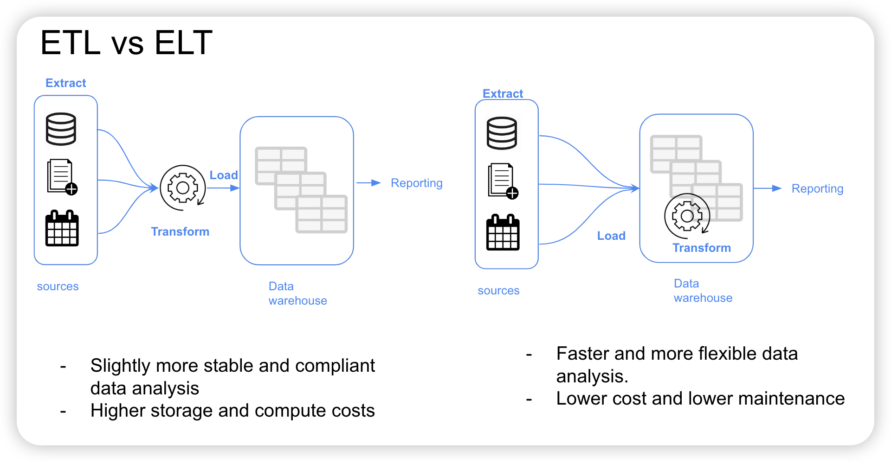
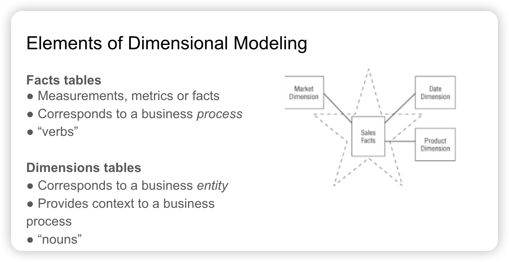
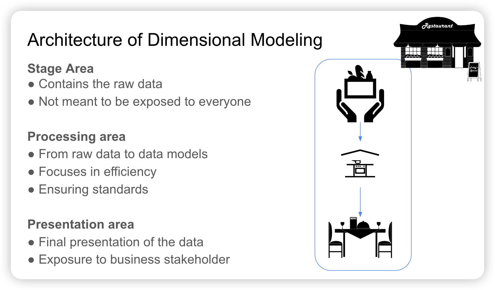
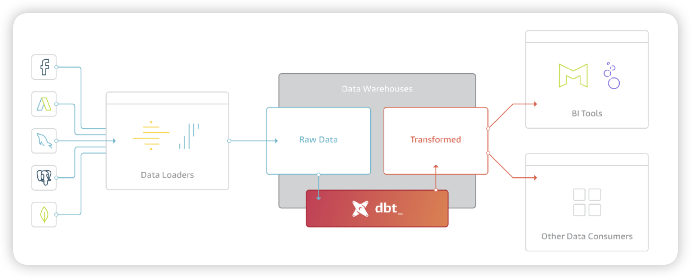
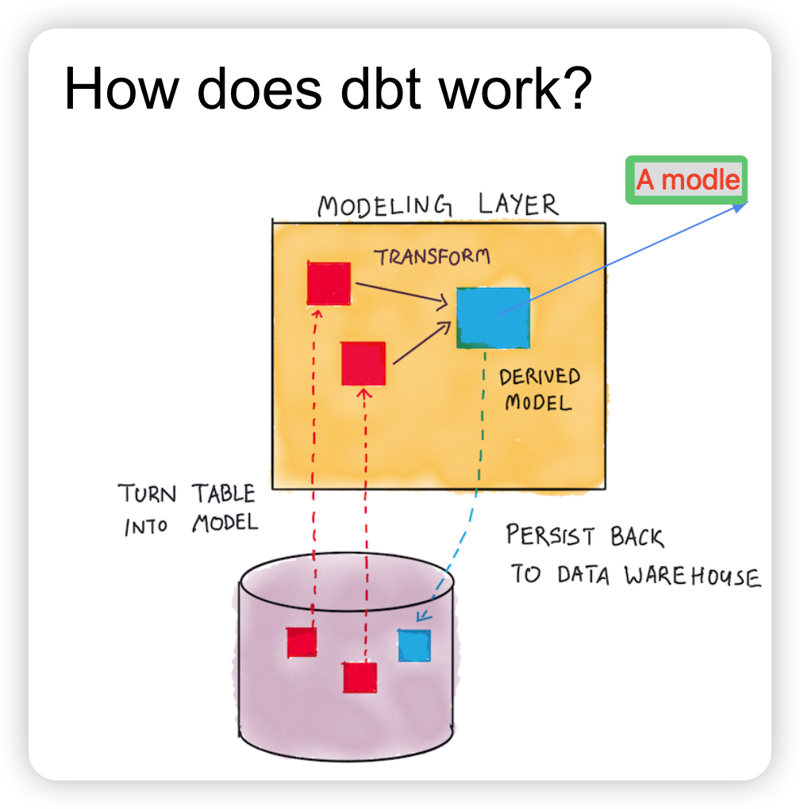
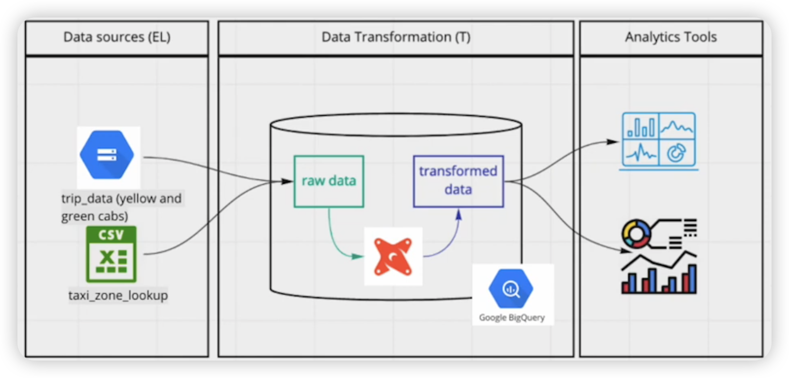

>  Previous:[03_data-warehouse](03_data_warehouse.md)
>
> [See the content tree](index.md)
>
> Next:[05_batch_processing](05_batch_processing.md)

# 1.Introduction to Analytics Engineering

## 1.1.What is Analytics Engineering?

> 会数据分析的程序员，填补以下两类职能空缺
>
> 数据开发：会编程，不会分析
>
> 数据分析师和科学家：会分析，不太会编程

As the _data domain_ has developed over time, new tools have been introduced that have changed the dynamics of working with data:

1. Massively parallel processing (MPP) databases
   * Lower the cost of storage 
   * BigQuery, Snowflake, Redshift...
1. Data-pipelines-as-a-service
   * Simplify the ETL process
   * Fivetran, Stitch...
1. SQL-first / Version control systems
   * Looker...
1. Self service analytics
   * Mode...
1. Data governance

The introduction of all of these tools changed the way the data teams work as well as the way that the stakeholders consume the data, creating a gap in the roles of the data team. Traditionally:

* The ***data engineer数据工程师*** prepares and maintains the infrastructure the data team needs.
* The ***data analyst*** uses data to answer questions and solve problems (they are in charge of _today_).
* The ***data scientist*** predicts the future based on past patterns and covers the what-ifs rather than the day-to-day (they are in charge of _tomorrow_).

The ***analytics engineer分析工程师*** is the role that tries to fill the gap: it introduces the good software engineering practices to the efforts of data analysts and data scientists. The analytics engineer may be exposed to the following tools:

1. Data Loading (Stitch...)
1. Data Storing (Data Warehouses)
1. **Data Modeling (dbt, Dataform...)**
1. **Data Presentation (BI tools like Looker, Mode, Tableau...)**

This lesson focuses on the last 2 parts: Data Modeling and Data Presentation.

## 1.2.Data Modeling Concepts

**数据建模**

* **ETL vs ELT** 

在本课程中我们将介绍 ELT 过程中的 _transform_ 

* **Dimensional Modeling维度建模**

  > 维度建模（Dimensional Modeling）是一种设计数据仓库和数据集市的方法，旨在提供有效的数据存储和查询性能，以支持数据分析和报告需求。维度建模通常采用星型或雪花型模式，其中包含了维度（Dimensions）和事实（Facts）

[Ralph Kimball's Dimensional Modeling](https://www.wikiwand.com/en/Dimensional_modeling#:~:text=Dimensional%20modeling%20(DM)%20is%20part,use%20in%20data%20warehouse%20design.) is an approach to Data Warehouse design which focuses on 2 main points:

* Deliver data which is understandable to the business users.
* Deliver fast query performance.

Other goals such as reducing redundant data (prioritized by other approaches such as [3NF](https://www.wikiwand.com/en/Third_normal_form#:~:text=Third%20normal%20form%20(3NF)%20is,integrity%2C%20and%20simplify%20data%20management.) by [Bill Inmon](https://www.wikiwand.com/en/Bill_Inmon)) are secondary to these goals. Dimensional Modeling also differs from other approaches to Data Warehouse design such as [Data Vaults](https://www.wikiwand.com/en/Data_vault_modeling).

Dimensional Modeling is based around 2 important concepts:



* ***Fact Table***:
  * _Facts_ = _Measures_
  * Typically numeric values which can be aggregated, such as measurements or metrics.
    * Examples: sales, orders, etc.
  * Corresponds to a [_business process_ ](https://www.wikiwand.com/en/Business_process).
  * Can be thought of as _"verbs"_.
* ***Dimension Table***:
  * _Dimension_ = _Context_
  * Groups of hierarchies and descriptors that define the facts.
    * Example: customer, product, etc.
  * Corresponds to a _business entity_.
  * Can be thought of as _"nouns"_.
* Dimensional Modeling is built on a [***star schema***](https://www.wikiwand.com/en/Star_schema) with fact tables surrounded by dimension tables.星型模式是维度建模中常用的一种设计模式，其中包含一个中心的事实表，周围围绕着多个维度表，形成了类似星星的结构。在星型模式中，每个维度表与事实表之间都有直接的一对多关系，使得查询和分析变得简单和直观

A good way to understand the _architecture_ of Dimensional Modeling is by drawing an analogy between dimensional modeling and a restaurant餐馆:



* Stage Area:
  * Contains the raw data.
  * Not meant to be exposed to everyone.
  * Similar to the food storage area in a restaurant.
* Processing area:
  * From raw data to data models.
  * Focuses in efficiency and ensuring standards.
  * Similar to the kitchen in a restaurant.
* Presentation area:
  * Final presentation of the data.
  * Exposure to business stakeholder.
  * Similar to the dining room in a restaurant.

# 2.Creating models

## 2.1.What is dbt?

**数据建模工具**



旨在简化和加速数据分析和报告的开发过程。它提供了一种声明式的、可重复使用的方法来定义、构建和管理数据转换和建模过程

***dbt*** stands for ***data build tool***. It's a _transformation_ tool: it allows us to transform process _raw_ data in our Data Warehouse to _transformed_ data which can be later used by Business Intelligence tools and any other data consumers.

dbt also allows us to introduce good software engineering practices by defining a _deployment workflow允许我们通过定义一个“部署工作流”来引入良好的软件工程实践_:

1. Develop models

1. Test and document models

   dbt提供了内置的测试和文档功能，允许用户编写和运行数据质量测试、业务规则验证以及自动生成数据文档。这有助于确保数据质量和一致性，并提供了对数据模型和转换过程的全面了解

1. Deploy models with _version control_ and _CI/CD_.

   dbt与版本控制系统集成，并支持代码审查和部署工作流。用户可以使用常见的版本控制工具（如Git）来管理dbt项目，并将数据模型和转换过程部署到不同的环境中（如开发、测试、生产）

## 2.2.How does dbt work?

> dbt的工作原理是通过定义一个**建模层**，该层位于我们的数据仓库之上。建模层将把数据仓库中的_表格_转换为**模型**，然后我们将这些模型转换为_派生模型_，最后可以将其存储到数据仓库中以保持持久性
>
> 一个模型是一个sql文档



dbt works by defining a ***modeling layer*** that sits on top of our Data Warehouse. The modeling layer will turn _tables_ into ***models*** which we will then transform into _derived models_, which can be then stored into the Data Warehouse for persistence.

* A ***model*** :

  * a .sql file with a `SELECT` statement; 

  * no DDL or DML is used. 

  * dbt will compile(编译) the file and run it in our Data Warehouse.
  
  

## 2.3.How to use dbt?

> 为了与BigQuery集成，我们将使用dbt Cloud IDE，因此不需要本地安装dbt core。如果要在本地进行开发而不是使用Cloud IDE，则需要dbt Core。使用本地Postgres数据库可以使用dbt Core，它可以在本地安装并连接到Postgres，通过CLI运行模型



* For integration with BigQuery we will use the dbt Cloud IDE, so a local installation of dbt core isn't required. For developing locally rather than using the Cloud IDE, dbt Core is required. Using dbt with a local Postgres database can be done with dbt Core, which can be installed locally and connected to Postgres and run models through the CLI.

* dbt has 2 main components: _dbt Core_ and _dbt Cloud_:

  * ***dbt Core***: open-source project that allows the data transformation.
    * Builds and runs a dbt project (.sql and .yaml files).
    * Includes SQL compilation logic, macros and database adapters.
    * Includes a CLI interface to run dbt commands locally.
    * Open-source and free to use.

  * ***dbt Cloud***: SaaS application to develop and manage dbt projects.
    * Web-based IDE to develop, run and test a dbt project.
    * Jobs orchestration.
    * Logging and alerting.
    * Intregrated documentation.
    * Free for individuals (one developer seat).


## 2.4.Setting up dbt

* **dbt Cloud**

  * In order to use dbt Cloud you will need to create a user account. Got to the [dbt homepage](https://www.getdbt.com/) and sign up.

  * 上传GCP服务帐号的密钥。During the sign up process you will be asked to create a starter project and connect to a database. We will connect dbt to BigQuery using [BigQuery OAuth](https://docs.getdbt.com/docs/dbt-cloud/cloud-configuring-dbt-cloud/cloud-setting-up-bigquery-oauth). More detailed instructions on how to generate the credentials and connect both services are available [in this link](https://github.com/DataTalksClub/data-engineering-zoomcamp/blob/main/week_4_analytics_engineering/dbt_cloud_setup.md). When asked, connnect the project to your _development_ dataset.

  * 链接一个Github repo。Make sure that you set up a GitHub repo for your project. In _Account settings_ > _Projects_ you can select your project and change its settings, such as _Name_ or _dbt Project Subdirectoy_, which can be convenient if your repo is previously populated and would like to keep the dbt project in a single subfolder.

  * In the `dbt Cloud IDE`windows, press the green` _Initilize_` button to create the project files. Create a new branch for your project changes, more details in [git-overview](https://docs.getdbt.com/docs/collaborate/git/version-control-basics#git-overview). Then Inside `dbt_project.yml`, change the project name both in the `name` field as well as right below the `models:` block. 

* **dbt Core**

  Installing dbt Core locally can be done following the steps in the table down below


| dbt Cloud                                                    | dbt Core                                                     |
| ------------------------------------------------------------ | ------------------------------------------------------------ |
| Setting up dbt for using BigQuery (cloud)                    | Setting up dbt for using Postgres locally                    |
| - Open a free developer dbt cloud account following [this link](https://www.getdbt.com/signup/) | - Open a free developer dbt cloud account following [this link](https://www.getdbt.com/signup/) |
| - Following these instructions to connect to your BigQuery instance | - follow the official dbt documentation or - follow the [dbt core with BigQuery on Docker](https://github.com/DataTalksClub/data-engineering-zoomcamp/blob/main/04-analytics-engineering/docker_setup/README.md) guide to setup dbt locally on docker or - use a docker image from oficial [Install with Docker](https://docs.getdbt.com/docs/core/docker-install). |
| - More detailed instructions in [dbt_cloud_setup.md](https://github.com/DataTalksClub/data-engineering-zoomcamp/blob/main/04-analytics-engineering/dbt_cloud_setup.md) | - You will need to install the latest version with the BigQuery adapter (dbt-bigquery). |
|                                                              | - You will need to install the latest version with the postgres adapter (dbt-postgres). |
|                                                              | After local installation you will have to set up the connection to PG in the `profiles.yml`, you can find the templates [here](https://docs.getdbt.com/docs/core/connect-data-platform/postgres-setup) |

## 2.5.Transforming the data(development of dbt models)

### 2.5.0.Prerequisites

> 上传课程中需要的数据到GCS作为数据源（sources）

By this stage of the course you should have already:

- A running warehouse (BigQuery or postgres)

- Loading the data into GCS

  Datasets list

  - Yellow taxi data - Years 2019 and 2020
  - Green taxi data - Years 2019 and 2020
  - fhv data - Year 2019.

A quick hack has been shared to load that data quicker, check instructions in [week3/extras](https://github.com/olaolaoo/Data-Engineer-Zoomcamp/tree/main/3_data_warehouse/extra)

error occur  in BigQuery, the parquet files have type problem :

```sql
Error while reading table: coherent-ascent-379901.dbt_lili.external_green_tripdata, error message: Parquet column 'passenger_count' has type INT64 which does not match the target cpp_type DOUBLE. File: gs://dtc-zoomcamp/green/green_tripdata_2019-04.parquet
```

Solution:

* In local, download all the `.csv.gz` data and decompress them into `.csv`  by typing code in CLI

```bash
for file in *.csv.gz; do
    gzip -d "$file"
done
```

* Upload loacal files to GCS manually.

* create tables in BigQuery

  ```sql
  -- Creating external table referring to dbt_lili
  CREATE OR REPLACE EXTERNAL TABLE `coherent-ascent-379901.dbt_lili.external_green_tripdata`
  OPTIONS (
    format = 'CSV',
    uris = ['gs://dtc-zoomcamp/green/green_tripdata_2019-*.csv','gs://dtc-zoomcamp/green/green_tripdata_2020-*.csv']
  );
  
  --check external
  SELECT * FROM coherent-ascent-379901.dbt_lili.external_green_tripdata limit 10;
  
  -- Create a non partitioned table from external table
  CREATE OR REPLACE TABLE coherent-ascent-379901.dbt_lili.green_tripdata AS
  SELECT *
  FROM coherent-ascent-379901.dbt_lili.external_green_tripdata;
  ```

  

### 2.5.1.Intro dbt model

**Before we begin, go to BigQuery and create 2 new empty datasets for your project: a _development_ dataset and a _production_ dataset. Name them any way you'd like.**


* a model is .sql file, for example, we have file named `my_model.sql`

  ```sql
  {{ 
  	config(materialized='table') 
  }}
  
  
  select *
  from staging.source_table
  where record_state = 'ACTIVE'
  ```

  

  * Several materialization strategies告诉dbt如何编译脚本（compile code）

    * table
    * view
    * incremental
    * ephemeral
    * materialized view

    more details about [Materializations](https://docs.getdbt.com/docs/build/materializations)

* you don't need to write DDL  code in a model, because建表之类的操作，在dbt拿到你的model后会编译你的code, like this:

  ```sql
  create table my_schema.my_model as (
  		select *
      from staging.source_table
      where record_state = 'ACTIVE'
  )
  ```

### 2.5.2.The FROM clause

The `FROM` clause within a `SELECT` statement defines the _sources_ of the data to be used.

The following sources are available to dbt models:

* ***Sources*** `in models folder` : `source()` function

  The data loaded within our Data Warehouse.Configuration defined in the yml files in the models folder

  * The `sources` key in our YAML file contains the details of the databases that the `source()` function can access and translate into proper SQL-valid names.
    * Additionally, we can define "source freshness" to each source so that we can check whether a source is "fresh" or "stale", which can be useful to check whether our data pipelines are working properly. 提供了一种有效的方式来监控数据管道的状态，帮助数据团队保持数据仓库中数据的及时性和一致性
  * More info about sources [in this link](https://docs.getdbt.com/docs/building-a-dbt-project/using-sources).

  * ==Here's an example of how you would declare a source in a `.yml` file:==

  ```yml
  `staging` 数据源的 
  `yellow_tripdata` 表
  被定义为具有新鲜度检查。具体地说，`error_after` 属性被设置为 `{count: 6, period: hour}`，这意味着如果在最后的 `record_loaded_at` 字段的时间戳之后 6 小时内没有加载新的数据，那么数据源将被标记为陈旧。换句话说，如果在过去 6 小时内没有新的数据被加载到 `yellow_tripdata` 表中，那么数据管道就会被视为不正常。
  通过这种方式，你可以使用 `source freshness` 来监控数据管道的健康状态，并及时发现任何潜在的数据异常或问题。当数据源变得陈旧时，你可以采取相应的措施来调查并解决问题，以确保数据管道的正常运行。
  
  sources:
      - name: staging
        database: production
        schema: trips_data_all
  
        loaded_at_field: record_loaded_at
        tables:
          - name: green_tripdata
          - name: yellow_tripdata
            freshness:
              error_after: {count: 6, period: hour}     
  ```
  
  * And here's how you would reference a source in a `FROM` clause:
  
  ```sql
  --source('source name','table name')
  FROM {{ source('staging','yellow_tripdata') }}
  ```
  
* ***Seeds***`in seeds folder`: `ref()` function

  加载静态数据（例如维度表初始数据、参考数据等）的一种方式。而 seeds 中的 csvfile 就是指定用于加载种子数据的 CSV 文件， seeds 的作用类似于数据库中的 copy 命令。在数据库中，copy 命令用于将数据从文件（如 CSV 文件）加载到表中。类似地，seeds 也是用来加载数据到表中的，只不过它是在 dbt 中使用的一种方式。

  * Seed usage:

    1. Add a CSV file to your `seeds` folder.

    1. Run the [`dbt seed --select "table_name"` command](https://docs.getdbt.com/reference/commands/seed) to create a table in our Data Warehouse.

       * If you update the content of a seed, running `dbt seed` will append the updated values to the table rather than substituing them. Running `dbt seed --full-refresh` instead will drop the old table and create a new one.

    1. Refer to the seed in your model with the `ref()` function.The `ref()` function translates our references table into the full reference, using the `database.schema.table` structure.If we were to run this code in our production environment, dbt would automatically resolve the reference to make it point to our **production schema**.`ref` 函数可以让你在 dbt 的model中引用其他model或表，这样你就可以在一个model中使用另一个model的数据或结构。相同脚本不同环境中使用，都会被解析指向到使用者的环境中的schema。

       `ref('model_name')`;`ref('table_name')`

  * More info about seeds [in this link](https://docs.getdbt.com/docs/building-a-dbt-project/seeds).

  * ==Here's an example:==

    In the case of seeds, assuming you've got a `taxi_zone_lookup.csv` file in your `seeds` folder which contains `locationid`, `borough`, `zone` and `service_zone`:

    ```yml
    SELECT
        locationid,
        borough,
        zone,
        replace(service_zone, 'Boro', 'Green') as service_zone
    FROM {{ ref('taxi_zone_lookup) }}
    ```

    

    The `ref()` function references underlying tables and views in the Data Warehouse. When compiled, it will automatically build the dependencies and resolve the correct schema fo us. **自动矫正shema**

    So, if BigQuery contains a schema/dataset called `dbt_dev` inside the `my_project` database which we're using for development and it contains a table called `stg_green_tripdata`, then the following code...

    ```sql
    WITH green_data AS (
        SELECT *,
            'Green' AS service_type
        FROM {{ ref('stg_green_tripdata') }}
    ),
    ```

    ...will compile to this:

    ```sql
    --FROM "database_name"."dataset_name"."table_name"
    
    WITH green_data AS (
        SELECT *,
            'Green' AS service_type
        FROM "my_project"."dbt_dev"."stg_green_tripdata"
    ),
    ```

### 2.5.3.Defining a source and creating a model

> "database"."dataset"."table"
>
> in BigQuery 
>
> "project"."dataset/schema"."table"

We will now create our first model. 一个model文件中包含这样两种文档，分别是含有sources的.yml和model的.sql


We will begin by creating 2 new folders under our `models` folder:

* `staging` will have the raw models.
* `core` will have the models that we will expose at the end to the BI tool, stakeholders, etc.

Under `staging` we will add 2 new files: `sgt_green_tripdata.sql` and `schema.yml`:

```yaml
# schema.yml

version: 2

sources:
    - name: staging
      database: coherent-ascent-379901
      schema: dbt_lili

      tables:
          - name: green_tripdata
          - name: yellow_tripdata
```

* We are defining the 2 tables for yellow and green taxi data as our sources.

  

```sql
-- sgt_green_tripdata.sql

{{ config(materialized='view') }}

select * from {{ source('staging', 'green_tripdata') }}
limit 100
```

* This query will create a ***view*** in the `staging` dataset/schema in our database.
* We make use of the `source()` function to access the green taxi data table, which is defined inside the `schema.yml` file.

The advantage of having the properties in a separate file is that we can easily modify the `schema.yml` file to change the database details and write to different databases without having to modify our `sgt_green_tripdata.sql` file.

You may know run the model with the `dbt run` command, either locally or from dbt Cloud.

### 2.5.4.Macros

> macro是一种可重用的代码片段，用于在模型或转换过程中执行常见的任务。macro可以帮助你在dbt项目中编写更加灵活、模块化的代码，并简化重复的操作。
>
> 1. **日期处理**：包括转换日期格式、提取日期部分等操作。
> 2. **字符串操作**：包括拆分字符串、合并字符串、替换字符串等操作。
> 3. **数据类型转换**：包括将数据类型从一种转换为另一种，例如将字符串转换为日期、将整数转换为字符串等。
> 4. **条件逻辑**：包括执行条件判断、分支逻辑等操作。
> 5. **数据聚合**：包括计算平均值、求和、计数等聚合操作。
> 6. **数据过滤**：包括根据条件过滤数据行或列等操作。
>
> 你可以在dbt项目中编写自己的macro，也可以使用dbt社区中已经存在的macro。使用macro可以提高代码的重用性、可维护性和可读性，使你的dbt项目更加高效。

***Macros*** are pieces of code in Jinja that can be reused, similar to functions in other languages.

dbt already includes a series of macros like `config()`, `source()` and `ref()`, but custom macros can also be defined.

Macros allow us to add features to SQL that aren't otherwise available, such as:

* Use control structures such as `if` statements or `for` loops.
* Use environment variables in our dbt project for production.
* Operate on the results of one query to generate another query.
* Abstract snippets of SQL into reusable macros.

Macros are defined in separate `.sql` files which are typically stored in a `macros` directory.

There are 3 kinds of Jinja _delimiters_:

* `` for ***statements*** (control blocks, macro definitions)

* `{{ ... }}` for ***expressions*** (literals, math, comparisons, logic, macro calls...)

* `{# ... #}` for comments.

  ****    

  **{#** Macro body **#}**

   ****

  加粗部分是固定语法

==Here's a macro definition example:==

```sql
{# This macro returns the description of the payment_type #}




    case {{ payment_type }}
        when 1 then 'Credit card'
        when 2 then 'Cash'
        when 3 then 'No charge'
        when 4 then 'Dispute'
        when 5 then 'Unknown'
        when 6 then 'Voided trip'
    end


```

* The macro returns the ***code*** we've defined rather than a specific value.

Here's how we use the macro:

```sql
select
    {{ get_payment_type_description('payment-type') }} as payment_type_description,
    congestion_surcharge::double precision
from {{ source('staging','green_tripdata') }}
where vendorid is not null
```

* We pass a `payment-type` variable which may be an integer from 1 to 6.

And this is what it would compile to:

```sql
select
    case payment_type
        when 1 then 'Credit card'
        when 2 then 'Cash'
        when 3 then 'No charge'
        when 4 then 'Dispute'
        when 5 then 'Unknown'
        when 6 then 'Voided trip'
    end as payment_type_description,
    congestion_surcharge::double precision
from {{ source('staging','green_tripdata') }}
where vendorid is not null
```

### 2.5.5.Packages

Macros can be exported to ***packages***, similarly to how classes and functions can be exported to libraries in other languages. Packages contain standalone dbt projects with models and macros that tackle a specific problem area.

When you add a package to your project, the package's models and macros become part of your own project. A list of useful packages can be found in the [dbt package hub](https://hub.getdbt.com/).

To use a package, you must first create a `packages.yml` file in the root of your work directory. ==Here's an example:==

```yaml
packages:
  - package: dbt-labs/dbt_utils
    version: 0.8.0
```

After declaring your packages, you need to install them by running the `dbt deps` command either locally or on dbt Cloud.

You may access macros inside a package in a similar way to how Python access class methods:

```sql
select
    {{ dbt_utils.surrogate_key(['vendorid', 'lpep_pickup_datetime']) }} as tripid,
    cast(vendorid as integer) as vendorid,
    -- ...
```

* The `surrogate_key()` macro generates a hashed [surrogate key](https://www.geeksforgeeks.org/surrogate-key-in-dbms/) with the specified fields in the arguments.

### 2.5.6.Variables

Like most other programming languages, ***variables*** can be defined and used across our project.

Variables can be defined in 2 different ways:

* In the `dbt_project.yml file`. Under the `vars` keyword inside `dbt_project.yml`.

  ```yaml
  vars:
      payment_type_values: [1, 2, 3, 4, 5, 6]
  ```

* On the command line. As arguments when building or running your project.

  ```bash
  dbt build --select <your-model.sql> --vars '{'is_test_run': 'false'}'
  ```

Variables can be used with the `var()` macro. For example:

```sql


    limit 100


```

* 如果执行 `dbt build`，值是 `false` , 那么不会执行变量里的`limit 100`, 反之执行。

### Summary 

| foder or file   | content                                                      | description                                                  |
| --------------- | ------------------------------------------------------------ | ------------------------------------------------------------ |
| macros          | [macro_properties.yml](../4_analytics/example_code/macros/macro_properties.yml)<br />[get_payment_type_description.sql](../4_analytics/example_code/macros/get_payment_type_description.sql) | 描述文档<br />宏定义文档，可重复使用                         |
| models          | [schema.yml](../4_analytics/example_code/models/schema.yml)<br />[stg_staging_green_tripdata.sql](../4_analytics/example_code/models/stg_staging_green_tripdata.sql) | 数据源定义文档<br />Sql脚本，使用macro/seed/package/variable |
| seeds           | 静态table文件                                                |                                                              |
| dbt_project.yml | [dbt_project.yml](../4_analytics/example_code/dbt_project.yml) | 可以在里面定义variable                                       |
| packages.yml    | [packages.yml](../4_analytics/example_code/packages.yml)     | 库定义文档                                                   |
| target          | 历史记录                                                     |                                                              |

| function | description                    | 定义                                                         | 在model中如何使用                                            |
| -------- | ------------------------------ | ------------------------------------------------------------ | ------------------------------------------------------------ |
| source() | 定义数据源                     | [schema.yml](../4_analytics/example_code/models/schema.yml)  | from后 {{ **source**('source name','table name') }}          |
| ref()    | 在一个模型都引用另一个模型或表 |                                                              | from后 {{ **ref**('table_name' or 'model_name') }}           |
| macro    | 宏，反复利用的代码片段         | [get_payment_type_description.sql](../4_analytics/example_code/macros/get_payment_type_description.sql) | 字段{{ **macro_name**("字段") }}                             |
| package  | 类似于python中的库library      | [packages.yml](../4_analytics/example_code/packages.yml)     | 字段{{ **package_name.function_name**(['字段1', '字段2']) }} |

{{ function_name(argument) }}

### 2.5.7.Referencing older models in new models

The models we've created in the _staging area_ are for normalizing the fields of both green and yellow taxis. With normalized field names we can now join the 2 together in more complex ways.

The `ref()` macro is used for referencing any undedrlying tables and views that we've created, so we can reference seeds as well as models using this macro:

```sql
{{ config(materialized='table') }}

select
    locationid,
    borough,
    zone,
    replace(service_zone, 'Boro', 'Green') as service_zone
from {{ ref('taxi_zone_lookup') }}
```

* This model references the `taxi_zone_lookup` table created from the taxi zone lookup CSV seed.

```sql
with green_data as (
    select *, 
        'Green' as service_type 
    from {{ ref('stg_green_tripdata') }}
), 
```

* This snippet references the `sgt_green_tripdata` model that we've created before. Since a model outputs a table/view, we can use it in the `FROM` clause of any query.

* You may check out these more complex "core" models [in this link](https://github.com/DataTalksClub/data-engineering-zoomcamp/tree/main/week_4_analytics_engineering/taxi_rides_ny/models/core).

* running `dbt run` will run all models but NOT the seeds. 

* The `dbt build` can be used instead to run all seeds and models as well as tests, which we will cover later. 

* Additionally, running `dbt run --select my_model` will only run the model itself, but running `dbt run --select +my_model` will run the model as well as all of its dependencies.

### 2.5.8.complete the whole model

Follow this course [build the First dbt Models](https://www.youtube.com/watch?v=ueVy2N54lyc) and [Analytics Engineering](https://github.com/DataTalksClub/data-engineering-zoomcamp/tree/main/04-analytics-engineering)

# 3.Testing and documenting dbt models

> 测试和记录不是成功运行模型的必要步骤，但在任何专业环境中都需要测试和记录

## 3.1.Testing

* Tests in dbt are ***assumptions*** that we make about our data.

* In dbt, tests are essentially a `SELECT` query that will return the amount of records that fail because they do not follow the assumption defined by the test.在 dbt 中，测试本质上是一个“SELECT”查询，它将返回失败的记录量，因为它们不遵循测试定义的假设

* Tests are defined on a column in the model YAML files (like the `schema.yml` file we defined before). dbt provides a few predefined tests to check column values but custom tests can also be created as queries. 

* dbt procides basic tests to check id if the column calues are:

  * unique
  * not null
  * accepted value 
  * a foreign key to another table

  


* A example test:

  * Here talk a little bit about packeage codegen which are macros that generate dbt code, and log it to the command line.自动生成code

    * You can use the helper function codegen.get_models and specify a directory and/or prefix to get a list of all matching models, to be passed into model_names list.我理解的是会把目录下的每个model中的column都列出来，然后你可以省去了手动写脚本，直接用就可以。下面这个脚本的意思是，生成staging下的所有model中的column

      ```yml
      
      {{ codegen.generate_model_yaml(
          model_names = models_to_generate
      ) }}
      ```

      上面的code被编译成：Compiled code(I just show a part of it):

      ```yml
      version: 2
      
      models:
        - name: stg_green_tripdata
          description: ""
          columns:
            - name: tripid
              data_type: string
              description: ""
      
            - name: vendorid
              data_type: int64
              description: ""
      
            - name: ratecodeid
              data_type: int64
              description: ""
      ```

      and paste compiled code into schema.yml, and in this file, test column `tripid` both in model `sig_green_tripdata` and `sig_yellow_tripdata`. Like:

      ```yml
      models:
        - name: stg_green_tripdata
          description: ""
          columns:
            - name: tripid
              data_type: string
              description: ""
              tests:
                - unique:
                    severity: warn
                - not_null:
                    severity: warn
         - name: pickup_locationid
              data_type: int64
              description: ""
              tests:
                - relationships:
                    field: locationid
                    to: ref('taxi_zone_lookup')
                    severity: warn
          - name: dropoff_locationid
            data_type: int64
            description: ""
            tests:
              - relationships:
                  field: locationid
                  to: ref('taxi_zone_lookup')
                  severity: warn
          - name: payment_type
              data_type: int64
              description: ""
              tests:
                - accepted_values:
                    values: "{{ var('payment_type_values') }}"
                    severity: war
      ```

      in `dbt_project.yml`, you can define varibles like this, and you can use it in your `accepted_values tests`like: `values: "{{ var('payment_type_values') }}"`

      ```yml
      vars:
        payment_type_values: [1, 2, 3, 4, 5, 6]
      ```

        and you run `dbt build` which can run all the models and tests, and you will get this if there is no error and as you can see, the tests are all passed.otherwise  tests will return a warning in the command line interface if they detect an error.

      

## 3.2.Documentation

dbt also provides a way to generate documentation for your dbt project and render it as a website.

You may have noticed in the previous code block that a `description:` field can be added to the YAML. dbt will make use of these fields to gather info.

The dbt generated docs will include the following:

* Information about the project:
  * Model code (both from the .sql files and compiled code)
  * Model dependencies
  * Sources
  * Auto generated DAGs from the `ref()` and `source()` macros
  * Descriptions from the .yml files and tests
* Information about the Data Warehouse (`information_schema`):
  * Column names and data types
  * Table stats like size and rows

dbt docs can be generated on the cloud or locally with `dbt docs generate`, and can be hosted in dbt Cloud as well or on any other webserver with `dbt docs serve`. You can click the button on the left top to  check the documentaion.


# 4.Deployment of a dbt project

## 4.1.Deployment basics


So far we've seen the Developt and Test And Document stages of the workflow. We will now cover ***deployment***.

***Deployment*** is the process of running the models we created in our development environment in a ***production environment***. （部署就是在生产环境中运行我们在开发环境中创建的模型的过程）Separating the development and production environments allows us to continue building and testing models without affecting the models in production.

Normally, a production environment will have a different schema in our Data Warehouse and ideally a different user.

Each dbt Cloud project can have **only one [development environment](https://docs.getdbt.com/docs/dbt-cloud-environments#create-a-development-environment),** but there is **no limit to the number of [deployment environments](https://docs.getdbt.com/docs/deploy/deploy-environments),** providing you the flexibility and customization to tailor the execution of scheduled jobs.However, a dbt Cloud project can only have one deployment environment that represents the production source of truth.（每一个dbt cloud 项目只有一个development environment，可以有多个deployment encvironments，但是呢，只有一个代表production source of truth的deployment encvironment。）

The ***deployment workflow*** defines the steps used to create a model from scratch and bring it to production. Here's a deployment workflow example:

1. Develop in a user branch.
1. Open a PR to merge into the main branch.（通过PR（ Pull Request） 将你的更改提交到主分支中，Pull Requests 是一种常见的版本控制工具，用于在代码库中进行合作开发和代码审查）
1. Merge the user branch to the main branch.
1. Run the new models in the production environment using the main branch.
1. Schedule the models.

## 4.2.Job

dbt Cloud 有两种不同的jobs: [deploy jobs](https://docs.getdbt.com/docs/deploy/deploy-jobs) 用于建立生产数据集, [continuous integration (CI) jobs](https://docs.getdbt.com/docs/deploy/ci-jobs) 用于检查代码更改。更多关于二者的不同见[Update: Improvements to dbt Cloud continuous integration](https://docs.getdbt.com/docs/dbt-versions/release-notes/Sept-2023/ci-updates-phase2-rn)

* job包含一个或者多个命令。A ***job*** is a collection of _commands_ such as `build` or `test`. A job may contain one or more commands.
* 可以被手动或定时触发。Jobs can be triggered manually or on schedule.
  * dbt Cloud has a scheduler which can run jobs for us, but other tools such as Airflow or cron can be used as well.

* Each job will keep a log of the runs over time, and each run will keep the logs for each command.

* A job may also be used to generate documentation, which may be viewed under the run information.

* If the `dbt source freshness` command was run, the results can also be viewed at the end of a job.

### 4.2.1.Deploy job部署作业

One thing you will need to do before running a job  is merge your user branch into main branch, by `commit and sync`, `pull request`.....


* **Step1**: We will create a new _Production_ environment, you should name it and chose type. 


* **Step2**: Type the dataset name in your BigQuery project and save it.

  If you used the JSON credentials when setting up dbt Cloud then most of the deployment credentials should already be set up except for the dataset. For this example, we will use the `dbt_prod` dataset (make sure that the `dbt_prod` dataset/schema exists in your BigQuery project).

  

* **Step3**: Create a job 

  

  * Job settings
    * with name `Nightly`  and description `This is where the data hits production `
  * Execution settings
    * Add the following commands: `dbt build`
    * Generate docs on run and Run source freshness
  * Schedule
    * Run on schedule, timing(Hours of the day), run at( 12), Days of the week(except Sunday and Saturday )
  * Advanced settings
    * leave it
  * save it

* Step4: Run the job manually to check the job runs successfully.

### 4.2.2.Continuous Integration job持续集成作业

> 用于检查user branch在merge的时候，更改后的脚本是否存在bugs

更多信息[Continuous integration jobs in dbt Cloud](https://docs.getdbt.com/docs/deploy/ci-jobs)

Another good software engineering practice that dbt enables is ***Continuous Integration*** (CI): the practice of regularly merging development branches into a central repository, after which automated builds and tests are run. The goal of CI is to reduce adding bugs to the production code and maintain a more stable project.

CI is built on jobs: a CI job will do things such as build, test, etc. We can define CI jobs which can then be triggered under certain circunstances to enable CI.

dbt makes use of GitHub/GitLab's Pull Requests to enable CI via [webhooks](https://www.wikiwand.com/en/Webhook). When a PR is ready to be merged, a webhook is received in dbt Cloud that will enqueue a new run of a CI job. This run will usually be against a temporary schema that has been created explicitly for the PR. If the job finishes successfully, the PR can be merged into the main branch, but if it fails the merge will not happen.

CI jobs can also be scheduled with the dbt Cloud scheduler, Airflow, cron and a number of additional tools.

let's do it:

* Step1:Create a CI job and name it with `CI checks` and description `Avoid breaking production`

* Step2:Save it

* Step3:merge your user branch into main branch, by `commit and sync`, `pull request`..... and you can see a CI checks like

  

You may face a problem like it on the picture, that's because for the [Concurrent CI checks](https://docs.getdbt.com/docs/deploy/continuous-integration#concurrent-ci-checks) and [Smart cancellation of stale builds](https://docs.getdbt.com/docs/deploy/continuous-integration#smart-cancellation) features, your dbt Cloud account must be on the [Team or Enterprise plan](https://www.getdbt.com/pricing/).But I am using a one developer plan. So Triggered by pull requests is disabled.

 

# 5.Visualizing data

学习完上面的deploy dbt project，在production environment中定义的数据集dbt-prod中已经灌入了数据，但是只是灌入了部分数据，生成一个新的deploy job，执行command `dbt build --vars '{'is_test_run': 'false'}'` , 将所有数据灌入，这将会覆盖之前的数据。{After completing the deployment of the dbt project mentioned above, data has been loaded into the dataset dbt-prod defined in the production environment. However, only partial data has been loaded. To rectify this, a new deploy job will be created. Executing the command `dbt build --vars '{'is_test_run': 'false'}'` will load all data, thereby overwriting the previously loaded data.}

After 

* creating our models
* transforming the data 
* deploying the models
* now ***visualize*** the data

## 5.1.Google Data Studio

[Google Data Studio](https://datastudio.google.com/) (GDS) is an online tool for converting data into ***reports*** and ***dashboards***.

[Looker documentation ](https://cloud.google.com/looker/docs/r/looker-core/looker)

[Set up and administer a Looker (Google Cloud core) instance ](https://cloud.google.com/looker/docs/r/looker-core/overview)

[Connect Looker (Google Cloud core) to your database ](https://cloud.google.com/looker/docs/r/looker-core/connecting-to-your-db)

[Write LookML ](https://cloud.google.com/looker/docs/r/looker-core/write-lookml-intro)

[Retrieve and chart data ](https://cloud.google.com/looker/docs/r/looker-core/retrieve-and-chart-data)

* Step1: In first place we will create a ***Data Source***. GDS supports multiple sources including BigQuery. After authorizing GDS to access BigQuery, we will be able to select our project and datasets. We will connect to our `dbt_prod.fact_trips` schema.


After creating the data source, a new window will open with the _dimensions_ (table columns), the type of each dimension and the default aggregation for each dimension. You may change the default aggregation as you see fit for each dimension.

A ***Report*** is essentially an empty canvas which can be filled with can be filled with different widgets. The widgets that display data are called ***Charts***; widgets that modify the behavior of other charts are called ***Controls***. There are additional widgets for text, images and other elements to help improve the looks and readability of the report.

We will now create a new report by clicking on the _Create report_ button at the top of the Data Source window. A new window will open which will allow us to design our own custom report. An example table is already provided but you may delete it because we will be creating our own from scratch.

* Step2: 不同service下，每天订单量

Add the first widget to the report. We want to show the amount of trips per day, so we'll choose a _Time Series Chart_. GDS will pick up the most likely dimensions for the chart, which for `fact_trips` happens to be `pickup_datetime`, but we need to add an additional dimension for breaking down the data, so we will drag an drop `service_type` into the widget sidebar, which should update with 2 lines, one for yellow taxi and another one for green taxi data. You may also move and resize the chart.


时间过滤。You may notice that the vast majority of trips are concentrated in a small interval; this is due to dirty data which has bogus values for `pickup_datetime`. We can filter out these bogus values by adding a _Date Range Control_, which we can drag and drop anywhere in the report, and then set the start date to January 1st 2019 and the end date to December 31st 2020.


>Note: Controls affect all the Charts in the report.

Clicking on a chart will open the chart's sidebar with 2 tabs: the _Data_ tab contains all the specifics of the data to be displayed and the _Style_ tab allows us to change the appearance of the chart.

添加标题。You may also add a text widget as a title for the chart.

圆形图。We will now add a _Scorecard With Compact Numbers_ with the total record count in `fact_trips`, a _Pie chart_ displaying the `service_type` dimension using the record count metric and a _Table With Heatmap_ using `pickup_zone` as its dimension.

堆叠柱图。We will also add a _Stacked Column Bar_ showing trips per month. Since we do not have that particular dimension, what we can do instead is to create a new field that will allow us to filter by month:

1. In the _Available Fields_ sidebar, click on _Add a field_ at the bottom.
1. Name the new field `pickup_month`.
1. In the _Formula_ field, type `MONTH(pickup_datetime)`.
1. Click on _Save_ and then on _Done_.
1. Back in the main page, drag the new `pickup_month` field from the _Available fields_ sidebar to the _Dimension_ field in the _Data_ sidebar. Get rid of all breakdown dimensions.

条形图。Our bar chart will now display trips per month but we still want to discriminate by year:

1. Add a new field and name it `pickup_year`.
1. Type in the formula `YEAR(pickup_datetime)`.
1. Click on _Save_ and _Done_.
1. Add the `pickup_year` field as a breakdown dimension for the bar chart.
1. Change the _Sort_ dimension to `pickup_month` and make it ascending.

Finally, we will add a _Drop-Down List Control_ and drag the `service_type` dimension to _Control field_. The drop-down control will now allow us to choose yellow, green or both taxi types. We will also rename the report to _Trips analysis years 2019-2020_.


You may click on the _View_ button at the top to check how the shared report will look to the stakeholders. Sharing the report works similarly to Google Drive document sharing.

## 5.2.Metabase

GDS cannot be used for local databases. If you're developing locally, you may use the [Open Source Edition](https://www.metabase.com/start/oss/) of [Metabase](https://www.metabase.com/).

You may run Metabase on Docker or running a local JAR file. The main UI is a website for which a username and a database connection must be provided.

In Metabase, charts are called ***questions***. Questions have 3 components:

* ***Data***: the data we will use for the question. Multiple data sources can be configured as well as custom columns that allow us to apply formulas to regular columns.
* ***Filters***: reduces the amount of records to use in the question by defining criteria for qualification, such as specific time periods.
* ***Summarize***: contains predefined aggregations and formulas to manipulate the results, such as counting records by specific dates. Custom summarization formulas can also be defined.

Once the 3 components have been defined, a preview will be shown. Once you're ready, you may click the _Visualize_ button to generate the chart.

Questions can be saved in _collections_ and displayed in _dashboards_.
