>Previous: [04_analytics engineering](04_analytics.md)

>[See the content tree](README.md)
>
>>Extra: [Preparing Data for Spark](extra1_preparing_data.md)

>Next: [06_streaming](06_streaming.md)

# 1.Introduction to Batch Processing

_[Video source](https://www.youtube.com/watch?v=dcHe5Fl3MF8&list=PL3MmuxUbc_hJed7dXYoJw8DoCuVHhGEQb&index=51)_

## 1.1.Batch vs Streaming

There are 2 ways of processing data:

* ***Batch processing***: processing _chunks_ of data at _regular intervals_.

  * Example: processing taxi trips each month.

    ```mermaid
    graph LR;
        a[(taxi trips DB)]-->b(batch job)
        b-->a
    ```

* ***Streaming***: processing data _on the fly_.

  * Example: processing a taxi trip as soon as it's generated.

    ```mermaid
    graph LR;
        a{{User}}-. gets on taxi .->b{{taxi}}
        b-- ride start event -->c([data stream])
        c-->d(Processor)
        d-->e([data stream])
    ```

This lesson will cover ***batch processing***. Next lesson will cover streaming.

## 1.2.Types of batch jobs

A ***batch job*** is a ***job*** (a unit of work) that will process data in batches.

Batch jobs may be _scheduled_ in many ways:

* Weekly
* Daily (very common)
* Hourly (very common)
* X timnes per hous
* Every 5 minutes
* Etc...

Batch jobs may also be carried out using different technologies:

* Python scripts (like the [data pipelines in lesson 1: simple pipeline in Docker](./01_Introduction.md##2.2.Creating a simple pipeline in Docker)).
  * Python scripts can be run anywhere (Kubernets, AWS Batch, ...)
* SQL (like the [dbt models in lesson 4: dbt models](04_analytics.md##2.5.Transforming the data(development of dbt models))).
* Spark (what we will use for this lesson)
* Flink
* Etc...

## 1.3.Orchestrating batch jobs

Batch jobs are commonly orchestrated with tools such as [Airflow](2_data_ingestion.md#airflow-architecture).

A common workflow for batch jobs may be the following:

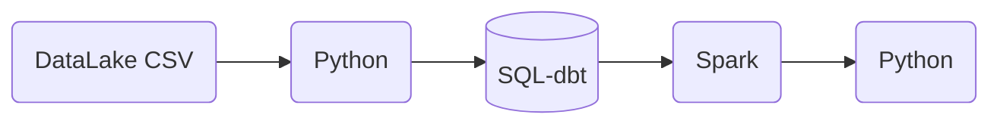

## 1.4.Pros and cons of batch jobs

* Advantages:
  * Easy to manage. There are multiple tools to manage them (the technologies we already mentioned)
  * Re-executable. Jobs can be easily retried if they fail.
  * Scalable. Scripts can be executed in more capable machines etc.
* Disadvantages:
  * Delay. Each task of the workflow in the previous section may take a few minutes; assuming the whole workflow takes 20 minutes, we would need to wait those 20 minutes until the data is ready for work.

However, the advantages of batch jobs often compensate for its shortcomings, and as a result most companies that deal with data tend to work with batch jobs mos of the time (probably 90%).【优点大于缺点】

# 2.Spark

## 2.1.What is Spark?

_[Video source](https://www.youtube.com/watch?v=FhaqbEOuQ8U&list=PL3MmuxUbc_hJed7dXYoJw8DoCuVHhGEQb&index=52)_

[Apache Spark](https://spark.apache.org/) is an open-source ***multi-language*** unified analytics ***engine*** for large-scale data processing.【开源的大数据处理框架】

Spark is an ***engine*** because it _processes data_.

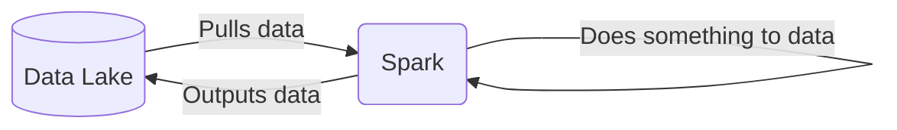

Spark can be ran in _clusters_ with multiple _nodes_, each pulling and transforming data.

Spark is ***multi-language*** because we can use Java and Scala natively, and there are wrappers for Python, R and other languages.【多语言】

The wrapper for Python is called [PySpark](https://spark.apache.org/docs/latest/api/python/).【python】

Spark can deal with both batches and streaming data. The technique for streaming data is seeing a stream of data as a sequence of small batches and then applying similar techniques on them to those used on regular badges. We will cover streaming in detail in the next lesson.【既可以批处理也可以流处理数据】

## 2.2.Why do we need Spark?

Spark is used for transforming data in a Data Lake.【在data lake中使用spark来转换数据】

There are tools such as Hive, Presto or Athena (a AWS managed query service) that allow you to express jobs as SQL queries. However, there are times where you need to apply more complex manipulation which are very difficult or even impossible to express with SQL (such as ML models); in those instances, Spark is the tool to use.【有时您需要应用更复杂的操作，这些操作很难甚至不可能用 SQL 表达（例如 ML 模型）；在这些情况下，Spark 就是可以使用的工具】

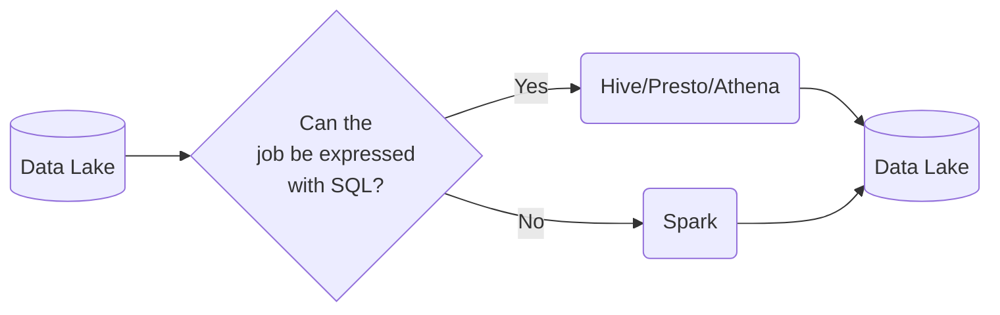

A typical workflow may combine both tools. Here's an example of a workflow involving Machine Learning:

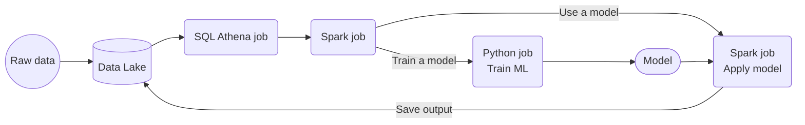

In this scenario, most of the preprocessing would be happening in Athena, so for everything that can be expressed with SQL, it's always a good idea to do so, but for everything else, there's Spark.

## 2.3.Installing Spark

_[Video source](https://www.youtube.com/watch?v=hqUbB9c8sKg&list=PL3MmuxUbc_hJed7dXYoJw8DoCuVHhGEQb&index=53)_

Install instructions for

- [Windows](https://github.com/DataTalksClub/data-engineering-zoomcamp/blob/main/05-batch/setup/windows.md)
- [Linux](https://github.com/DataTalksClub/data-engineering-zoomcamp/blob/main/05-batch/setup/linux.md)
- [MacOS](https://github.com/DataTalksClub/data-engineering-zoomcamp/blob/main/05-batch/setup/macos.md)

After installing the appropiate JDK and Spark, make sure that you set up PySpark by [following these instructions](https://github.com/DataTalksClub/data-engineering-zoomcamp/blob/main/05-batch/setup/pyspark.md).

Test your install by running [this Jupiter Notebook](../5_batch_processing/03_test.ipynb).

## 2.4.First look at Spark/PySpark

_[Video Source](https://www.youtube.com/watch?v=r_Sf6fCB40c&list=PL3MmuxUbc_hJed7dXYoJw8DoCuVHhGEQb&index=54)_

> 没有schema的csv文件，数据类型是string和long，因此存储空间大，通过数据类型和文件类型转换，减小存储空间
>
> * 首先转换成有指定shema的文件，来修改数据类型
> * 然后使用分区，将csv文件分区`df = df.repartition(24)`，然后写入24个parquet文件中`df.write.parquet('fhvhv/2021/01/', mode='overwrite')`
> * 最后将24个parquet文件读入一个spark dataframe中`df = spark.read.parquet('fhvhv/2021/01/')`

>Note: if you're running Spark and Jupyter Notebook on a remote machine, you will need to redirect ports 8888 for Jupyter Notebook and 4040 for the Spark UI.

### Creating a Spark session

We can use Spark with Python code by means of PySpark. We  will be using Jupyter Notebooks for this lesson.

We first need to import PySpark to our code:

```python
import pyspark
from pyspark.sql import SparkSession
```

We now need to instantiate a ***Spark session***, an object that we use to interact with Spark.

```python
spark = SparkSession.builder \
    .master("local[*]") \
    .appName('test') \
    .getOrCreate()
```

* `SparkSession` is the class of the object that we instantiate. `builder` is the builder method.
* `master()` sets the Spark _master URL_ to connect to. The `local` string means that Spark will run on a local cluster. `[*]` means that Spark will run with as many CPU cores as possible.
* `appName()` defines the name of our application/session. This will show in the Spark UI.
* `getOrCreate()` will create the session or recover the object if it was previously created.

Once we've instantiated a session, we can access the Spark UI by browsing to `localhost:4040`. The UI will display all current jobs. Since we've just created the instance, there should be no jobs currently running.

### Reading CSV files

Similarlly to Pandas, Spark can read CSV files into ***dataframes***, a tabular data structure. Unlike Pandas, Spark can handle much bigger datasets but it's unable to infer the datatypes of each column.

>Note: Spark dataframes use custom data types; we cannot use regular Python types.

For this example we will use the [High Volume For-Hire Vehicle Trip Records for January 2021](https://github.com/DataTalksClub/nyc-tlc-data/releases/download/fhvhv/fhvhv_tripdata_2021-01.csv.gz) , The csv file should be about 720MB in size. The csv file is not available from the [NYC TLC Trip Record Data webiste](https://www1.nyc.gov/site/tlc/about/tlc-trip-record-data.page) instead of parquet file.

Let's read the file and create a dataframe after unzipping csv.gz:

```python
df = spark.read \
    .option("header", "true") \
    .csv('fhvhv_tripdata_2021-01.csv')
```

* `read()` reads the file.
* `option()` contains options for the `read` method. In this case, we're specifying that the first line of the CSV file contains the column names.
* `csv()` is for readinc CSV files.

You can see the contents of the dataframe with `df.show()` (only a few rows will be shown) or `df.head()`. You can also check the current schema with `df.schema`; you will notice that all values are strings.

We can use a trick with Pandas to infer the datatypes:

1. Create a smaller CSV file with the first 1000 records or so.

1. Import Pandas and create a Pandas dataframe. This dataframe will have inferred datatypes.

1. Create a Spark dataframe from the Pandas dataframe and check its schema.

   ```python
   spark.createDataFrame(my_pandas_dataframe).schema
   ```

1. Based on the output of the previous method, import `types` from `pyspark.sql` and create a `StructType` containing a list of the datatypes.

   ```python
   from pyspark.sql import types
   schema = types.StructType([...])
   ```

   * `types` contains all of the available data types for Spark dataframes.

1. Create a new Spark dataframe and include the schema as an option.

   ```python
   df = spark.read \
       .option("header", "true") \
       .schema(schema) \
       .csv('fhvhv_tripdata_2021-01.csv')
   ```

You may find an example Jupiter Notebook file using this trick [in this link](../5_batch_processing/04_pyspark.ipynb).

### Partitions

> 因为spark有多执行器，可以独立执行任务来增加处理速度。如果将一个文件放在一个处理器上处理，其余处理器空置，反而会降低速度，所以将数据分区成多个文件，再使用spark多任务同时处理，加快速度

A ***Spark cluster*** is composed of multiple ***executors***. Each executor can process data independently in order to parallelize and speed up work.

In the previous example we read a single large CSV file. A file can only be read by a single executor, which means that the code we've written so far isn't parallelized and thus will only be run by a single executor rather than many at the same time.

In order to solve this issue, we can _split a file into multiple parts_ so that each executor can take care of a part and have all executors working simultaneously. These splits are called ***partitions***.

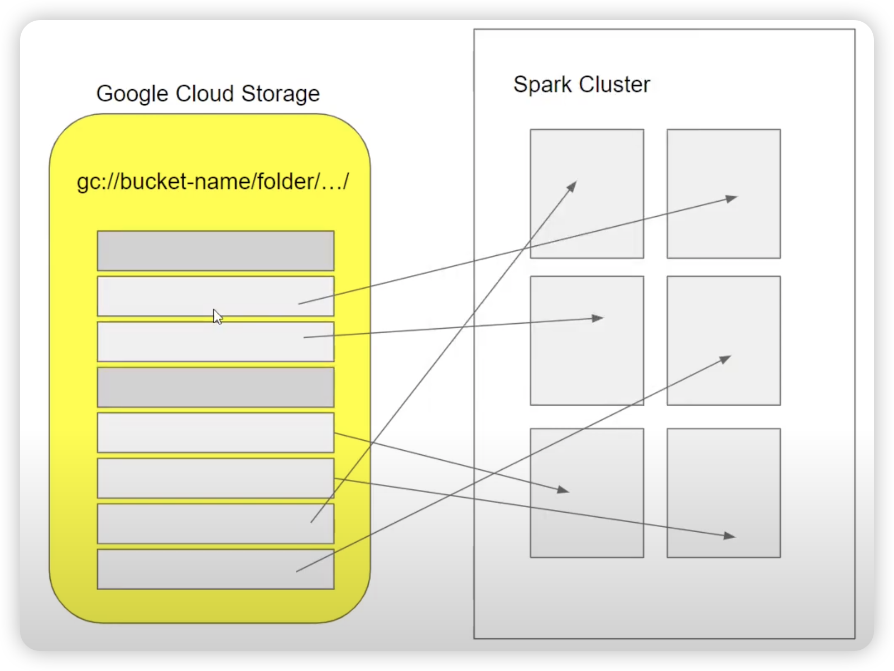

We will now read the CSV file, partition the dataframe and parquetize it. This will create multiple files in parquet format.

>Note: converting to parquet is an expensive operation which may take several minutes.

```python
# create 24 partitions in our dataframe
df = df.repartition(24)
# parquetize and write to fhvhv/2021/01/ folder
df.write.parquet('fhvhv/2021/01/', mode='overwrite')
```

You may check the Spark UI at any time and see the progress of the current job, which is divided into stages which contain tasks. The tasks in a stage will not start until all tasks on the previous stage are finished.

Besides the 24 parquet files, you should also see a `_SUCCESS` file which should be empty. This file is created when the job finishes successfully.

The opposite of partitioning (joining multiple partitions into a single partition) is called ***coalescing***.

## 2.5.Spark dataframes

_[Video source](https://www.youtube.com/watch?v=ti3aC1m3rE8&list=PL3MmuxUbc_hJed7dXYoJw8DoCuVHhGEQb&index=55)_

[As we said before](#reading-csv-files), Spark works with ***dataframes***.

We can create a dataframe from the parquet files we created in the previous section:

```python
df = spark.read.parquet('fhvhv/2021/01/')
```

Unlike CSV files, **parquet files** contain the schema of the dataset, so there is no need to specify a schema like we previously did when reading the CSV file. **You can check the schema like this:**

```python
df.printSchema()
```

(One of the reasons why parquet files are smaller than CSV files is because they store the data according to the datatypes, so integer values will take less space than long or string values.)

There are many Pandas-like operations that we can do on **Spark dataframes**, such as:

* Column selection - returns a dataframe with only the specified columns.

  ```python
  new_df = df.select('pickup_datetime', 'dropoff_datetime', 'PULocationID', 'DOLocationID')
  ```

* Filtering by value - returns a dataframe whose records match the condition stated in the filter.

  ```python
  new_df = df.select('pickup_datetime', 'dropoff_datetime', 'PULocationID', 'DOLocationID')\
  .filter(df.hvfhs_license_num == 'HV0003')
  ```

* And many more. The official Spark documentation website contains a [quick guide for dataframes](https://spark.apache.org/docs/latest/api/python/getting_started/quickstart_df.html).

### Actions vs Transformations

* Some Spark methods are "lazy", meaning that they are not executed right away. You can test this with the last instructions we run in the previous section: after running them, the Spark UI will not show any new jobs. 

  ```python
  new_df = df.select('pickup_datetime', 'dropoff_datetime', 'PULocationID', 'DOLocationID')
  ```

* However, running `df.show()` right after will execute right away and display the contents of the dataframe; the Spark UI will also show a new job.

  ```python
  new_df = df.select('pickup_datetime', 'dropoff_datetime', 'PULocationID', 'DOLocationID')\
  				.show()
  ```

These lazy commands are called ***transformations*** and the eager commands are called ***actions***. Computations only happen when actions are triggered.

```python
df.select(...).filter(...).show()
```

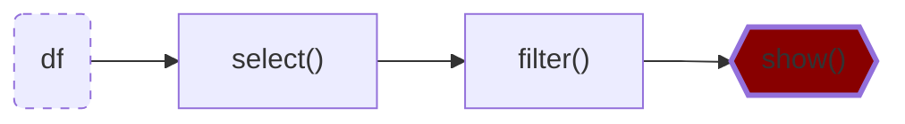

Both `select()` and `filter()` are _transformations_, but `show()` is an _action_. The whole instruction gets evaluated only when the `show()` action is triggered.

List of transformations (lazy):

* Selecting columns
* Filtering
* Joins
* Group by
* Partitions
* ...

List of actions (eager):

* Show, take, head
* Write, read
* ...

### Functions and User Defined Functions (UDFs)

Besides the SQL and Pandas-like commands we've seen so far, Spark provides additional built-in functions that allow for more complex data manipulation.

Here's an example of built-in function usage:

```python
from pyspark.sql import functions as F
```

```python
df \
    .withColumn('pickup_date', F.to_date(df.pickup_datetime)) \#创建一个新的列，如果列名是存在的，会覆盖原来字段的数据
    .withColumn('dropoff_date', F.to_date(df.dropoff_datetime)) \
    .select('pickup_date', 'dropoff_date', 'PULocationID', 'DOLocationID') \
    .show()
```

* `withColumn()` is a ***transformation*** that adds a new column to the dataframe.
  * ***IMPORTANT***: adding a new column with the same name as a previously existing column will overwrite the existing column!
* `select()` is another transformation that selects the stated columns.
* `F.to_date()` is a built-in Spark function that converts a timestamp to date format ('yyyy-MM-dd', no hour and minute).

A list of built-in functions is available [in the official Spark documentation page](https://spark.apache.org/docs/latest/api/sql/index.html).


Besides these built-in functions, Spark allows us to create ***User Defined Functions*** (UDFs) with custom behavior for those instances where creating SQL queries for that behaviour becomes difficult both to manage and test.【当不适用于使用sql时，可以创建UDFs来处理数据】

UDFs are regular functions which are then passed as parameters to a special builder. Let's create one:

```python
# A crazy function that changes values when they're divisible by 7 or 3
def crazy_stuff(base_num):
    num = int(base_num[1:])
    if num % 7 == 0:
        return f's/{num:03x}'
    elif num % 3 == 0:
        return f'a/{num:03x}'
    else:
        return f'e/{num:03x}'

# Creating the actual UDF
crazy_stuff_udf = F.udf(crazy_stuff, returnType=types.StringType())
```

* `F.udf()` takes a function (`crazy_stuff()` in this example) as parameter as well as a return type for the function (a string in our example).
* While `crazy_stuff()` is obviously non-sensical, UDFs are handy for things such as ML and other complex operations for which SQL isn't suitable or desirable. Python code is also easier to test than SQL.【Python 代码也比 SQL 更容易测试】

We can then use our UDF in transformations just like built-in functions:

```python
df \
    .withColumn('pickup_date', F.to_date(df.pickup_datetime)) \
    .withColumn('dropoff_date', F.to_date(df.dropoff_datetime)) \
    .withColumn('base_id', crazy_stuff_udf(df.dispatching_base_num)) \
    .select('base_id', 'pickup_date', 'dropoff_date', 'PULocationID', 'DOLocationID') \
    .show()
```

# 3.Spark SQL

_[Video source](https://www.youtube.com/watch?v=uAlp2VuZZPY&list=PL3MmuxUbc_hJed7dXYoJw8DoCuVHhGEQb&index=57)_

We already mentioned at the beginning that there are other tools for expressing batch jobs as SQL queries. However, Spark can also run SQL queries, which can come in handy if you already have a Spark cluster and setting up an additional tool for sporadic use isn't desirable.【有很多工具可以建立batch jobs，如果你有一个spark集群，不如用spark sql试试】

## 3.1.Combining the 2 datasets

>Note: this block makes use of the yellow and green taxi datasets for 2020 and 2021 as parquetized local files. You may create a DAG with Airflow [as seen on lesson 2](2_data_ingestion.md#creating-a-dag) or you may download and parquetize the files directly
>
> [check out this extra lesson](05_preparing_data.md) to see how to get the parquetized files.

Let's now load all of the yellow and green taxi data for 2020 and 2021 to Spark dataframes.

**step1:读取数据并使用`withColumnRenamed`修改列名**：Assuning the parquet files for the datasets are stored on a `data/pq/color/year/month` folder structure:

```python
df_green = spark.read.parquet('data/pq/green/*/*')
df_green = df_green \
    .withColumnRenamed('lpep_pickup_datetime', 'pickup_datetime') \#Pandas DataFrame，没有withColumnRenamed()方法
    .withColumnRenamed('lpep_dropoff_datetime', 'dropoff_datetime')

df_yellow = spark.read.parquet('data/pq/yellow/*/*')
df_yellow = df_yellow \
    .withColumnRenamed('tpep_pickup_datetime', 'pickup_datetime') \
    .withColumnRenamed('tpep_dropoff_datetime', 'dropoff_datetime')
```

* Because the pickup and dropoff column names don't match between the 2 datasets, we use the `withColumnRenamed` action to make them have matching names.

**step2:统一两个表的列顺序并使用`F.lit`增加一列数据**：We need to find out which are the common columns. We could do this:

```python
set(df_green.columns) & set(df_yellow.columns)
```

However, this command will not respect the column order. We can do this instead to respect the order:

【但是，此命令不会遵守表中的“列”顺序。我们可以这样做修正“列”顺序】

```python
common_colums = []

yellow_columns = set(df_yellow.columns)

for col in df_green.columns:
    if col in yellow_columns:#也可以注释yellow_columns这一行，将yellow_columns替换为df_yellow.columns
        common_colums.append(col)
```

Before we combine the datasets, we need to figure out how we will keep track of the taxi type for each record (the `service_type` field in `dm_monthyl_zone_revenue.sql`). We will add the `service_type` column to each dataframe.

```python
from pyspark.sql import functions as F

df_green_sel = df_green \
    .select(common_colums) \
    .withColumn('service_type', F.lit('green'))

df_yellow_sel = df_yellow \
    .select(common_colums) \
    .withColumn('service_type', F.lit('yellow'))
```

* `F.lit()` adds a _literal_ or constant to a dataframe. We use it here to fill the `service_type` column with a constant value, which is its corresponging taxi type.

**step3:合并数据**：Finally, let's combine both datasets:

We will replicate the [`dm_monthyl_zone_revenue.sql`](https://github.com/DataTalksClub/data-engineering-zoomcamp/blob/main/04-analytics-engineering/taxi_rides_ny/models/core/dm_monthly_zone_revenue.sql) model from [lesson 4](04_analytics.md) in Spark. This model makes use of `trips_data`, a combined table of yellow and green taxis, so we will create a combined dataframe with the common columns to both datasets.

```python
df_trips_data = df_green_sel.unionAll(df_yellow_sel)
```

We can also count the amount of records per taxi type:

```python
df_trips_data.groupBy('service_type').count().show()
```

_[Back to the top](#)_

## 3.2.Querying a dataset with Temporary Tables

We can make SQL queries with Spark with `spark.sqll("SELECT * FROM ???")`. SQL expects a table for retrieving records, but a dataframe is not a table, so we need to ***change*** the dataframe as a table first:【将dataframe标记为table】

**step1:告诉spark这是一个table**：

```python
df_trips_data.createOrReplaceTempView('trips_data')
```

* This method creates a ***temporary table*** with the name `trips_data`.

**step2:撰写sql**：

With our registered table, we can now perform regular SQL operations.

```python
spark.sql("""
SELECT
    service_type,
    count(1)
FROM
    trips_data
GROUP BY 
    service_type
""").show()
```

* This query outputs the same as `df_trips_data.groupBy('service_type').count().show()`
* Note that the SQL query is wrapped with 3 double quotes (`"`).

The query output can be manipulated as a dataframe, which means that we can perform any queries on our table and manipulate the results with Python as we see fit.【query结果可以转换为dataframe】

We can now slightly modify the [`dm_monthyl_zone_revenue.sql`](https://github.com/DataTalksClub/data-engineering-zoomcamp/blob/main/04-analytics-engineering/taxi_rides_ny/models/core/dm_monthly_zone_revenue.sql), and run it as a query with Spark and store the output in a dataframe:

```python
df_result = spark.sql("""
SELECT 
    -- Reveneue grouping 
    PULocationID AS revenue_zone,
    date_trunc('month', pickup_datetime) AS revenue_month, 
    service_type, 

    -- Revenue calculation 
    SUM(fare_amount) AS revenue_monthly_fare,
    SUM(extra) AS revenue_monthly_extra,
    SUM(mta_tax) AS revenue_monthly_mta_tax,
    SUM(tip_amount) AS revenue_monthly_tip_amount,
    SUM(tolls_amount) AS revenue_monthly_tolls_amount,
    SUM(improvement_surcharge) AS revenue_monthly_improvement_surcharge,
    SUM(total_amount) AS revenue_monthly_total_amount,
    SUM(congestion_surcharge) AS revenue_monthly_congestion_surcharge,

    -- Additional calculations
    AVG(passenger_count) AS avg_montly_passenger_count,
    AVG(trip_distance) AS avg_montly_trip_distance
FROM
    trips_data
GROUP BY
    1, 2, 3
""")
```

* We removed the `with` statement from the original query because it operates on an external table that Spark does not have access to.
* We removed the `count(tripid) as total_monthly_trips,` line in _Additional calculations_ because it also depends on that external table.
* We change the grouping from field names to references in order to avoid mistakes.

SQL queries are transformations, so we need an action to perform them such as `df_result.show()`.

**step3:将step2的结果写入parquet文档**：

Once we're happy with the output, we can also store it as a parquet file just like any other dataframe. We could run this:

```python
df_result.write.parquet('data/report/revenue/')#生成200多个文件
```

However, with our current dataset, this will create more than 200 parquet files of very small size, which isn't very desirable.

In order to reduce the amount of files, we need to reduce the amount of partitions of the dataset, which is done with the `coalesce()` method:

```python
df_result.coalesce(1).write.parquet('data/report/revenue/', mode='overwrite')#生成1个文件
```

* This reduces the amount of partitions to just 1.

# 4.Spark internals内部结构

## 4.1.Spark Cluster集群

_[Video source](https://www.youtube.com/watch?v=68CipcZt7ZA&list=PL3MmuxUbc_hJed7dXYoJw8DoCuVHhGEQb&index=58)_

Until now, we've used a ***local cluster*** to run our Spark code, but real Spark clusters often contain multiple computers that act as executors.

Spark clusters are managed by a ***master***, which behaves similarly to an entry point of a Kubernetes cluster. A ***driver*** (an Airflow DAG, a computer running a local script, etc.) that wants to execute a Spark job will send the job to the master, which in turn will divide the work among the cluster's executors. If any executor fails and becomes offline for any reason, the master will reassign the task to another executor. 【code 通过spark submit 连接master，master管理spark clusters中的executors】

> driver can be a operator in air flow, for example, a task an airflow does spark submit or can be your laptop or can be something else.

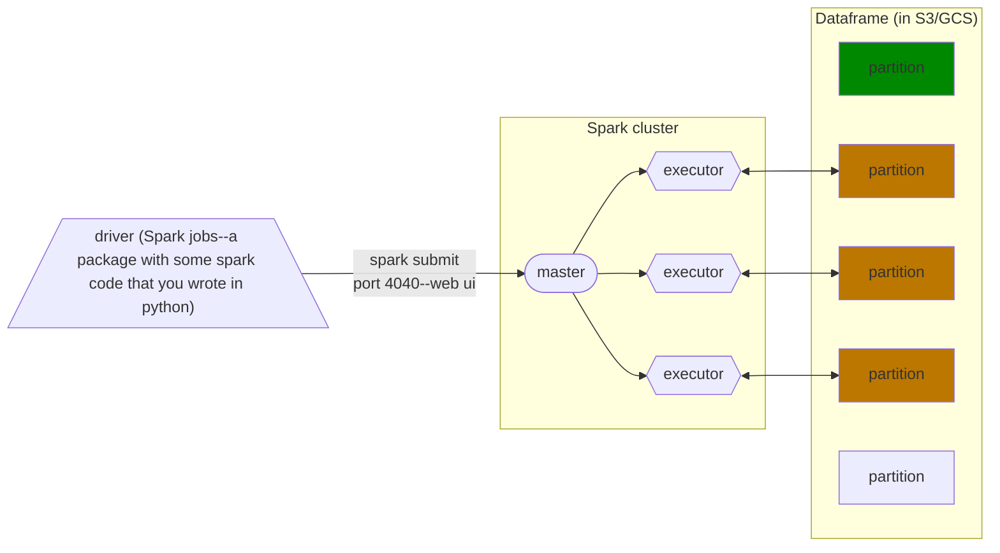

* separate storage from computation, more popular【分离存储与计算，更流行】

Each executor will fetch a ***dataframe partition*** stored in a ***Data Lake*** (usually S3, GCS or a similar cloud provider), do something with it and then store it somewhere, which could be the same Data Lake or somewhere else. If there are more partitions than executors, executors will keep fetching partitions until every single one has been processed.【数据存储在cloud端，读取到cluster中，再将处理后的数据存储到cloud中】

* combine storage from computation, less popular【合并存储与计算，目的是减少下载数据的麻烦，但是分离存储与计算的下载速度现在并不慢了，这种方法不太流行了】

This is in contrast to [Hadoop](https://hadoop.apache.org/), another data analytics engine, whose executors locally store the data they process. Partitions in Hadoop are duplicated across several executors for redundancy, in case an executor fails for whatever reason (Hadoop is meant for clusters made of commodity hardware computers). Because data is stored locally, you can send a small size source code to master instead of dowloading big size data.【相比下载原始的大数据，只要发送很小的原始代码给已经存储了本地数据的executor，就可以实现数据计算】

However, data locality has become less important as storage and data transfer costs have dramatically decreased and nowadays it's feasible to separate storage from computation, so Hadoop has fallen out of fashion.【数据存储在本地executor中，数据会重复存储，造成数据冗余】

_[Back to the top](#)_

## 4.2.GROUP BY in Spark

_[Video source](https://www.youtube.com/watch?v=9qrDsY_2COo&list=PL3MmuxUbc_hJed7dXYoJw8DoCuVHhGEQb&index=59)_

Let's do the following query:

```python
df_green_revenue = spark.sql("""
SELECT 
    date_trunc('hour', lpep_pickup_datetime) AS hour, 
    PULocationID AS zone,
    SUM(total_amount) AS amount,
    COUNT(1) AS number_records
FROM 
		green
WHERE
    lpep_pickup_datetime >= '2020-01-01 00:00:00'
GROUP BY
    1, 2  
""")
```

This query will output the total revenue and amount of trips per hour per zone. We need to group by hour and zones in order to do this.

Since the data is split along partitions, it's likely that we will need to group data which is in separate partitions, but executors only deal with individual partitions. Spark solves this issue by separating the grouping in 2 stages:【两个stage，第一个是执行filter和partition中的group by，第二个是真正的group by，如果加上order by，那么会出现第三个stage】

Running the query should display the following DAG in the Spark UI:

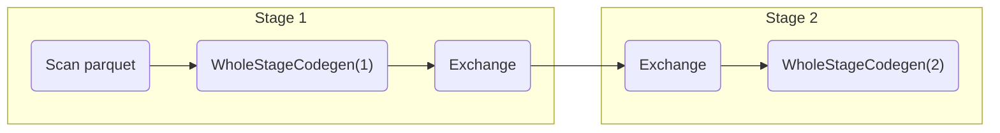

* The `Exchange` task refers to the reshuffling.

If we  were to add sorting to the query (adding a `ORDER BY 1,2` at the end), Spark would perform a very similar operation to `ORDER BY` after grouping the data. The resulting DAG would look liked this:

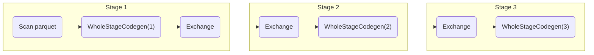

1. **Stage 1: 部分group by。**每个executor在指定partition中执行`filter(where)`，`group by`

   In the first stage, each executor groups the results in the partition they're working on and outputs the results to a temporary partition. These temporary partitions are the ***intermediate results***.

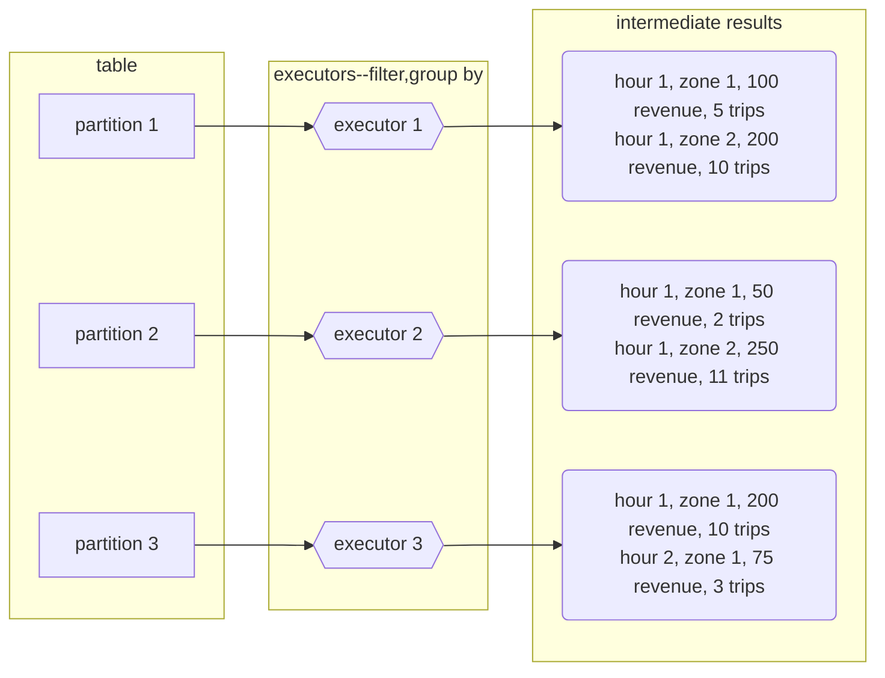

2. **Stage2: 整合group by。** reshuff the data from stage1【reshuff-重洗数据，shuffle到不同的partition】

   The second stage ***reshuffle*** the data: Spark will put all records with the ***same keys*** (in this case, the `GROUP BY` keys which are hour and zone) in the ***same partition***. The algorithm to do this is called _external merge sort_. Once the shuffling has finished, we can once again apply the `GROUP BY` to these new partitions and ***reduce*** the records to the ***final output***.

   * Note that the shuffled partitions may contain more than one key, but all records belonging to a key should end up in the same partition.【在reshuff阶段，每个partition中可能存在不同的key，但是final中一定都是单独key的partition】

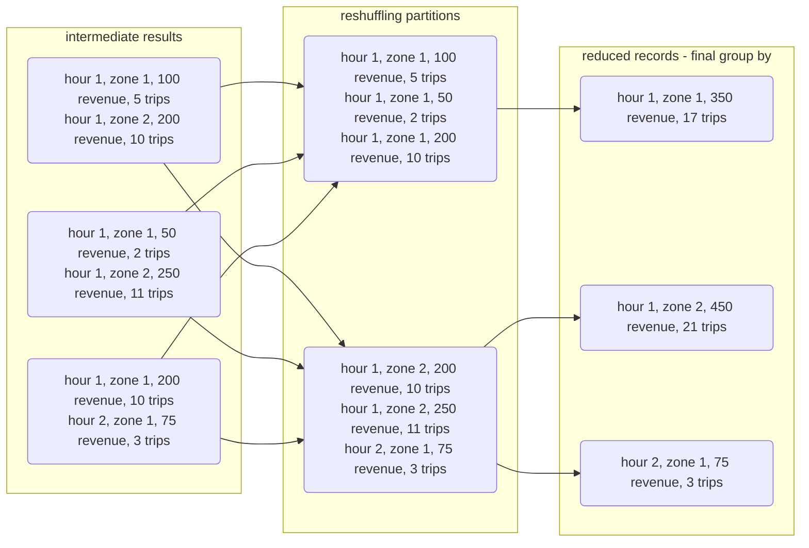


By default, Spark will repartition the dataframe to 200 partitions after reshuffling data. For the kind of data we're dealing with in this example this could be counterproductive because of the small size of each partition/file, but for larger datasets this is fine.【在这个sql计算中，reshuffle后默认产生200多个final group by文件，对于小文件来说，不划算，因为有太多partition，就会产生更多的数据shuffle，在不同的partition中来回跑动，对于大文件来说没问题】

Reshuffling is an ***expensive operation***, so it's in our best interest to reduce the amount of data to shuffle when querying.【减少在不同的partition中来回跑动的数据量降低Reshuffling成本】

* Keep in mind that repartitioning also involves reshuffling data.【因为repartition也包括在reshuffling中，所以通过减少repartition，降低Reshuffling成本】

_[Back to the top](#)_

## 4.3.Joins in Spark

_[Video source](https://www.youtube.com/watch?v=lu7TrqAWuH4&list=PL3MmuxUbc_hJed7dXYoJw8DoCuVHhGEQb&index=60)_

Joining tables in Spark is implemented in a similar way to `GROUP BY` and `ORDER BY`, but there are 2 distinct cases: joining 2 large tables and joining a large table and a small table.【两个大表join会reshuffle，一个大表join一个小表不需要reshuffle，因为小表被复制到每一个executor中，速度更快】

### Joining 2 large tables

Let's assume that we've created a `df_yellow_revenue` dataframe in the same manner as the `df_green_revenue` we created in the previous section. We want to join both tables, so we will create temporary dataframes with changed column names so that we can tell apart data from each original table:

【join两个表之前，先更改字段名，区分相同字段】

```python
df_green_revenue_tmp = df_green_revenue \
    .withColumnRenamed('amount', 'green_amount') \
    .withColumnRenamed('number_records', 'green_number_records')

df_yellow_revenue_tmp = df_yellow_revenue \
    .withColumnRenamed('amount', 'yellow_amount') \
    .withColumnRenamed('number_records', 'yellow_number_records')
```

* Both of these queries are _transformations_; Spark doesn't actually do anything when we run them.

We will now perform an [outer join](https://dataschool.com/how-to-teach-people-sql/sql-join-types-explained-visually/) so that we can display the amount of trips and revenue per hour per zone for green and yellow taxis at the same time regardless of whether the hour/zone combo had one type of taxi trips or the other:

```python
df_join = df_green_revenue_tmp.join(df_yellow_revenue_tmp, on=['hour', 'zone'], how='outer')
```

* `on=` receives a list of columns by which we will join the tables. This will result in a ***primary composite key*** for the resulting table.
* `how=` specifies the type of `JOIN` to execute.

When we run either `show()` or `write()` on this query, Spark will have to create both the temporary dataframes and the joint final dataframe. The DAG will look like this:

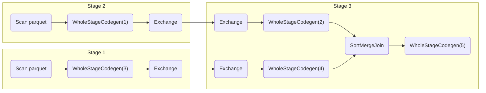

Stages 1 and 2 belong to the creation of `df_green_revenue_tmp` and `df_yellow_revenue_tmp`.

For stage 3, given all records for yellow taxis `Y1, Y2, ... , Yn` and for green taxis `G1, G2, ... , Gn` and knowing that the resulting composite key is `key K = (hour H, zone Z)`, we can express the resulting complex records as `(Kn, Yn)` for yellow records and `(Kn, Gn)` for green records. Spark will first ***shuffle*** the data like it did for grouping (using the ***external merge sort algorithm***) and then it will ***reduce*** the records by joining yellow and green data for matching keys to show the final output.

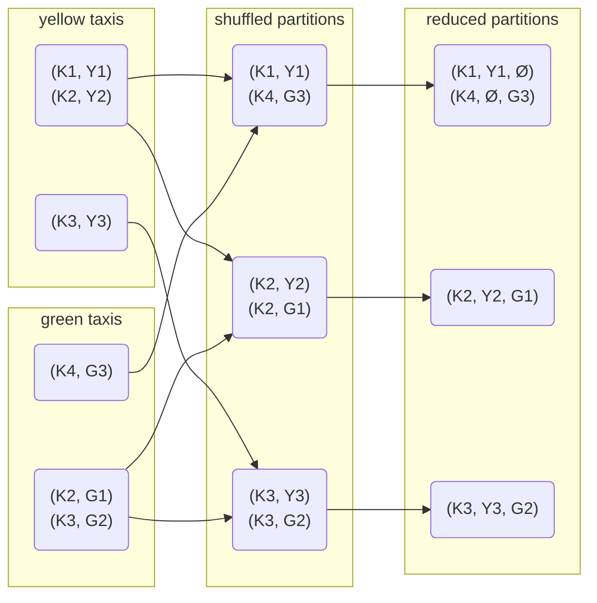

* Because we're doing an ***outer join***, keys which only have yellow taxi or green taxi records will be shown with empty fields for the missing data, whereas keys with both types of records will show both yellow and green taxi data.
  * If we did an ***inner join*** instead, the records such as `(K1, Y1, Ø)` and `(K4, Ø, G3)` would be excluded from the final result.

### Joining a large table and a small table

>Note: this section assumes that you have run the code in [the test Jupyter Notebook](../5_batch_processing/03_test.ipynb) from the [Installing spark section](#installing-spark) and therefore have created a `zones` dataframe.

Let's now use the `zones` lookup table to match each zone ID to its corresponding name.

```python
df_zones = spark.read.parquet('zones/')

df_result = df_join.join(df_zones, df_join.zone == df_zones.LocationID)

df_result.drop('LocationID', 'zone').write.parquet('tmp/revenue-zones')
```

* The default join type in Spark SQL is the inner join.
* Because we renamed the `LocationID` in the joint table to `zone`, we can't simply specify the columns to join and we need to provide a condition as criteria.
* We use the `drop()` method to get rid of the extra columns we don't need anymore, because we only want to keep the zone names and both `LocationID` and `zone` are duplicate columns with numeral ID's only.
* We also use `write()` instead of `show()` because `show()` might not process all of the data.

The `zones` table is actually very small and joining both tables with merge sort is unnecessary. What Spark does instead is ***broadcasting***: Spark sends a copy of the complete table to all of the executors and each executor then joins each partition of the big table in memory by performing a lookup on the local broadcasted table.

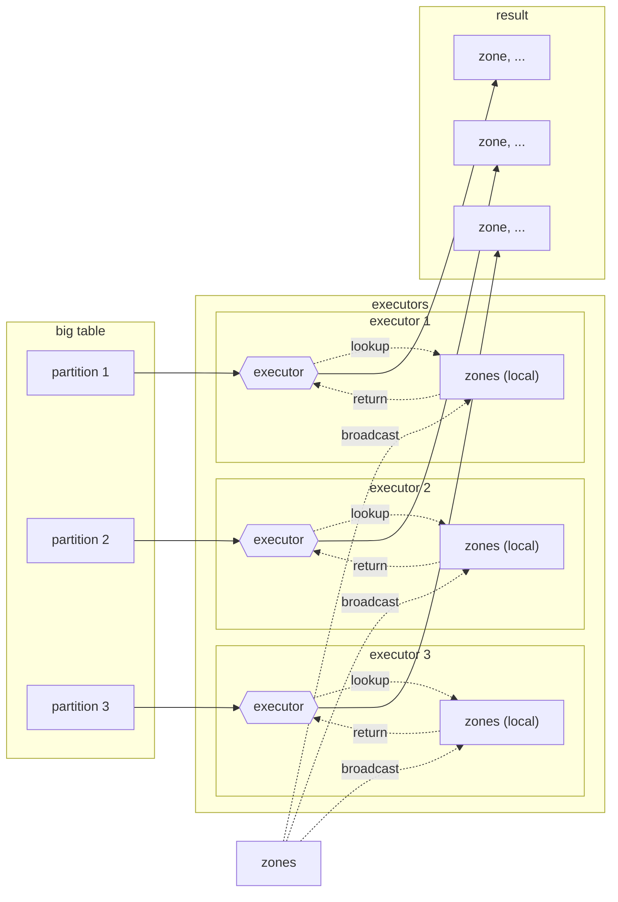

Shuffling isn't needed because each executor already has all of the necessary info to perform the join on each partition, thus speeding up the join operation by orders of magnitude.

# 5.Running Spark in the Cloud

So far we've seen how to run Spark locally and how to work with local data. In this section we will cover how to use Spark with remote data and run Spark in the cloud as well.

## 5.1.Connecting local Spark to Google Cloud Storage

_[Video source](https://www.youtube.com/watch?v=Yyz293hBVcQ&list=PL3MmuxUbc_hJed7dXYoJw8DoCuVHhGEQb&index=63)_

Google Cloud Storage is an _object store_, which means that it doesn't offer a fully featured file system. Spark can connect to remote object stores by using ***connectors***; each object store has its own connector, so we will need to use [Google's Cloud Storage Connector](https://cloud.google.com/dataproc/docs/concepts/connectors/cloud-storage) if we want our local Spark instance to connect to our Data Lake.

Before we do that, we will use `gsutil` to upload our local files to our Data Lake. `gsutil` is included with the GCP SDK, so you should already have it if you've followed the previous chapters.

### Uploading files to Cloud Storage with `gsutil`

Assuming you've got a bunch of parquet files you'd like to upload to Cloud Storage, run the following command to upload them:

```bash
gsutil -m cp -r <local_folder> gs://<bucket_name/destination_folder>
```

Like: `gsutil -m cp -r data/pq/ gs://dtc-zoomcamp-spark/pq/`

* The `-m` option is for enabling multithreaded upload in order to speed it up.【多线程上传，提高速度】
* `cp` is for copying files.
* `-r` stands for _recursive_; it's used to state that the contents of the local folder are to be uploaded. For single file this option isn't needed.【文件夹内递归上传，对于单个文件不需要】

### Configuring Spark with the GCS connector

* **Step1: download the corresponding version of the connector**

Go to the [Google's Cloud Storage Connector page](https://cloud.google.com/dataproc/docs/concepts/connectors/cloud-storage) and download the corresponding version of the connector. The version tested for this lesson is version 2.5.5 for Hadoop 3; create a `lib` folder in your work directory and run the following command from it:

```bash
gsutil cp gs://hadoop-lib/gcs/gcs-connector-hadoop3-2.2.5.jar data/lib/gcs-connector-hadoop3-2.2.5.jar
```

This will download the connector to the local folder.

* **Step2: import libraries**

We now need to follow a few extra steps before creating the Spark session in our notebook. Import the following libraries:

```python
import pyspark
from pyspark.sql import SparkSession
from pyspark.conf import SparkConf
from pyspark.context import SparkContext
```

* **Step3:  configure Spark**

Now we need to configure Spark by creating a configuration object. Run the following code to create it:

```python
credentials_location = '/Users/ola/Downloads/coherent-ascent-379901-f8984bc6c655.json'

conf = SparkConf() \
    .setMaster('local[*]') \
    .setAppName('test') \
    .set("spark.jars", "./data/lib/gcs-connector-hadoop3-2.2.5.jar") \
    .set("spark.hadoop.google.cloud.auth.service.account.enable", "true") \
    .set("spark.hadoop.google.cloud.auth.service.account.json.keyfile", credentials_location)
```

* **Step4: create a connection to a spark cluste**

You may have noticed that we're including a couple of options that we previously used when creating a Spark Session with its builder. That's because we implicitly created a ***context***, which represents a connection to a spark cluster. This time we need to explicitly create and configure the context like so:

```python
sc = SparkContext(conf=conf)

hadoop_conf = sc._jsc.hadoopConfiguration()

hadoop_conf.set("fs.AbstractFileSystem.gs.impl",  "com.google.cloud.hadoop.fs.gcs.GoogleHadoopFS")
hadoop_conf.set("fs.gs.impl", "com.google.cloud.hadoop.fs.gcs.GoogleHadoopFileSystem")
hadoop_conf.set("fs.gs.auth.service.account.json.keyfile", credentials_location)
hadoop_conf.set("fs.gs.auth.service.account.enable", "true")
```

This will likely output a warning when running the code. You may ignore it.

* **Step5: instantiate a Spark session**

We can now finally instantiate a Spark session:

```python
spark = SparkSession.builder \
    .config(conf=sc.getConf()) \
    .getOrCreate()
```

### Reading the remote data in GCS

In order to read the parquet files stored in the Data Lake, you simply use the bucket URI as a parameter, like so:

```python
df_green = spark.read.parquet('gs://dtc-zoomcamp-spark/pq/green/*/*')
```

You should obviously change the URI in this example for yours.

You may now work with the `df_green` dataframe normally.

_[Back to the top](#)_

## 5.2.Creating a  Spark Cluster in local with standalone mode

_[Video source](https://www.youtube.com/watch?v=HXBwSlXo5IA&list=PL3MmuxUbc_hJed7dXYoJw8DoCuVHhGEQb&index=65)_

### Spark standalone master and workers

[At the beginning of this lesson](#creating-a-spark-session) we saw how to create a Spark session from a notebook, like so:

```python
spark = SparkSession.builder \
    .master("local[*]") \
    .appName('test') \
    .getOrCreate()
```

This code will start a local cluster, but once the notebook kernel is shut down, the cluster will disappear.【这种方式以及上面与gcs connector连接中建立的cluster，一旦jupyter notebook关掉，也就失效了】

We will now see how to crate a Spark cluster in [Standalone Mode](https://spark.apache.org/docs/latest/spark-standalone.html) so that the cluster can remain running even after we stop running our notebooks.【如何在notebook之外建立spark cluster】

**Step1: Start a standalone master server**

In the terminal run `echo $SPARK_HOME` to find Spark install directory

Simply go to your Spark install directory from a terminal and run the following command:

```bash
./sbin/start-master.sh
```

You should now be able to open the main Spark dashboard by browsing to `localhost:8080` (remember to forward the port if you're running it on a virtual machine). At the very top of the dashboard the URL for the dashboard should appear; copy it and use it in your session code like so:

```python
spark = SparkSession.builder \
    .master("spark://<URL>:7077") \
    .appName('test') \
    .getOrCreate()
```

> * Note that we used the HTTP port 8080 for browsing to the dashboard but we use the Spark port 7077 for connecting our code to the cluster.
> * Using `localhost` as a stand-in for the URL may not work.
>

**Step2: Create workers**

You may note that in the Spark dashboard there aren't any _workers_ listed. The actual Spark jobs are run from within ***workers*** (or _slaves_ in older Spark versions), which we need to create and set up.【spark jobs 在worker内运行，需要启动worker】

```python
24/03/01 08:40:53 WARN TaskSchedulerImpl: Initial job has not accepted any resources; check your cluster UI to ensure that workers are registered and have sufficient resources
```

Similarly to how we created the Spark master, we can run a worker from the command line by running the following command from the Spark install directory:

```bash
./sbin/start-worker.sh <master-spark-URL>
```

Like: `./sbin/start-worker.sh spark://192.168.0.101:7077`

* If you don't run it successfully . In older Spark versions, the script to run is `start-slave.sh` .

Once you've run the command, you should see a worker in the Spark dashboard.

Note that a worker may not be able to run multiple jobs simultaneously. If you're running separate notebooks and connecting to the same Spark worker, you can check in the Spark dashboard how many Running Applications exist. Since we haven't configured the workers, any jobs will take as many resources as there are available for the job.【jupyter notebook占用一个application，同时在terminal运行python script也占用一个application，但是第一个把资源全部占用了，terminal这个没资源，需要先杀掉第一个】

### Parametrizing our scripts

So far we've hard-coded many of the values such as folders and dates in our code, but with a little bit of tweaking we can make our code so that it can receive parameters from Spark and make our code much more reusable and versatile.【参数化脚本，方便灵活选用数据，而不是在脚本中写死】

**Step1: Notebook to python script**

We will use the [argparse library](https://docs.python.org/3/library/argparse.html) for parsing parameters. Convert a notebook to a script with `jupyter nbconvert --to=script 10_spark_local_cluster.ipynb`

**Step2: Modify python script adding parameters**

manually modify it or create it from scratch and add the following:

```python
import argparse

parser = argparse.ArgumentParser()
parser.add_argument('--input_green', required=True)
parser.add_argument('--input_yellow', required=True)
parser.add_argument('--output', required=True)
args = parser.parse_args()

input_green = args.input_green
input_yellow = args.input_yellow
output = args.output
```

We can now modify previous lines using the 3 parameters we've created. For example:

```python
df_green = spark.read.parquet(input_green)
```

**Step3: Run python script with parameters** 

Once we've finished our script, we simply call it from a terminal line with the parameters we need:

```bash
python 10_spark_local_cluster.py \
    --input_green=data/pq/green/2020/*/ \
    --input_yellow=data/pq/yellow/2020/*/ \
    --output=data/report-2020
```

If you get an error `zsh: no matches found: --input_green=data/pq/green/2020/*/`, change the code like:

```bash
python 10_spark_local_cluster.py \
    --input_green='data/pq/green/2020/*/' \
    --input_yellow='data/pq/yellow/2020/*/' \
    --output='data/report-2020'
```

### Choosing specific cluster with spark-submit

However, we still haven't covered any Spark specific parameters; things like the the cluster URL when having multiple available clusters or how many workers to use for the job. Instead of specifying these parameters when setting up the session inside the script, we can use an external script called [Spark submit](https://spark.apache.org/docs/latest/submitting-applications.html).【实现灵活连接不同的cluster】

The basic usage is as follows:

```bash
spark-submit \
    --master="spark://<URL>" \
    my_script.py \
        --input_green=data/pq/green/2020/*/ \
        --input_yellow=data/pq/yellow/2020/*/ \
        --output=data/report-2020
```

And the Spark session code in the script is simplified like so:

```python
spark = SparkSession.builder \
    .appName('test') \
    .getOrCreate()
```

You may find more sophisticated uses of `spark-submit` in the [official documentation](https://spark.apache.org/docs/latest/submitting-applications.html).

> You may download a finished script [from this file](../5_batch_processing/10_spark_submit.py)

After you're done running Spark in standalone mode, you will need to manually shut it down. Simply run the `./sbin/stop-worker.sh` (`./sbin/stop-slave.sh` in older Spark versions) and ``./sbin/stop-master.sh` scripts to shut down Spark.

## 5.3.Creating a Spark Cluster in GCP

_[Video source](https://www.youtube.com/watch?v=osAiAYahvh8&list=PL3MmuxUbc_hJed7dXYoJw8DoCuVHhGEQb&index=65)_

## Setting up a Dataproc Cluster

### Creating the cluster

[Dataproc](https://cloud.google.com/dataproc) is Google's cloud-managed service for running Spark and other data processing tools such as Flink, Presto, etc.

You may access Dataproc from the GCP dashboard and typing `dataproc` on the search bar. The first time you access it you will have to enable the API.

**Let's started it:**

In the images below you may find some example values for creating a simple cluster. Give it a name of your choosing and choose the same region as your bucket.

We would normally choose a `standard` cluster, but you may choose `single node` if you just want to experiment and not run any jobs.

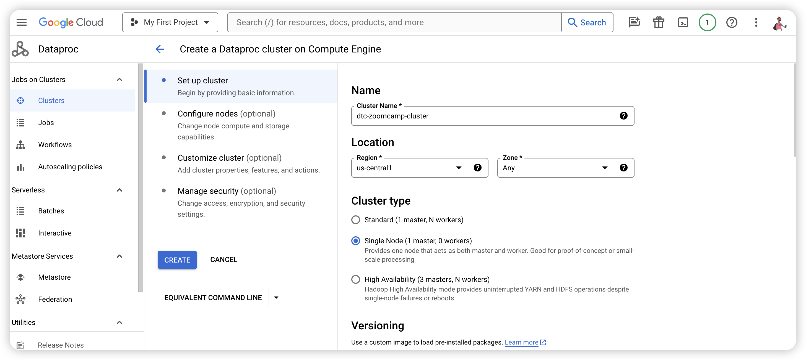

Optionally, you may install additional components but we won't be covering them in this lesson.

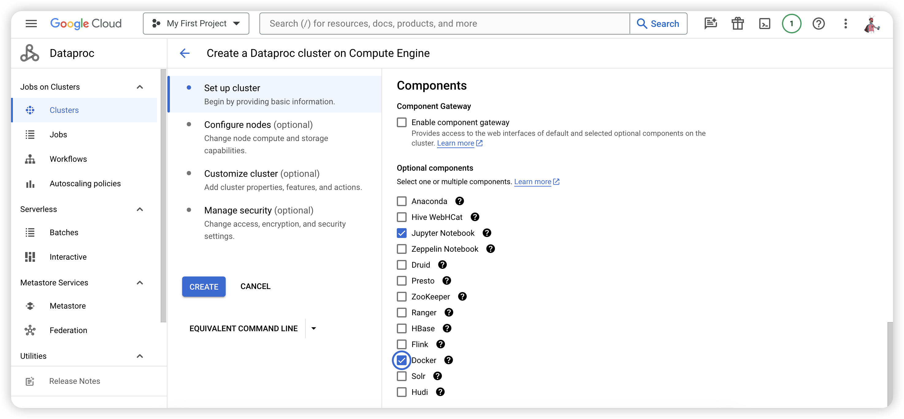

You may leave all other optional settings with their default values. After you click on `Create`, it will take a few seconds to create the cluster. You may notice an extra VM instance under VMs; that's the Spark instance.

### Running a spark job with the web UI(Dataproc)

In a [previous section](#configuring-spark-with-the-gcs-connector) we saw how to connect Spark to our bucket in GCP. However, in Dataproc we don't need to specify this connection because it's already pre-comfigured for us. We will also submit jobs using a menu, following similar principles to what we saw in the previous section.

In Dataproc's _Clusters_ page, choose your cluster and un the _Cluster details_ page, click on `Submit job`. Under _Job type_ choose `PySpark`, then in _Main Python file_ write the path to your script (you may upload the script to your bucket  by running `gsutil -m cp -r 10_spark_submit.py gs://dtc-zoomcamp-spark/code/` and then copy the URL).


Make sure that your script does not specify the `master` cluster! Your script should take the connection details from Dataproc; make sure it looks something like this:

```python
spark = SparkSession.builder \
    .appName('test') \
    .getOrCreate()
```

You may use [this script](../5_batch_processing/10_spark_submit.py) for testing.

We also need to specify arguments, in a similar fashion to what we saw [in the previous section](#parametrizing-our-scripts-for-spark), but using the URL's for our folders rather than the local paths:


Now press `Submit`. Sadly there is no easy way to access the Spark dashboard but you can check the status of the job from the `Job details` page.【看不到Spark dashboard啦】

### Running a spark job with the gcloud SDK

Besides the web UI, there are additional ways to run a job, listed [in this link](https://cloud.google.com/dataproc/docs/guides/submit-job). We will focus on the gcloud SDK now.

Before you can submit jobs with the SDK, you will need to grant permissions to the Service Account we've been using so far. Go to _IAM & Admin_ and edit your Service Account so that the `Dataproc Administrator` role is added to it.

We can now submit a job from the command line, like this:

```bash
gcloud dataproc jobs submit pyspark \
    --cluster=<your-cluster-name> \
    --region=europe-west6 \
    gs://<url-of-your-script> \
    -- \
        --param1=<your-param-value> \
        --param2=<your-param-value>
```

You may find more details on how to run jobs [in the official docs](https://cloud.google.com/dataproc/docs/guides/submit-job).

## 5.4.Connecting Spark to BigQuery
