# 1.Introduction to straming process

_[Video source](https://www.youtube.com/watch?v=WxTxKGcfA-k&list=PL3MmuxUbc_hJed7dXYoJw8DoCuVHhGEQb&index=68)_

**Stream processing** is a data management technique that involves ingesting a continuous data stream to quickly analyze, filter, transform or enhance the data in real time.

I recommend reading [Introduction to streaming for data scientists](https://huyenchip.com/2022/08/03/stream-processing-for-data-scientists.html) by Chip Huyen.

### Data exchange

Data exchange allows data to be shared between different computer programs.

### Producer and consumers

More generally, a producer can create messages that consumers can read. The consumers may be interested in certain topics. The producer indicates the topic of his messages. The consumer can subscribe to the topics of his choice.

### Data exchange in stream processing

When the producer posts a message on a particular topic, consumers who have subscribed to that topic receive the message in real time.

Real time does not mean immediately, but rather a few seconds late, or more generally much faster than batch processing.

# 2.Run Apache Kafka by Confluent cloud

_[Video source](https://www.youtube.com/watch?v=ZnEZFEYKppw&list=PL3MmuxUbc_hJed7dXYoJw8DoCuVHhGEQb&index=70)_

> [!WARNING]
>
> Remember to pause your connector when you don't use kafka in order to save your free trial money.

The easiest way to run Apache Kafka is using **Confluent cloud**. 

You can also  run Apache Kafka in **docker**.We can install Kafka locally.

If you have already installed Homebrew for macOS, you can use it to install Kafka in one step. This will ensure that you have Java installed first, and it will then install Apache Kafka

```
$ brew install kafka
```

Homebrew will install Kafka under `/opt/homebrew/Cellar/kafka/`.

Confluent cloud provides a free 30 days trial for.You can signup or login [here](https://www.confluent.io/confluent-cloud/tryfree/)

* **cluster**:Create a cluster during sign up.【注册的时候建立一个cluster】

  I use google cloud.

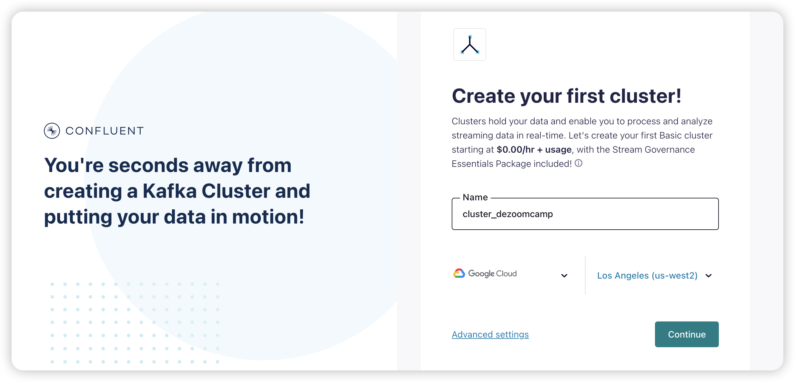

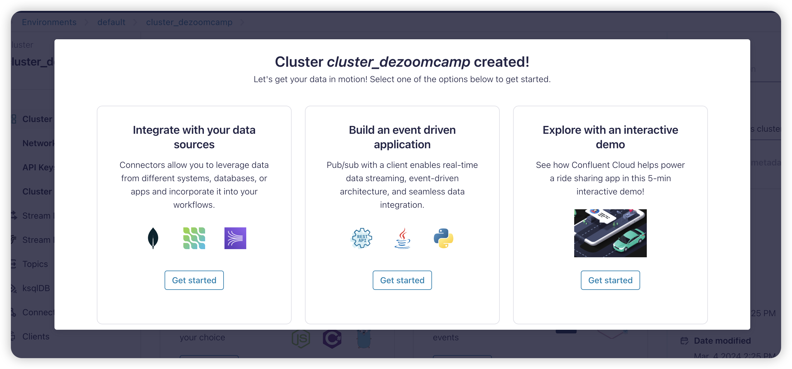

* **topic**:Create a topic

  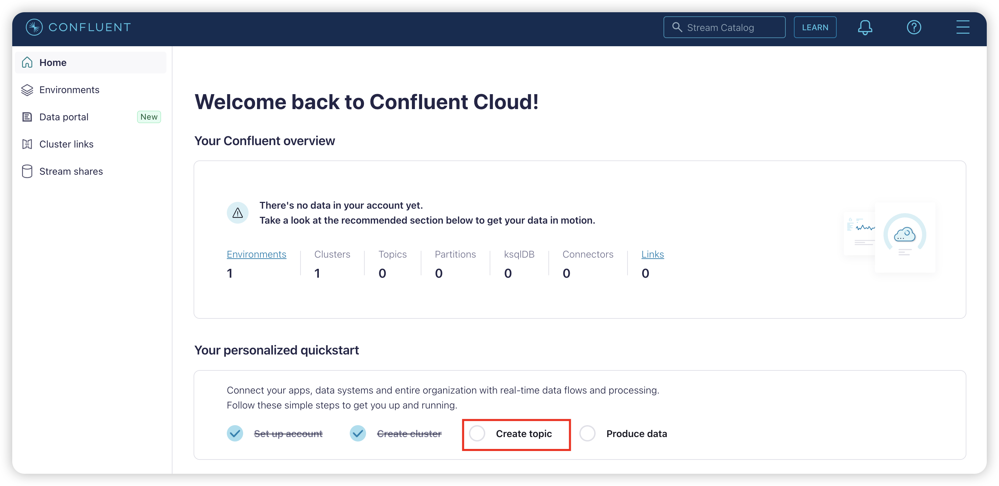

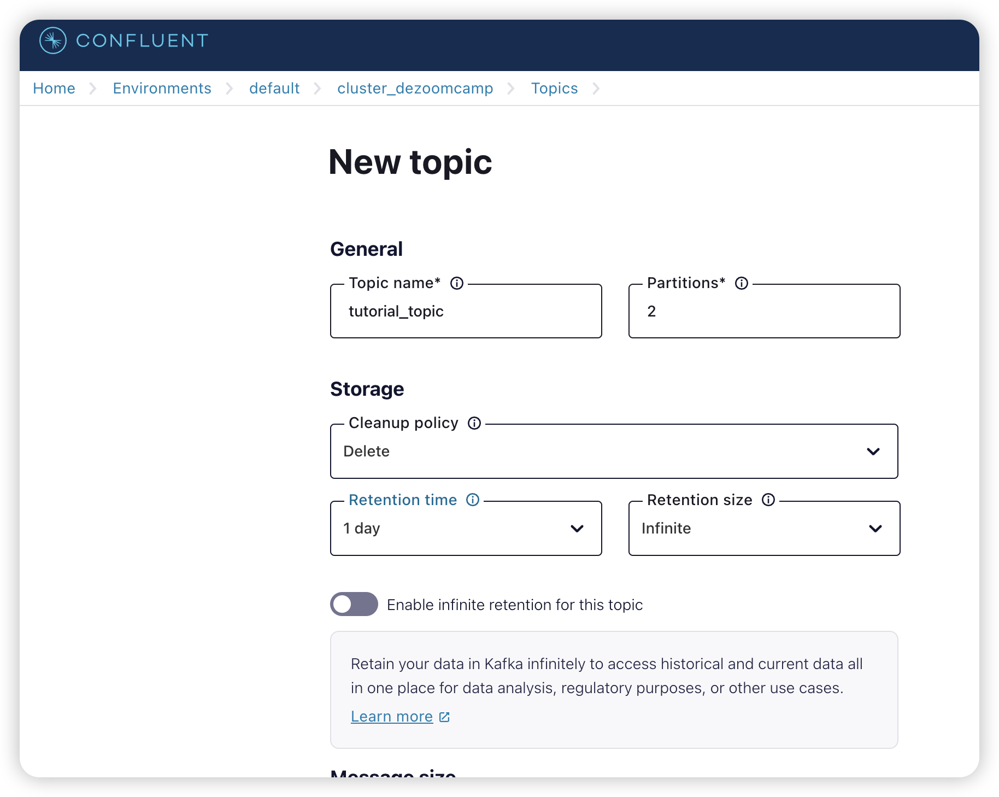

* **message**:Produce your first message

  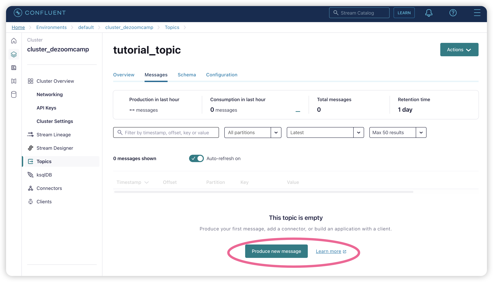

  Create one by just pressing the button and leave setting as default

* **connector**:Create a connector 

  Confluent Cloud offers pre-built, fully managed Kafka connectors that make it easy to instantly connect your clusters to popular data sources and sinks. Connect to external data systems effortlessly with simple configuration and no ongoing operational burden.

  In this case, we use datagen source

  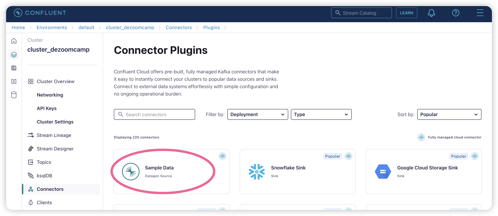

  You need to set your `Topics`--`API credentials --Configuration--Connector sizing`

  In API credentials, we select `global access`, and don't set api credentials

  In connect configuration, we select `JSON` as output record value format, `orders` as template.

  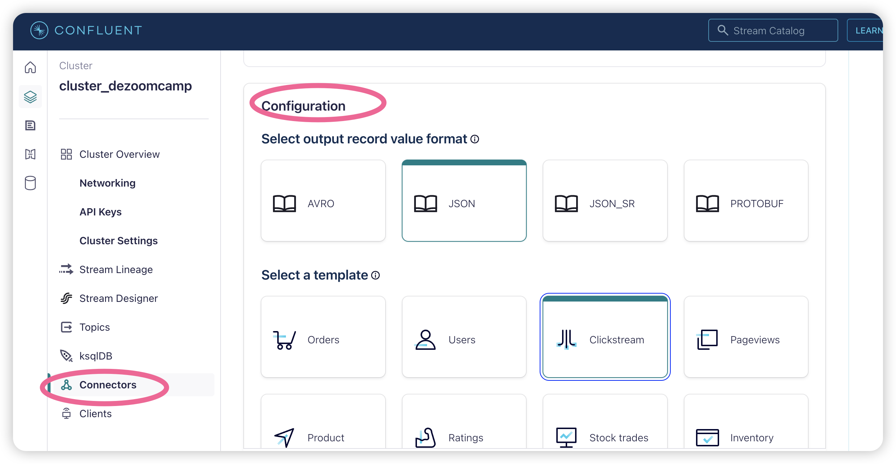

  In Connector sizing, we choose `1` tasks

* **API**:Create an API key for your current cluster

   Each Kafka API key is valid for a specific Kafka cluster. Kafka API keys are required to interact with Kafka clusters in Confluent Cloud. 

# 3.Introduction to Apache Kafka

_[Video source](https://www.youtube.com/watch?v=zPLZUDPi4AY&list=PL3MmuxUbc_hJed7dXYoJw8DoCuVHhGEQb&index=69)_

[Apache Kafka](https://kafka.apache.org/) is a ***message broker*** and ***stream processor***. Kafka is used to handle ***real-time data feeds***.【数据中间商，流数据处理】

Kafka is used to upgrade from a project architecture like this...【下面这图没有kafka】

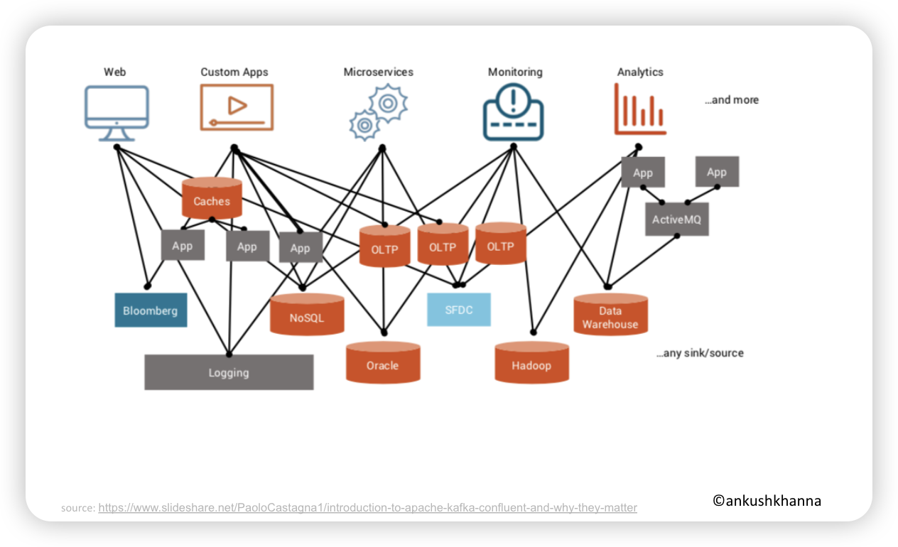

...to an architecture like this:【下面这图有kafka】

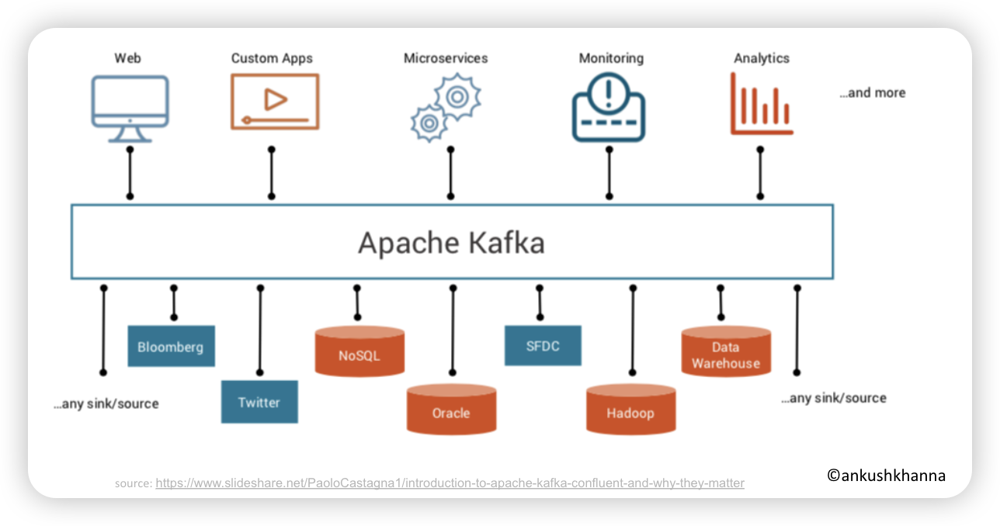


_You can also check out [this animated comic](https://www.gentlydownthe.stream/) to learn more about Kafka._

### Main Concepts

See [Streams Concepts](https://docs.confluent.io/platform/current/streams/concepts.html#streams-concepts).

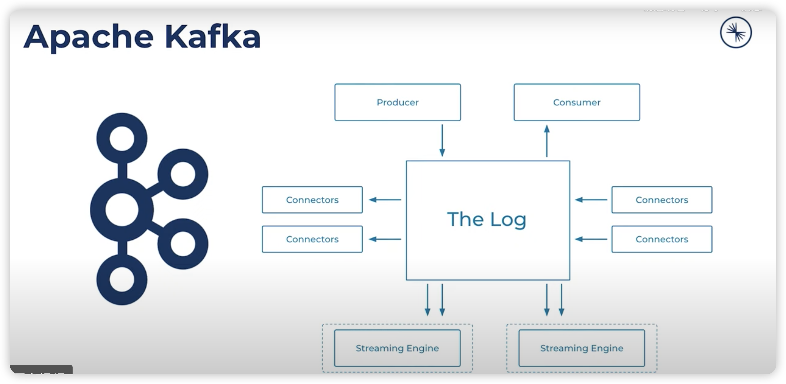

- **Publish/subscribe messaging** is a pattern that is characterized by the sender (publisher) of a piece of data (message) not specifically directing it to a receiver.
- These systems often have a **broker**, a central point where messages are published, to facilitate this pattern.
- The unit of data within Kafka is called a **message**.
- A message can have an optional piece of metadata, which is referred to as a **key**.
- While messages are opaque byte arrays to Kafka itself, it is recommended that additional structure, or **schema**, be imposed on the message content so that it can be easily understood.
- Messages in Kafka are categorized into **topics**. The closest analogies for a topic are a database table or a folder in a filesystem.
- Topics are additionally broken down into a number of **partitions**.
- A **stream** is considered to be a single topic of data, regardless of the number of partitions, moving from the producers to the consumers.
- **Producers** create new messages. In other publish/subscribe systems, these may be called **publishers** or **writers**.
- **Consumers** read messages. In other publish/subscribe systems, these clients may be called **subscribers** or **readers**.
- The consumer keeps track of which messages it has already consumed by keeping track of the **offset** of messages. The **offset**, an integer value that continually increases, is another piece of metadata that Kafka adds to each message as it is produced.
- Consumers work as part of a **consumer group**, which is one or more consumers that work together to consume a topic.
- A single Kafka server is called a **broker**. The broker receives messages from producers, assigns offsets to them, and writes the messages to storage on disk.
- Kafka brokers are designed to operate as part of a **cluster**.
- Within a **cluster of brokers**, one broker will also function as the cluster **controller** (elected automatically from the live members of the cluster).
- A partition is owned by a single broker in the cluster, and that broker is called the **leader** of the partition
- A replicated partition is assigned to additional brokers, called **followers** of the partition.

### Why Kafka?

**Kafka brings robustness**: For example, when a server goes down, we can still access the data. Apache Kafka achieves a certain level of resiliency through replication, both across machines in a cluster and across multiple clusters in multiple data centers.

**Kafka offers a lot of flexibility**: The data exchange application can be small or very large. Kafka can be connected to multiple databases with Kafka connect

**Kafka provides scalability**: Kafka has no problem handling a number of events that increases dramatically in a short time.

## 3.1.Basic Kafka components

_[Video source](https://www.youtube.com/watch?v=SXQtWyRpMKs&list=PL3MmuxUbc_hJed7dXYoJw8DoCuVHhGEQb&index=72)_

### Producer and consumer

In a data project we can differentiate between _consumers_ and _producers_:【kafka连接data consumer和data producer】

* ***Consumers*** are those that consume the data: web pages, micro services, apps, etc.
* ***Producers*** are those who supply the data to consumers.

Connecting consumers to producers directly can lead to an amorphous and hard to maintain architecture in complex projects like the one in the first image. Kafka solves this issue by becoming an intermediary that all other components connect to.

Kafka works by allowing producers to send ***messages*** which are then pushed in real time by Kafka to consumers.

Kafka is hugely popular and most technology-related companies use it.

### Broker(nodes) and Cluster

【cluster包含了nodes，nodes之间互通】

A ***Kafka broker*** is a machine (physical or virtualized) on which Kafka is running.

A ***Kafka cluster*** is a collection of brokers (nodes) working together.

Kafka cluster is nodes of machines that communicate with each other.

Kafka has recently shifted from [ZooKeeper](https://zookeeper.apache.org/) to a quorum-based controller that uses a new consensus protocol called Kafka Raft, shortened as Kraft (pronounced “craft”).

Being a distributed system with high availability and fault-tolerant, Kafka requires a mechanism for coordinating multiple decisions between all the active brokers. It also requires maintaining a consistent view of the cluster and its configurations. Kafka has been using ZooKeeper to achieve this for a long time now.

But, ZooKeeper adds an extra management layer for Kafka. Managing distributed systems is a complex task, even if it’s as simple and robust as ZooKeeper. This is one of the reasons why it was deemed preferable for Kafka to rely for this purpose on internal mechanisms.

Apache Kafka Raft (KRaft) is the consensus protocol that was introduced to remove Apache Kafka’s dependency on ZooKeeper for metadata management. This greatly simplifies Kafka’s architecture by consolidating responsibility for metadata into Kafka itself, rather than splitting it between two different systems: ZooKeeper and Kafka.

See [Kafka’s Shift from ZooKeeper to Kraft](https://www.baeldung.com/kafka-shift-from-zookeeper-to-kraft) and [KRaft: Apache Kafka Without ZooKeeper](https://developer.confluent.io/learn/kraft/) for more information.

### Topic

【data table，数据主题，用于解释这些数据是什么，由数据开发作为producer来创建】

topic is a sequence of events.

Message is one of a event.

A ***topic*** is an abstraction of a concept. Concepts can be anything that makes sense in the context of the project, such as "sales data", "new members", "clicks on banner", etc.

A producer pushes a message to a topic, which is then consumed by a consumer subscribed to that topic.

### Message

【data record，存储在topic中】

The basic communication abstraction used by producers and consumers in order to share information in Kafka is called a ***message***.

Messages have 3 main components:

* ***Key***: used to identify the message and for additional Kafka stuff such as partitions (covered later).
* ***Value***: the actual information that producers push and consumers are interested in.
* ***Timestamp***: used for logging.

### Logs

【kafka给每个message编号，存储在logs中，logs是数据片段】

In Kafka, ***logs*** are _data segments_ present on a storage disk. In other words, they're _physical representations of data_.

Logs store messages in an ordered fashion. Kafka assigns a sequence ID in order to each new message and then stores it in logs.

### Replication factor

目的：规定如何topic可以备份存储在cluster中，防止cluster中的某个leder broker出问题，数据中止执行

工作原理：假如有3个broker，leder a复制topic到follower b中，如果a出问题了，由b作为leder，再把数据复制到c中，c成为follower。

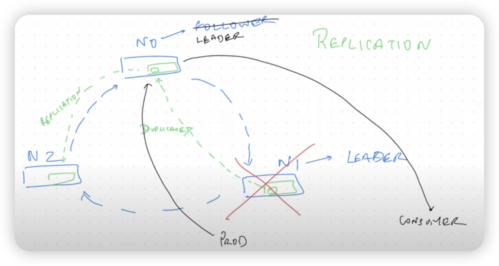

Apache Kafka ensures high data availability by replicating data via the replication factor in Kafka. The replication factor is the number of nodes to which your data is replicated.

When a producer writes data to Kafka, it sends it to the broker designated as the **Leader** for that topic:partition in the cluster. Such a broker is the entry point to the cluster for the topic’s data:partition.

If we use **replication factor** > 1, writes will also propagate to other brokers called **followers**. This fundamental operation enables Kafka to provide high availability (HA).

See [Kafka Replication and Committed Messages](https://docs.confluent.io/kafka/design/replication.html#kafka-replication-and-committed-messages) and [Apache Kafka replication factor – What’s the perfect number?](https://www.cloudkarafka.com/blog/apache-kafka-replication-factor-perfect-number.html) for more.

### Consumer Groups

A ***consumer group*** is composed of multiple consumers.

In regards of controlling read messages, Kafka treats all the consumers inside a consumer group as a _single entity_: when a consumer inside a group reads a message, that message will ***NOT*** be delivered to any other consumer in the group.

Consumer groups allow consumer apps to scale independently: a consumer app made of multiple consumer nodes will not have to deal with duplicated or redundant messages.

Consumer groups have IDs and all consumers within a group have IDs as well.

The default value for consumer groups is 1. All consumers belong to a consumer group.

### Partitions

>Note: do not confuse BigQuery or Spark partitions with Kafka partitions; they are different concepts.

有一个topic，名字是RIDES，分成了两个partition。

1个partition只能连接1个consumer，如果数据量大，不只是通过增加consumer的手段来提高数据读取速度，而是通过增加partition，同时增加虚拟consumer。

1个consumer可以读取多个partition的数据，但是一个partition只能被1个consumer读取。一夫多妻？

这些增加的consumer来自一个consumer实体，拥有相同的consumer group id。如果一个consumer出问题了，那么同一个consumer group中闲置的consumer来接班。例如，如果consumer2出问题了，那么之前不工作的consumer3就会顶上2的工作。

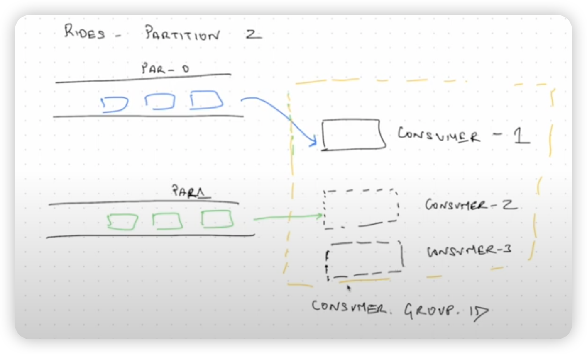

Topic logs in Kafka can be ***partitioned***. A topic is essentially a _wrapper_ around at least 1 partition.

Partitions are assigned to consumers inside consumer groups:

* ***A partition*** is assigned to ***one consumer only***.
* ***One consumer*** may have ***multiple partitions*** assigned to it.
* If a consumer dies, the partition is reassigned to another consumer.
* Ideally there should be as many partitions as consumers in the consumer group.
  * If there are more partitions than consumers, some consumers will receive messages from multiple partitions.
  * If there are more consumers than partitions, the extra consumers will be idle with nothing to do.

Partitions in Kafka, along with consumer groups, are a scalability feature. Increasing the amount of partitions allows the consumer group to increase the amount of consumers in order to read messages at a faster rate. Partitions for one topic may be stored in separate Kafka brokers in our cluster as well.

Messages are assigned to partitions inside a topic by means of their ***key***: message keys are hashed and the hashes are then divided by the amount of partitions for that topic; the remainder of the division is determined to assign it to its partition. In other words: _hash modulo partition amount_.

* While it would be possible to store messages in different partitions in a round-robin way, this method would not keep track of the _message order_.
* Using keys for assigning messages to partitions has the risk of making some partitions bigger than others. For example, if the topic `client` makes use of client IDs as message keys and one client is much more active than the others, then the partition assigned to that client will grow more than the others. In practice however this is not an issue and the advantages outweight the cons.

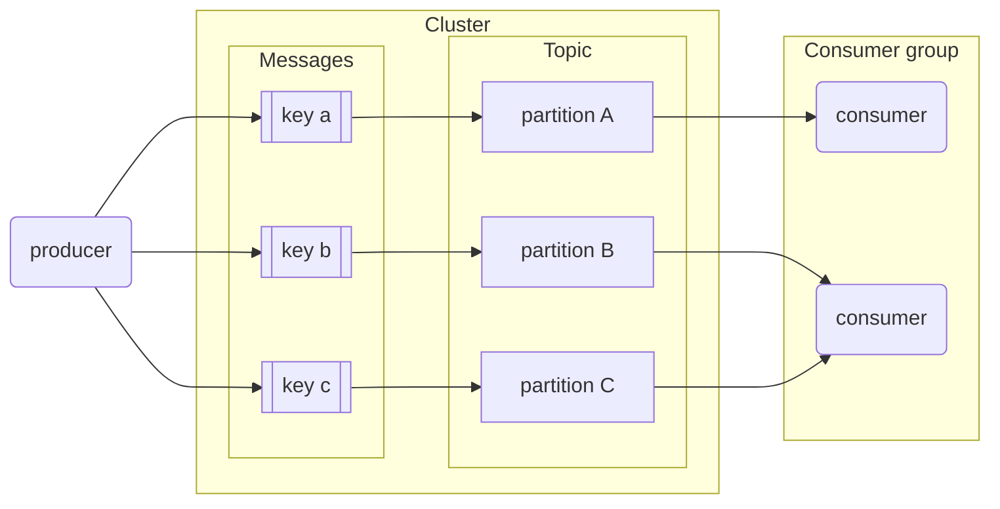

### __consumer_offsets

consumer_offsets是一个kafka内置topic，用来存储consumer读取数据的进度，这样下次consumer再读取数据，就可以按照进度读取未读取的数据。consumer_offsets存储了`<consumer_group_id,topic,partition,offset>`

有一个topic，名字是RIDES，每个message被编号，读取了0-10，读取进度被存入了__consumer_offset中

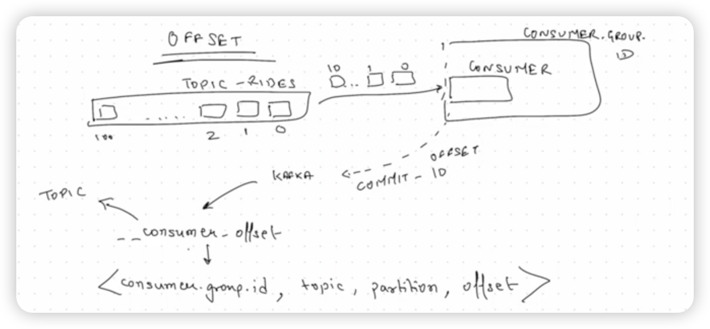

The workflows work fine for a single consumer but it omits how it keeps track of read messages. It also doesn't show what would happen if 2 or more consumers are consuming messages for the same topic.

***`__consumer_offsets`*** is a special topic that keeps track of messages read by each consumer and topic. In other words: _Kafka uses itself_ to keep track of what consumers do.

When a consumer reads messages and Kafka receives the ack, Kafka posts a message to `__consumer_offsets` with the consumer ID, the topic and the message IDs that the consumer has read. If the consumer dies and spawns again, Kafka will know the last message delivered to it in order to resume sending new ones. If multiple consumers are present, Kafka knows which consumers have read which messages, so a message that has been read by consumer #1 but not by #2 can still be sent to #2.

### AUTO.OFFSET.RESET

告诉kafka cluster，有新的consumer group id加入了，这个新consumer如何读取topic中的数据。

AUTO.OFFSET.RESET中有两个设置

* latest，让consumer，从最新的数据开始读，也就是在现有的数据基础上，最后一条数据，如果topic中有0-10个数据，那么从11开始
* earliest，让consumer，从最老的数据开始读，也就是第一条数据开始读，如果topic中有0-10个数据，那么从0开始

### ACK.ALL

数据在replication的基础上，设置producer写入数据规则

* ack:0  Fire&Forget 不需要确认producer产生的数据是否写入leder node中
* ack:1  leder successful 需要确认producer产生的数据是否写入leder node中，写入则返回成功
  * 优点：存储快
  * 缺点：一旦leder node出问题，没有备份数据，会丢失数据
* ack:all  leder&follower successful 需要确认producer产生的数据是否写入leder 以及 follower node中，写入则返回成功
  * 优点：不会丢失任何数据
  * 缺点：存储空间大，慢

### Retention

how long the data will be retained by  kafka 

目的：数据会存多久

工作原理：具体到toipc中，从message的维度来说，如果设置1天的Retention，那么超过1天存储的message会被删除，不超过的继续存储，同时会有新数据灌入

## 3.2.Kafka configurations

### Documentation

More details in [here](https://kafka.apache.org/documentation/#configuration)

### Topic configurations

* `retention.ms`: due to storage space limitations, messages can't be kept indefinitely. This setting specifies the amount of time (in milliseconds) that a specific topic log will be available before being deleted.
* `cleanup.policy`: when the `retention.ms` time is up, we may choose to `delete` or `compact` a topic log.
  * Compaction does not happen instantly; it's a batch job that takes time.
* `partition`: number of partitions.
  * The higher the amount, the more resources Kafka requires to handle them. Remember that partitions will be replicated across brokers; if a broker dies we could easily overload the cluster.
* `replication`: replication factor; number of times a partition will be replicated.

### Consumer configurations

* `offset`: sequence of message IDs which have been read by the consumer.
* `consumer.group.id`: ID for the consumer group. All consumers belonging to the same group contain the same `consumer.group.id`.
* `auto_offset_reset`: when a consumer subscribes to a pre-existing topic for the first time, Kafka needs to figure out which messages to send to the consumer.
  * If `auto_offset_reset` is set to `earliest`, all of the existing messages in the topic log will be sent to the consumer.
  * If `auto_offset_reset` is set to `latest`, existing old messages will be ignored and only new messages will be sent to the consumer.

### Producer configurations

* `acks`: behaviour policy for handling acknowledgement signals. It may be set to `0`, `1` or `all`.
  * `0`: "fire and forget". The producer will not wait for the leader or replica brokers to write messages to disk.
    * Fastest policy for the producer. Useful for time-sensitive applications which are not affected by missing a couple of messages every so often, such as log messages or monitoring messages.
  * `1`: the producer waits for the leader broker to write the messaage to disk.
    * If the message is processed by the leader broker but the broker inmediately dies and the message has not been replicated, the message is lost.
  * `all`: the producer waits for the leader and all replica brokers to write the message to disk.
    * Safest but slowest policy. Useful for data-sensitive applications which cannot afford to lose messages, but speed will have to be taken into account.

# 4. Kafka producer consumer

We will cover :

- Produce some messages programmaticaly
- Consume some data programmaticaly

We will use Java for this. If we want to use Python, there’s a Docker image to help us.

## 4.1.Create a topic with Confluent cloud

Login to [Confluent Cloud](https://confluent.cloud/).

From the **Welcome back** page, click on **Environments**, select the **Default cluster**, click on **cluster_dezoomcamp** and select **Topics** in the left menu.

Click on **Add topic** button.

In the **New topic form**, enter :

- **Topic name** : rides
- **Partitions** : 2
- Click on **Show advanced settings**
- **Retention time**: 1 day

Click on **Save & create** button.

This topic has no messages, schema or configuration.

## 4.2.Create a client

Select **Clients** on the left menu, click on **New client** button, and choose **Java** as language. This provides snippet code to configure our client.

Here the snippet code created.

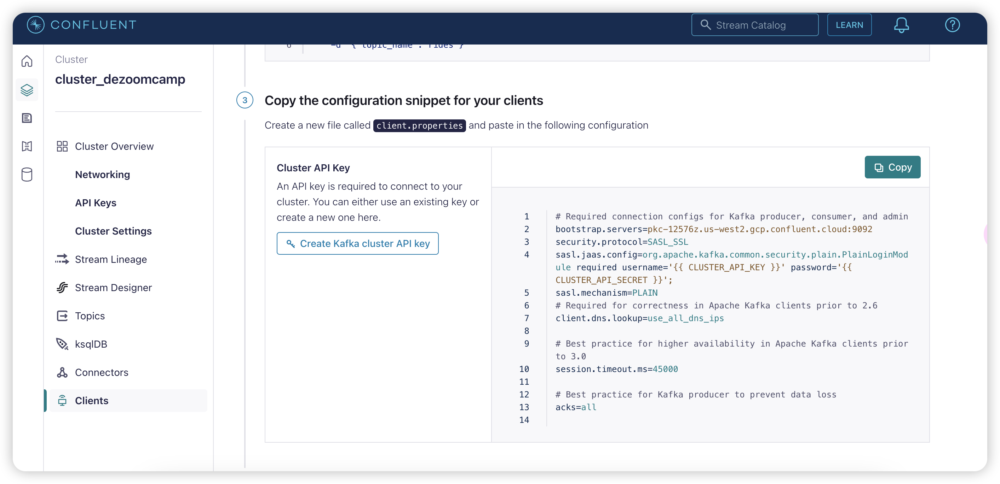

Here the snippet code created.

**Snippet**

```java
# Required connection configs for Kafka producer, consumer, and admin
bootstrap.servers=pkc-12576z.us-west2.gcp.confluent.cloud:9092
security.protocol=SASL_SSL
sasl.jaas.config=org.apache.kafka.common.security.plain.PlainLoginModule required username='{{ CLUSTER_API_KEY }}' password='{{ CLUSTER_API_SECRET }}';
sasl.mechanism=PLAIN
# Required for correctness in Apache Kafka clients prior to 2.6
client.dns.lookup=use_all_dns_ips

# Best practice for higher availability in Apache Kafka clients prior to 3.0
session.timeout.ms=45000

# Best practice for Kafka producer to prevent data loss
acks=all
```

## 4.3.**File JsonProducer.java**

用来读取、上传数据

Start your Java IDE (I use IntelliJ IDEA) et open `06-streaming/java/kafka_examples` directory from a cloned repo on your disk of [data-engineering-zoomcamp](https://github.com/DataTalksClub/data-engineering-zoomcamp).

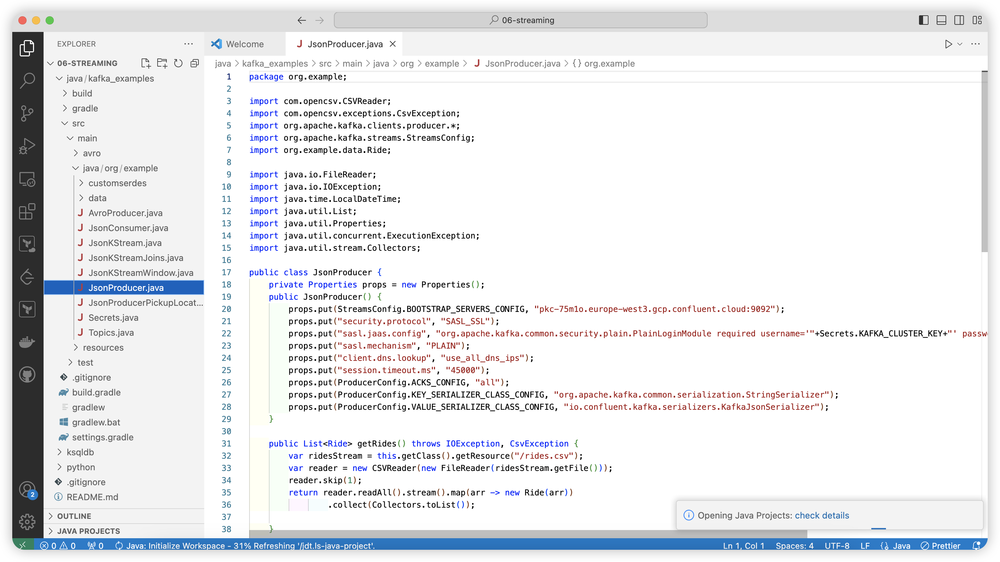

### getRides()

读取csv文件，返回 a list of Ride

```java
//The JsonProducer class contains de getRides() method that reads a CSV file and return a list of Ride.
    public List<Ride> getRides() throws IOException, CsvException {
        var ridesStream = this.getClass().getResource("/rides.csv");
        var reader = new CSVReader(new FileReader(ridesStream.getFile()));
        reader.skip(1);
        return reader.readAll().stream().map(arr -> new Ride(arr))
                .collect(Collectors.toList());
```

### main()

创建一个新的producer, get a list of `Ride`, and publish these rides.

```java
public static void main(String[] args) throws IOException, CsvException, ExecutionException, InterruptedException {
        var producer = new JsonProducer();
        var rides = producer.getRides();
        producer.publishRides(rides);
```

### Create Properties

We have to create properties using the snippet code obtained previously.

Change the `"+Secrets.KAFKA_CLUSTER_KEY+"` and `"+Secrets.KAFKA_CLUSTER_SECRET+"` for your API

```java
private Properties props = new Properties();
    public JsonProducer() {
        props.put(StreamsConfig.BOOTSTRAP_SERVERS_CONFIG, "pkc-75m1o.europe-west3.gcp.confluent.cloud:9092");
        props.put("security.protocol", "SASL_SSL");
        props.put("sasl.jaas.config", "org.apache.kafka.common.security.plain.PlainLoginModule required username='"+Secrets.KAFKA_CLUSTER_KEY+"' password='"+Secrets.KAFKA_CLUSTER_SECRET+"';");
        props.put("sasl.mechanism", "PLAIN");
        props.put("client.dns.lookup", "use_all_dns_ips");
        props.put("session.timeout.ms", "45000");
        props.put(ProducerConfig.ACKS_CONFIG, "all");
        props.put(ProducerConfig.KEY_SERIALIZER_CLASS_CONFIG, "org.apache.kafka.common.serialization.StringSerializer");
        props.put(ProducerConfig.VALUE_SERIALIZER_CLASS_CONFIG, "io.confluent.kafka.serializers.KafkaJsonSerializer");
    }
```

### Serialization

在上面的properties中加入

```java
props.put(ProducerConfig.KEY_SERIALIZER_CLASS_CONFIG, "org.apache.kafka.common.serialization.StringSerializer");
        props.put(ProducerConfig.VALUE_SERIALIZER_CLASS_CONFIG, "io.confluent.kafka.serializers.KafkaJsonSerializer");
```

We need two types of serializer: StringSerializer and JsonSerializer. Remember that serialization is the process of converting objects into bytes. Apache Kafka provides a pre-built serializer and deserializer for several basic types :

StringSerializer
ShortSerializer
IntegerSerializer
LongSerializer
DoubleSerializer
BytesSerializer
See [StringSerializer](https://kafka.apache.org/34/javadoc/org/apache/kafka/common/serialization/StringSerializer.html) and [JSON Schema Serializer](https://docs.confluent.io/platform/current/schema-registry/serdes-develop/serdes-json.html#json-schema-serializer).

### publishRides()

Now create the `publishRides()` method.

[KafkaProducer](https://javadoc.io/static/org.apache.kafka/kafka-clients/3.4.0/org/apache/kafka/clients/producer/KafkaProducer.html) is a Kafka client that publishes records to the Kafka cluster.

```java
public void publishRides(List<Ride> rides) throws ExecutionException, InterruptedException {
        KafkaProducer<String, Ride> kafkaProducer = new KafkaProducer<String, Ride>(props);
        for(Ride ride: rides) {
            ride.tpep_pickup_datetime = LocalDateTime.now().minusMinutes(20);
            ride.tpep_dropoff_datetime = LocalDateTime.now();
            var record = kafkaProducer.send(new ProducerRecord<>("rides", String.valueOf(ride.DOLocationID), ride), (metadata, exception) -> {
                if(exception != null) {
                    System.out.println(exception.getMessage());
                }
            });
            System.out.println(record.get().offset());
            System.out.println(ride.DOLocationID);
            Thread.sleep(500);
        }
    }
```

## 4.4.File build.gradle

We need to add implementations in the dependencies of `build.gradle` file.

## 4.5.Run `JsonProducer`

Now, let’s run `JsonProducer`.

If all goes well, you should see messages appear in the log of the Java IDE and also under **Messages** tab of the topic **rides** in Confluent cloud.

| 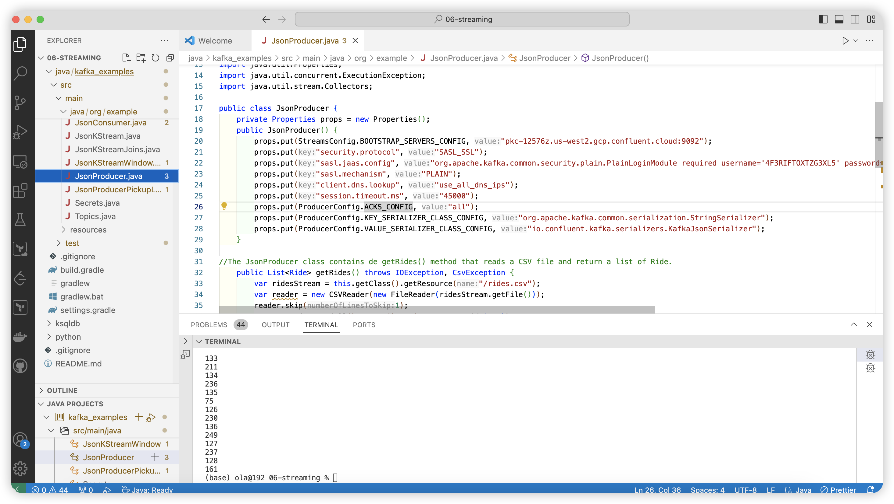 | 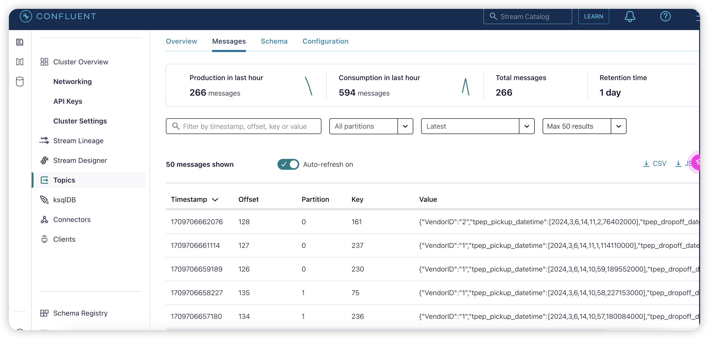 |
| ----------------------- | ----------------------- |

## 4.6.**File `JsonConsumer.java`**

Now, for the consumer, we’re going to do basically the same thing as before with the producer.

### Create `Properties` for Consumer

[KafkaConsumer](https://javadoc.io/static/org.apache.kafka/kafka-clients/3.4.0/org/apache/kafka/clients/consumer/KafkaConsumer.html) is a client that consumes records from a Kafka cluster.

We have to create properties using the snippet code obtained previously.

Change the `"+Secrets.KAFKA_CLUSTER_KEY+"` and `"+Secrets.KAFKA_CLUSTER_SECRET+"` for your API

```java
private Properties props = new Properties();
    private KafkaConsumer<String, Ride> consumer;
    public JsonConsumer() {
        props.put(ConsumerConfig.BOOTSTRAP_SERVERS_CONFIG, "pkc-75m1o.europe-west3.gcp.confluent.cloud:9092");
        props.put("security.protocol", "SASL_SSL");
        props.put("sasl.jaas.config", "org.apache.kafka.common.security.plain.PlainLoginModule required username='"+Secrets.KAFKA_CLUSTER_KEY+"' password='"+Secrets.KAFKA_CLUSTER_SECRET+"';");
        props.put("sasl.mechanism", "PLAIN");
        props.put("client.dns.lookup", "use_all_dns_ips");
        props.put("session.timeout.ms", "45000");
        props.put(ConsumerConfig.KEY_DESERIALIZER_CLASS_CONFIG, "org.apache.kafka.common.serialization.StringDeserializer");
        props.put(ConsumerConfig.VALUE_DESERIALIZER_CLASS_CONFIG, "io.confluent.kafka.serializers.KafkaJsonDeserializer");
        props.put(ConsumerConfig.GROUP_ID_CONFIG, "kafka_tutorial_example.jsonconsumer.v2");
        props.put(ConsumerConfig.AUTO_OFFSET_RESET_CONFIG, "earliest");
        props.put(KafkaJsonDeserializerConfig.JSON_VALUE_TYPE, Ride.class);
        consumer = new KafkaConsumer<String, Ride>(props);
        consumer.subscribe(List.of("rides"));

    }
```

### `consumeFromKafka()` 

Let’s ceate the `consumeFromKafka()` method.

```java
public void consumeFromKafka() {
        System.out.println("Consuming form kafka started");
        var results = consumer.poll(Duration.of(1, ChronoUnit.SECONDS));
        var i = 0;
        do {

            for(ConsumerRecord<String, Ride> result: results) {
                System.out.println(result.value().DOLocationID);
            }
            results =  consumer.poll(Duration.of(1, ChronoUnit.SECONDS));
            System.out.println("RESULTS:::" + results.count());
            i++;
        }
        while(!results.isEmpty() || i < 10);
    }
```

###  `main()` 

```java
public static void main(String[] args) {
        JsonConsumer jsonConsumer = new JsonConsumer();
        jsonConsumer.consumeFromKafka();
    }
```

## 4.7.**File `Ride.java`**

Adds a default constructor to the `Ride` class.

## 4.8.Run `JsonConsumer`

Now, let’s run `JsonConsumer`.

If all goes well, you should see messages appear in the log of the Java IDE like this.

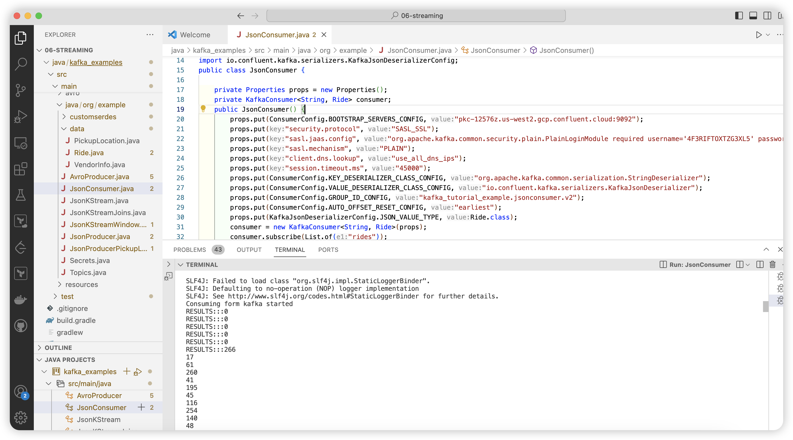

# 5.Kafka streams basics

## What is Kafka Streams?

> Kafka stream是一个java 库，是一个用于构建输入和输出数据都存储在kafka cluster的应用
>
> [Kafka Streams Basics for Confluent Platform](https://docs.confluent.io/platform/current/streams/concepts.html)
>
> [Kafka Streams_videocourse](https://developer.confluent.io/courses/kafka-streams/get-started/?_gl=1*pdw6w5*_ga*NTQ0MjA1OTUwLjE3MDk2ODAzMTU.*_ga_D2D3EGKSGD*MTcwOTgwOTY0OS41LjAuMTcwOTgwOTY1MC41OS4wLjA.&_ga=2.80626654.814252829.1709809650-544205950.1709680315)

**Kafka Streams** is a _java library_ for building applications and services whose input and output are stored in Kafka clusters. In other words: _Streams applications_ consume data from a Kafka topic and produce it back into another Kafka topic.

In this section, we will create a very simple Kafka stream example.

Also, we will see how keys play an important role when messages are outputted to Kafka, especially in stream processing

## Streams topologies and features

A ***topology*** (short for _processor topology_) defines the _stream computational logic_ for our app. In other words, it defines how input data is transformed into output data.

Essentially, a topology is a graph of _stream processors_ (the graph nodes) which are connected by _streams_ (the graph edges). A topology is a useful abstraction to design and understand Streams applications.

A ***stream processor*** is a node which represents a processing step (i.e. it transforms data), such as map, filter, join or aggregation.

Stream processors (and thus topologies) are defined via the imperative Processor API or with the declarative, functional DSL. We will focus on DSL in this lesson.

Kafka Streams provides a series of features which stream processors can take advantage of, such as:

* Aggregates (count, groupby)
* Stateful processing (stored internally in a Kafka topic)
* Joins (KStream with Kstream, KStream with KTable, Ktable with KTable)
* [Windows](https://kafka.apache.org/20/documentation/streams/developer-guide/dsl-api.html#windowing) (time based, session based)
  * A window is a group of records that have the same key, meant for stateful operations such as aggregations or joins.

## 5.1.**File JsonKStream.java**

### Properties

**application ID** (`StreamsConfig.BOOTSTRAP_SERVERS_CONFIG`).
Each stream processing application must have a unique ID. The same ID must be given to all instances of the application.

**cache.max.bytes.buffering** (`CACHE_MAX_BYTES_BUFFERING_CONFIG`)
We set to zero this configuration to turn off caching. Note that this configuration is deprecated on the latest version of Kafka.

See [org.apache.kafka.streams.StreamsConfig](https://javadoc.io/static/org.apache.kafka/kafka-streams/3.4.0/org/apache/kafka/streams/StreamsConfig.html) and [org.apache.kafka.clients.consumer.ConsumerConfig](https://javadoc.io/static/org.apache.kafka/kafka-clients/3.4.0/org/apache/kafka/clients/consumer/ConsumerConfig.html)

### String Builder

定义数据来源、数据转换、数据存储

```java
import org.apache.kafka.common.serialization.Serdes;
import org.apache.kafka.streams.StreamsBuilder;

public Topology createTopology() {
        StreamsBuilder streamsBuilder = new StreamsBuilder();
        var ridesStream = streamsBuilder.stream("rides", Consumed.with(Serdes.String(), CustomSerdes.getSerde(Ride.class)));
        var puLocationCount = ridesStream.groupByKey().count().toStream();
        puLocationCount.to("rides-pulocation-count", Produced.with(Serdes.String(), Serdes.Long()));
        return streamsBuilder.build();
    }
```

### Create a new topic in Confluent cloud

In **Confluent cloud**, let’s create a new topic `rides-pulocation-count` with 2 partitions.

### countPLocation()

We need to start our job explicitly by calling the start() method on the KafkaStreams instance

```java
import org.apache.kafka.common.serialization.Serdes;
import org.apache.kafka.streams.KafkaStreams;
import org.apache.kafka.streams.StreamsBuilder;

public void countPLocation() throws InterruptedException {
        var topology = createTopology();
        var kStreams = new KafkaStreams(topology, props);
        kStreams.start();
        while (kStreams.state() != KafkaStreams.State.RUNNING) {
            System.out.println(kStreams.state());
            Thread.sleep(1000);
        }
        System.out.println(kStreams.state());
        Runtime.getRuntime().addShutdownHook(new Thread(kStreams::close));
    }
```

### Run JsonKStream

Let’s see if Kafka strean is running. Go to **Confluent Cloud**, select **Topics** in the left menu, select **rides** topic, click **Messages** tab. We should see that some messages are coming in, this is because our producer is running.

Now, select **rides-pulocation-count** topic and click **Messages** tab. We should also see that some messages are coming in.

This is our basic example of using Kafka streams. In summary:

- Somes rides coming in from our topic.
- We grouped it by key (this key was pulocation).
- We counted it.
- We outputted it to a new topic.

# Kafka stream join


